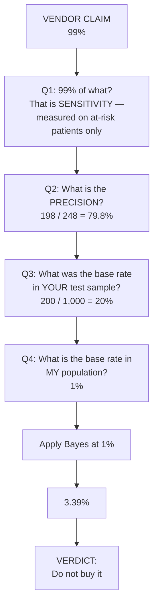
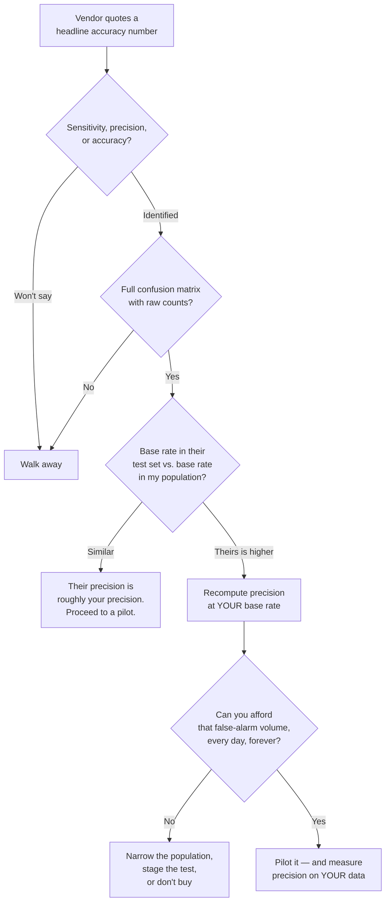

# The Vendor Role-Play — From 99% to 3.39% in Three Questions

This is the centrepiece of the session. It is a base-rate lesson disguised as a procurement decision, and it ends in a verdict rather than a formula. Read it as a script; it is designed to be run as a staged reveal, one number at a time.

---

## Stage 0 — The pitch

A medical-technology AI startup approaches your organisation.

> Their system takes a small blood sample, assays several variables, runs an ensemble of machine-learning algorithms, and returns a binary result: **AT RISK** or **NOT AT RISK** for a serious health condition.
>
> **The vendor's headline claim: "99% of patients who are at risk will test positive."**

The room is asked, before anything else:

- Is this significant? Is it credible?
- Would you buy it?
- **What should your next question be?**

Sit with it. The claim is not a lie. Nothing in this scenario involves anyone being dishonest. Every number the vendor produces will turn out to be true.

---

## Stage 1 — What *kind* of 99% is that?

The first move is not to doubt the number. It is to identify **which conditional probability it is**.

> "99% of patients who are **at risk** will test positive."

The population being described is *patients who are at risk*. So this is:

$$P(\text{tests positive} \mid \text{at risk}) = 0.99$$

That is **sensitivity** (`content/03`). It is measured only on people who have the condition. It says nothing whatsoever about how many *healthy* people also test positive — and therefore nothing about what a positive result means when you get one.

Note how easy it is to drive sensitivity to 1.0: a test that returns POSITIVE for every single patient has **100% sensitivity**. It catches every at-risk patient, without fail. It is also completely worthless. Sensitivity alone can always be made perfect, so sensitivity alone is never evidence.

**So the first question is:**

> *"That's sensitivity. What is the precision — of the patients who test positive, what fraction is actually at risk?"*

---

## Stage 2 — The precision answer

The vendor is cooperative and produces their validation data: a confusion matrix over **1,000 tested patients**.

| | **Tests positive** | **Tests negative** | Row total |
|---|---|---|---|
| **At risk** | **198** (TP) | **2** (FN) | **200** |
| **Not at risk** | **50** (FP) | **750** (TN) | **800** |
| Column total | **248** | **752** | **1,000** |

Check their claim first — always check the claim against the matrix:

$$\text{Sensitivity} = \frac{198}{198+2} = \frac{198}{200} = 0.99 \;\checkmark$$

The 99% is real. Now the number you asked for:

$$\text{Precision} = \frac{198}{198+50} = \frac{198}{248} = \mathbf{0.798} = \mathbf{79.8\%}$$

And, while you have the matrix, the number that will matter more than either of them in two minutes' time:

$$\text{Specificity} = \frac{750}{800} = 0.9375 \quad\Rightarrow\quad \text{False-positive rate} = \frac{50}{800} = \mathbf{6.25\%}$$

**79.8% precision.** Four out of five positives are real. That is a defensible clinical screening tool. Both directions of the conditional are now known, both are strong, the arithmetic checks out.

**At this point most evaluations stop and most purchases happen.** Everything asked for has been supplied, promptly and honestly.

---

## Stage 3 — The unease

Something should still itch.

> Every number you have used came from the vendor's own test. You have verified their internal consistency and nothing else. **You have not brought in a single fact from outside their sample.**

What can you check independently? There is exactly one thing, and it is public: **how common is this condition in the population you would actually deploy to?**

---

## Stage 4 — The outside fact

Ten minutes of research — a public health registry, a review article, an encyclopaedia — gives the answer:

> **Only 1% of the population is at risk for this condition.**

Now look back at the vendor's matrix, and specifically at its left margin.

| | Vendor's test sample | Real population |
|---|---|---|
| At risk | **200 / 1,000 = 20%** | **1%** |
| Not at risk | 800 / 1,000 = 80% | 99% |

**The vendor's test sample was twenty times more enriched with at-risk patients than reality.**

This is not necessarily misconduct. It is *standard practice*. If you are validating a test for a rare condition, you deliberately over-sample positive cases — otherwise you would need 20,000 patients to get 200 usable positives, and you cannot afford that. Enrichment is the correct way to build a validation set.

**It is also the correct way to make precision look excellent, because precision is not a property of the test.** Sensitivity and specificity are properties of the test — they travel with it. **Precision is a property of the test *and the population it is used in*.** Move the test to a different population and precision changes, without a single line of the model changing.

---

## Stage 5 — The reveal

Apply Bayes with the *real* base rate.

$$P(\text{at risk} \mid \text{positive}) = \frac{P(\text{positive} \mid \text{at risk}) \times P(\text{at risk})}{P(\text{positive})}$$

$$= \frac{0.99 \times 0.01}{0.248} = \mathbf{0.0339} = \mathbf{3.39\%}$$

**From 99% to 3.39%.**

Nothing was faked. The vendor did not lie once. The model was not changed. The only thing that happened is that a number measured in one population was read as though it applied to another.



*The staged reveal. Build this as four slide clicks — the number must not be visible before the question that earns it.*

### Stage 5b — Correcting the source, out loud

House rule: never present a source-deck error as fact. The 3.39% above is the source deck's figure (`resources/sources.md` #6), and it contains **two** problems. Both are worth two minutes in front of the room, because — and this is the good part — **the deck's own error is a milder version of the exact fallacy the deck is exposing.**

**Problem 1 — an arithmetic slip.** $0.99 \times 0.01 = 0.0099$, and $0.0099 / 0.248 = 0.0399$. Not 0.0339. The digits are transposed.

**Problem 2 — the deeper one — the wrong denominator.** The 0.248 is the vendor's positive rate *in the vendor's enriched sample*, where 20% were at risk. But we are now asking about **your** population, where 1% are at risk. Fewer at-risk people means fewer true positives, so the overall positive rate must fall too. Using 24.8% here re-imports the vendor's population *while trying to escape it*.

Compute $P(\text{positive})$ properly for a 1% population, using the test's own characteristics (sensitivity 99%, false-positive rate 6.25%):

$$P(\text{positive}) = \underbrace{0.99 \times 0.01}_{\text{true positives}} + \underbrace{0.0625 \times 0.99}_{\text{false positives}} = 0.0099 + 0.0619 = \mathbf{0.0718}$$

$$P(\text{at risk} \mid \text{positive}) = \frac{0.0099}{0.0718} = \mathbf{0.1379} = \mathbf{13.79\%}$$

Or, once more, by counting bodies — deploy to **100,000 people**:

| | Tests positive | Tests negative | Total |
|---|---|---|---|
| **At risk** (1%) | **990** | 10 | 1,000 |
| **Not at risk** (99%) | **6,188** | 92,812 | 99,000 |
| **Total** | **7,178** | 92,822 | 100,000 |

$$\text{Precision} = \frac{990}{7{,}178} = \mathbf{13.8\%}$$

**The honest number is 13.8%, not 3.39%.** Say so. It is *better* for the vendor than the deck's figure — and it changes nothing about the verdict:

> Of every 7,178 people this test flags as AT RISK, **6,188 are not**. Roughly **six out of every seven positive results are false alarms**. To find the 990 genuinely at-risk people, you frighten, re-test and follow up on more than seven thousand.

And the collapse is still the whole story: **79.8% precision in the vendor's sample becomes 13.8% in yours, with no change to the product.**

> **Why correct this in front of the room?** Because it is the most powerful two minutes available. A deck teaching people not to be fooled by a mismatched population got fooled by a mismatched population. Nobody was careless; the arithmetic just *looks* fine. If it can happen inside the lesson, it can happen inside your evaluation report. Do the counting-bodies table. It is immune to this error, because you physically cannot put 200 at-risk people into a group of 1,000 that is supposed to contain 10.

---

## Stage 6 — The verdict

> **Do not buy it.**

Not because the vendor lied — they did not. Not because the model is bad — sensitivity 99% and specificity 93.75% is genuinely decent engineering. **Because the product's usefulness is destroyed by the population you would deploy it into, and no amount of model improvement fixes that.**

Watch what would have to change to rescue it. Keep sensitivity at 99% and ask what specificity is needed for 50% precision at a 1% base rate:

- Currently: FPR 6.25% → 6,188 false positives per 100,000.
- For precision 50%, false positives must equal true positives: 990. That is an FPR of $990/99{,}000 = 1\%$, i.e. **specificity 99%**, up from 93.75%.
- For precision 90%: 110 false positives, FPR $\approx 0.11\%$, **specificity 99.89%**.

**A rare condition demands a specificity most people would call absurd,** because the false-positive rate is multiplied by the enormous healthy majority. This is why the honest answer to "can't they just improve the model?" is usually no — not on any timescale or budget that matters.

Three legitimate paths remain, and it is worth naming them so the session is not merely destructive:

1. **Narrow the deployment population.** Use the test only where the base rate is genuinely high — a pre-screened cohort with symptoms or family history. At 20% prevalence, precision really is 79.8%, and the vendor's number was never wrong; it was just describing a different job. **Changing the population is far cheaper than changing the model.**
2. **Use it as a first stage, never a decision.** A cheap high-sensitivity screen followed by an expensive high-specificity confirmatory test is a completely standard and sound architecture — *provided* the second stage is funded, staffed, and mandatory. The failure mode is when stage two is dropped for cost and the screen quietly becomes the decision.
3. **Change what a positive triggers.** If a positive triggers a free follow-up questionnaire, 13.8% precision is fine. If it triggers a biopsy, an insurance flag, or a customer-visible action, it is not. **Precision requirements come from consequences, not from the model.**

---

## Stage 7 — The tailoring: swap the vendor

**Run the scenario with a medical vendor in the room, then re-run it in ninety seconds with an AI-tooling vendor pitching *this team*.** The structure transfers exactly and it lands considerably harder, because the second version is a meeting several people present will actually attend.

> **The pitch.** A vendor sells an AI defect-prediction tool that reviews commits and flags those likely to contain a defect that will escape to the field.
>
> **The claim: "Our tool identifies 99% of escaping defects."**

Now walk the identical four questions:

| Q | Question | Answer | What it means |
|---|---|---|---|
| 1 | 99% of *what*? | Of commits that *do* contain an escaping defect, 99% get flagged | **Sensitivity.** Says nothing about how many clean commits get flagged. A tool that flags every commit scores 100% here. |
| 2 | What is the **precision**? | On their benchmark: 198 of 248 flagged commits really were defective → **79.8%** | Four in five flags are real. Sounds excellent. |
| 3 | What was the **base rate in your benchmark**? | 200 of 1,000 commits contained an escaping defect → **20%** | Their benchmark repository is a fifth defective. |
| 4 | What is the base rate in **our** repository? | Roughly **1%** of commits produce an escaping defect | Twenty times rarer. |

Deploy to **10,000 commits** — a quarter's work for a decent-sized team:

| | Tool flags | Tool clears | Total |
|---|---|---|---|
| **Really has an escaping defect** (1%) | **99** | 1 | 100 |
| **Clean** (99%) | **619** | 9,281 | 9,900 |
| **Total** | **718** | 9,282 | 10,000 |

$$\text{Precision} = \frac{99}{718} = \mathbf{13.8\%}$$

**Translate that out of statistics and into your team's week:**

- **718 flagged commits per quarter.** Roughly 11 per working day, every day.
- **619 of them are false alarms** — about 86%.
- To find the 99 real defects, an engineer investigates 718 commits. At 20 minutes each that is **240 hours per quarter**, or a third of a full-time engineer, spent almost entirely on clean code.
- **And here is the failure that actually happens:** long before the 240 hours are budgeted, the team learns that flags are usually noise. Within a fortnight the flags are being closed unread. The tool's 99% sensitivity is now **completely irrelevant**, because the control that consumes its output has been switched off by the volume — not by a decision, by attrition.

You have paid for a tool that catches 99% of escaping defects and installed a process that catches none of them. Meanwhile the tool's dashboard still reports 99% sensitivity, truthfully, every day.

> **This is the sentence to leave the room with:** *the tool's metrics stay green while the system it lives in stops working, and nothing in the tool's reporting can tell you that has happened.* That gap — between a component's metric and a system's behaviour — is exactly the gap release, problem and configuration management exists to close. This is not a new discipline for you. It is your existing discipline, applied to a new kind of component.

### Other places to run the same swap

The four questions work on any binary AI classifier this room will be sold:

| Tool | The "99%" claim | The base rate to go and find |
|---|---|---|
| Incident auto-triage | "Correctly routes 99% of P1s" | What fraction of incoming incidents are P1? |
| Config drift detection | "Detects 99% of unauthorised changes" | What fraction of changes are unauthorised? |
| Anomaly detection on logs | "Catches 99% of real anomalies" | What fraction of log windows contain a real anomaly? |
| Duplicate-ticket detection | "Finds 99% of duplicates" | What fraction of tickets are duplicates? |
| AI code review | "Catches 99% of security defects" | What fraction of PRs contain a security defect? |

In every row, the rarer the event, the more the vendor's precision claim depends on a benchmark that is not your world.

---

## The Bayes calculator, applied

```python
"""Vendor evaluation: what precision will this test give in MY population?
Change one argument -- the prevalence -- and watch the sale collapse.
"""

def posterior(sensitivity, specificity, prevalence):
    """Return (precision, overall_positive_rate) for a binary test
    deployed into a population with the given prevalence."""
    true_pos  = sensitivity * prevalence
    false_pos = (1 - specificity) * (1 - prevalence)
    p_positive = true_pos + false_pos
    return true_pos / p_positive, p_positive


# The vendor's own confusion matrix (1,000 patients):
#            positive  negative
#   at risk      198        2      -> sensitivity = 198/200 = 0.99
#   not at risk   50      750      -> specificity = 750/800 = 0.9375
SENS = 198 / 200      # 0.99
SPEC = 750 / 800      # 0.9375

# Step 1 -- reproduce the vendor's own precision. Their sample was 20% at risk.
precision_vendor, rate_vendor = posterior(SENS, SPEC, prevalence=0.20)
print(f"vendor sample (20% at risk): precision {precision_vendor:.1%}, "
      f"positive rate {rate_vendor:.1%}")
# vendor sample (20% at risk): precision 79.8%, positive rate 24.8%
#   ^ matches 198/248 and 248/1000 exactly -- the model of the test is correct.

# Step 2 -- change ONE argument: the real-world base rate.
precision_real, rate_real = posterior(SENS, SPEC, prevalence=0.01)
print(f"real population (1% at risk): precision {precision_real:.1%}, "
      f"positive rate {rate_real:.1%}")
# real population (1% at risk): precision 13.8%, positive rate 7.2%
```

Step 1 is the part not to skip when you present this. Reproducing **79.8%** and **24.8%** from sensitivity and specificity alone proves the model of the test is right, so nobody can dismiss step 2 as a modelling artefact. Then one keyword argument changes and precision falls by a factor of six.

### The prevalence sweep — the single most useful table in the session

```python
print(f"{'prevalence':>10} | {'% flagged':>9} | {'precision':>9}")
print("-" * 34)
for prev in [0.001, 0.005, 0.01, 0.02, 0.05, 0.10, 0.20]:
    prec, rate = posterior(SENS, SPEC, prev)
    print(f"{prev:>9.1%} | {rate:>8.1%} | {prec:>8.1%}")

# prevalence | % flagged | precision
# ----------------------------------
#      0.1% |     6.3% |     1.6%
#      0.5% |     6.7% |     7.4%
#      1.0% |     7.2% |    13.8%
#      2.0% |     8.1% |    24.4%
#      5.0% |    10.9% |    45.5%
#     10.0% |    15.5% |    63.8%
#     20.0% |    24.8% |    79.8%
```

| Prevalence | % of population flagged | **Precision** |
|---:|---:|---:|
| 0.1% | 6.3% | **1.6%** |
| 0.5% | 6.7% | **7.4%** |
| 1% | 7.2% | **13.8%** |
| 2% | 8.1% | **24.4%** |
| 5% | 10.9% | **45.5%** |
| 10% | 15.5% | **63.8%** |
| 20% | 24.8% | **79.8%** |

**One unchanged test. Precision from 1.6% to 79.8%.** Print this table. When a vendor shows you a precision figure, the only question that matters is which row of their table you are standing on.

Note the second column too: the flag rate barely moves — 6.3% to 24.8% — while precision moves fiftyfold. **The volume of alerts you receive tells you almost nothing about whether they are any good.** A dashboard showing a steady alert count is fully compatible with the tool having become worthless.

---

## The four questions — the takeaway artefact

Print this. Take it to vendor meetings. It is the deliverable of this session.

> ### Before you believe any AI accuracy claim
>
> 1. **"That percentage — of what population?"** Sensitivity, precision, or accuracy? They are different numbers and only one of them is what you will experience.
> 2. **"What is the precision, and on what test set?"** Ask for the full confusion matrix with raw counts, not rates. Counts reveal `support`; rates hide it.
> 3. **"What was the base rate of the positive class in your test set?"** Divide the positive row total by the grand total. This is one division and it is the whole ballgame.
> 4. **"What is the base rate in *our* population?"** Go and find this out yourself, from your own data. **Never accept the vendor's estimate of your world.**
>
> Then: apply Bayes at *your* base rate, and ask **"what happens when the tool is wrong, and who finds out?"**



*The vendor decision flowchart. Note that both acceptable endings finish with measurement on your own data, not on theirs.*

---

## Key points from this file

- The vendor's **99% is sensitivity** — measured only on positives, and always achievable by flagging everything.
- Asking for **precision** gives **79.8%**, which still describes only *their* sample.
- Their sample was **20% at risk**; the real world is **1%**. Precision is a property of the test **and the population**; move the population and it changes with nothing else changing.
- The source deck's reveal lands on **3.39%**; the correctly-worked figure is **13.8%**. We teach both, and the correction is a feature — the deck committed a gentler form of the fallacy it is teaching.
- The verdict is unchanged: **six of every seven positives are false alarms.** Don't buy it — or narrow the population, stage the test, or reduce what a positive triggers.
- **Swap in an AI-tooling vendor and it is the same arithmetic:** 718 flags per 10,000 commits, 619 of them false, a third of an engineer consumed, and a control that is switched off by attrition while the dashboard stays green.
- Carry the **four questions**. Question 4 is the one you must answer yourself.
