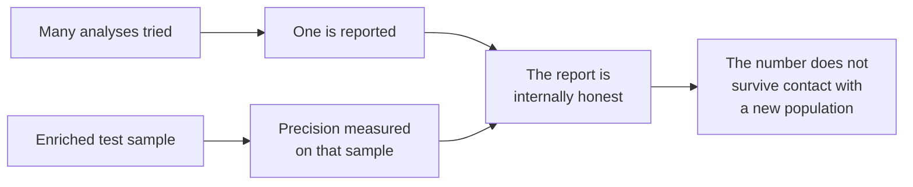

# P-Values and P-Hacking — How Honest People Produce Dishonest Numbers

The last way a metric lies: it was not *found*, it was *hunted for*. This file is short, and the framing matters more than the mechanics.

---

## 1. What a p-value actually is

> **A p-value is the probability that you would have got a result this striking by random luck, if the thing you are proposing had no effect at all.**

Low p-value → luck is an unlikely explanation → something may really be going on. That is all it claims.

### The worked example: the lady tasting tea

In 1925 the statistician Ronald Fisher was at a tea party. A colleague claimed she could taste whether the milk had been poured into the cup before or after the tea. Fisher, being Fisher, ran an experiment on the spot.

He prepared **8 cups: 4 milk-first, 4 tea-first**, in random order, and asked her to identify which were which.

**She got all 8 right.**

How impressed should we be? Count the possibilities. Choosing 4 cups out of 8 to label "milk-first" can be done in $\binom{8}{4} = 70$ ways, and exactly one of them is correct. So if she were guessing:

$$p = \frac{1}{70} = 0.0143$$

There was a **1.4% chance** of achieving this by luck alone. That is the p-value. It does not prove she can taste the difference; it says that "she was guessing" is a poor explanation for what happened.

### What a p-value is not

Three misreadings, all common, all consequential:

| The misreading | Why it is wrong |
|---|---|
| "p = 0.04 means there is a 96% chance the effect is real" | No. It is the probability of the *data* given no effect — not the probability of an *effect* given the data. **This is exactly the P(A\|B) vs. P(B\|A) reversal from `content/04`**, in its most widespread form. |
| "p < 0.05 means the effect is large or important" | No. With a large enough sample, a trivially small effect produces a tiny p-value. Statistical significance is not practical significance. |
| "p > 0.05 means there is no effect" | No. It means this experiment did not distinguish the effect from noise. Absence of evidence, not evidence of absence. |

The **0.05 threshold itself is arbitrary** — a convention Fisher offered casually and the world adopted as law. It has come under serious scrutiny as data availability has commoditised research: when you can run a thousand analyses in an afternoon, a 1-in-20 threshold stops being a filter and becomes a target.

---

## 2. P-hacking

> **P-hacking is cherry-picking models and data that produce a desired result rather than a realistic one.** It is data-mining for a p-value below 0.05.

Six ways it happens — every one of which has a perfectly respectable-sounding justification available at the moment it is done:

| # | Technique | What it sounds like when you do it |
|---|---|---|
| 1 | **Collect exactly enough data to reach significance, then stop** | "We had enough data, so we stopped collecting." |
| 2 | **Remove inconvenient data as "outliers" or "noise"** | "Those runs were contaminated." |
| 3 | **Shop for variables until one gives the result** | "We iterated on feature selection." |
| 4 | **Split into sub-groups and report the one that worked** | "The effect is strongest in the enterprise segment." |
| 5 | **Shop for model hyperparameters that give the result** | "We tuned the model." |
| 6 | **Try random seeds until one produces the desired outcome** | "We used seed 42." |

Number 6 is the one that catches machine-learning practitioners specifically, and it is the most invisible. Random seeds create **the illusion of determinism**: your result reproduces perfectly forever, which feels like rigour, while being an artefact of one lucky draw. **Test many seeds and report the mean and standard deviation.** A result that survives one seed is not a result.

```python
# The p-hacking version: run until it looks good, then keep that seed.
# The honest version: run many, report the spread.
import numpy as np
from sklearn.model_selection import KFold, cross_val_score

scores = []
for seed in range(30):                       # 30 seeds, not one
    kf = KFold(n_splits=5, shuffle=True, random_state=seed)
    scores.extend(cross_val_score(model, X, y, cv=kf))

scores = np.array(scores)
print(f"accuracy {scores.mean():.3f} (sd {scores.std():.3f}, "
      f"min {scores.min():.3f}, max {scores.max():.3f})")
# accuracy 0.842 (sd 0.031, min 0.771, max 0.903)
#   ^ Illustrative. The point: someone reporting 0.903 and someone reporting
#     0.771 have both told the truth about the same model. The spread is the
#     result; a single number is a choice about which truth to tell.
```

---

## 3. The framing that matters

Here is the part to say slowly, because it determines whether the room becomes usefully sceptical or uselessly cynical:

> **Is p-hacking malicious and deceptive? Not usually. It is human nature operating under pressure and career survival.**

Almost nobody sets out to deceive. What happens is that a competent person with a deadline tries a reasonable variant, then another reasonable variant, and each individual decision is defensible in isolation. Nobody ever writes down "attempt 7 of 12." The final report describes the analysis that worked, honestly and in full detail, and omits the eleven that did not — not by concealment, but because *that is what a report is*.

**Three pressures produce it.** Each has a sentence attached, and the sentences are the point — they are what people actually say to each other:

| Pressure | What is said out loud |
|---|---|
| **Research pressure** | *"No paper, no funding."* |
| **Job pressure** | *"Our client wants to see a model that predicts 10% savings in transportation costs."* |
| **Startup pressure** | *"Our VC investors want a demonstration, so find a dataset that will produce favourable results."* |

Read the second one again. That is not a research lab. That is a normal commercial engagement with a normal commercial expectation, and it is a p-hacking instruction that nobody experiences as one. The person who receives it will try things until something works, and will believe — correctly — that they were doing their job.

**Why this framing is operationally important.** If you think of p-hacking as fraud, you look for bad actors, find none, and conclude your numbers are fine. If you think of it as a predictable response to incentive, you look at the *process* — and you build controls, because you now expect the failure from good people. The second stance is the useful one, and it is the same stance a mature problem-management function already takes toward human error everywhere else.

The consequence is an inflation of **false positives**: models that look promising in evaluation and disappoint in the field. P-hacking is widely held responsible for the **replication crisis** across several sciences (Ioannidis 2005, `resources/sources.md` #8), and machine learning makes it *easier*, not harder — more data, more model variants, more hyperparameters, faster iteration. Every one of those is a lever, and levers get pulled.

> The idea, usually attributed to the economist Ronald Coase, is that data tortured long enough will confess to anything. *(Paraphrased — the quotation itself is under copyright and should not be reproduced on a slide.)*

---

## 4. The connection back to this session

P-hacking is the same failure as the vendor scenario, moved one step earlier in time.



*Selection during analysis and selection during sampling produce the same artefact: a number that is true where it was measured and false where you intend to use it.*

Which is why the honest defence against both is identical: **a number is only believable on data that had no opportunity to influence it.**

---

## 5. What actually defends against it

| Control | What it catches | Cost |
|---|---|---|
| **A held-out validation set, touched once** | Everything above — this is the point of the third split | Free (you have the data) |
| **Pre-register the analysis** — write down the metric and the decision rule *before* seeing results | Variable shopping, sub-group shopping, moving the goalposts | An hour |
| **Report all runs, not the best** — mean and standard deviation over many seeds and folds | Seed shopping, lucky splits | Compute time |
| **Ask "how many things did you try?"** | Multiple comparisons in general. If the answer is "a lot," the effective threshold is much stricter than 0.05 | One question |
| **Measure on your own data before you buy** | Everything a vendor did before you met them | A pilot |
| **Separate the person who builds from the person who evaluates** | Motivated reasoning, in both directions | Organisational |

### The three-way split, and what the third split is *for*

Sessions 3 and 8 introduced train / test / validation. Here is the reason the third one exists, stated properly:

- **Training set** — fit the model's parameters.
- **Test set** — tune the model: hyperparameters, thresholds, features. **Every time you look at the test set and change something, a little information leaks from it into the model.** After fifty iterations, your test set has been partly trained on. Its score is now optimistic and you cannot tell by how much.
- **Validation set** — held back, untouched, and looked at **once**, at the end. It is a **stopgap against your own iterative tuning**, which is p-hacking whether or not anyone intended it.

Note the honest implication: **if you look at the validation set and then change the model, it is no longer a validation set.** It has become a second test set, and you need a new one. There is no way around this. The discipline is the control.

> **The configuration-management framing.** A validation set is a controlled artefact. Its value comes entirely from restricted access and a recorded number of uses. Treat it exactly as you would a release candidate or a golden baseline: version it, control who can touch it, and log every access. A team that cannot say how many times it has evaluated against its validation set does not have one.

---

## Key points from this file

- A p-value is **P(data this striking | no real effect)** — *not* the probability that the effect is real. Reading it the other way is the same reversal as `content/04`.
- The 0.05 threshold is an arbitrary convention that becomes a target once analysis is cheap.
- Six p-hacking techniques; **seed-shopping** is the machine-learning-specific one, and it hides behind the appearance of reproducibility.
- **It is usually not malicious — it is human nature under pressure and career survival.** Design controls for good people under incentive, not for bad actors.
- The three pressures, in their own words: *"No paper, no funding" · "Our client wants to see 10% savings" · "Our VC investors want a demonstration."*
- Data tortured long enough will confess (paraphrasing Coase — do not put the quotation on a slide).
- The strongest defences are procedural and cheap: a validation set touched **once**, pre-registration, reporting all runs, asking how many were tried, and measuring on your own data before you buy.
