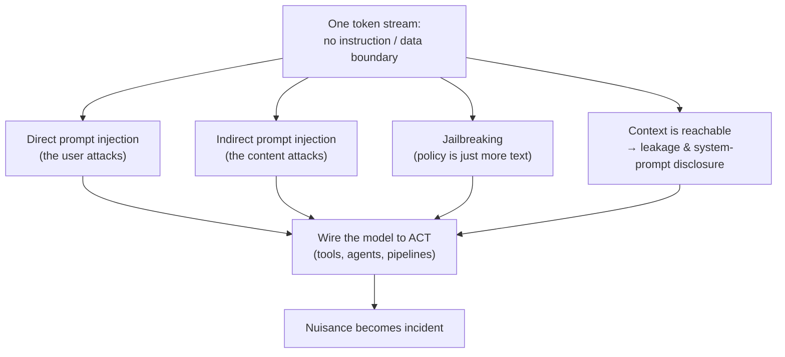

# Overview — The Risks That Come From How You Deploy

Session 13 asked *what goes wrong because of what this technology is*. This session asks *what goes wrong because of how you wired it up*. The difference matters: the first class of problem you manage with verification habits; the second you manage with architecture, access control, and policy — which is squarely the professional territory of a release, problem, or configuration manager.

## The arc

There is one idea underneath everything here, and it is worth stating before the detail:

> **A language model has no boundary between the instructions it was given and the data it is processing.** Both arrive as one stream of tokens. Everything in this session is a consequence of that sentence.

From that single architectural fact:

- **Prompt injection** follows directly — if there is no boundary, text inside a document can act as an instruction (`01`).
- **Jailbreaking** follows too — if there is no boundary, the "rules" in a system prompt are just more text competing with the user's text (`02`).
- **Data leakage** gets worse — because anything in the context window is reachable by any instruction that arrives in the context window (`03`).
- **Agents and tools** convert all of the above from an embarrassment into an incident, because now the model's output *does something* (`01`, `05`).

*Caption: everything in this session descends from one architectural property.*

## What you get out of it

Four deliverables you can use immediately:

| # | Deliverable | Where | Form |
|---|---|---|---|
| 1 | A working mental model of injection you can explain to a colleague in 60 seconds | `01` | The "no prepared statement" argument |
| 2 | A paste rule for this team's actual data | `03` | A four-tier classification table |
| 3 | A review checklist for any proposed internal AI use | `04` | OWASP LLM Top 10 2025 (CC BY-SA 4.0) |
| 4 | A method for shrinking a risk instead of admiring it | `05` | HS/IM/TTO + operating domain |

Plus two things that change behaviour rather than knowledge: the number on AI-generated code (`06`), and a policy draft the team writes itself (`08`).

## The honest framing

Three claims this session will not soften.

**1. Prompt injection is not solved and may not be solvable in the current architecture.** Vendors ship mitigations — instruction hierarchies, input classifiers, output filters, sandboxing. They raise the cost of an attack. None of them is a boundary in the sense that a parameterised SQL query is a boundary. Treat every mitigation as a probability reduction, never as a guarantee. If a design only works when injection never succeeds, the design is wrong.

**2. Guardrails leak, and you will watch them leak.** The Gandalf activity is not entertainment. Its later levels have a system prompt, an input guard, an output guard, and an LLM classifier stacked in front of the model — genuine, non-trivial defences — and a room of non-specialists will still get through several of them in fifteen minutes. That experience is the argument.

**3. The fix is mostly architectural, not linguistic.** You do not prompt your way out of this. You reduce what the system is allowed to do, what data it can reach, and where its output can go. This is the old system-safety lesson the source deck states well: *you make a system safer by constraining it to do less* — see `05`.

## The reading order

| File | Topic | Why it's here |
|---|---|---|
| `01` | Prompt injection, direct and indirect; the three preconditions | The core vulnerability |
| `02` | Jailbreaking and why prevention is unsolved | The adjacent, often-confused problem |
| `03` | Data leakage and privacy | The risk this audience is most likely to *cause* |
| `04` | OWASP Top 10 for LLM Applications 2025 | The checklist |
| `05` | Hazard triangle, operating domain, the human gate | The method for reducing all of it |
| `06` | Insecure code generation | The one hard number, and what it means for review |
| `07` | EU AI Act for a deployer | The compliance floor, honestly caveated |
| `08` | Writing your own AI-use policy | The takeaway artefact |
| `99` | Key takeaways | The recap |

A note on tone: this session is deliberately unsettling in the middle and constructive at the end. If you stop reading after `03` you will have the fear without the method. Read to `05` at minimum.
