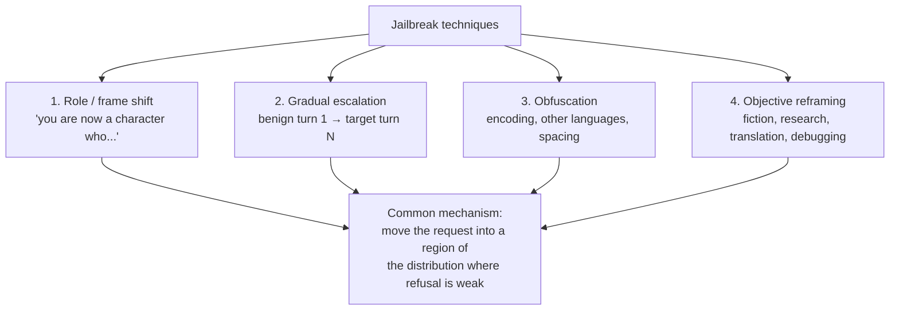
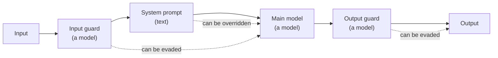

# Jailbreaking — Why It Cannot Be Fully Prevented

Jailbreaking is prompt injection's better-known cousin: getting a model to do the thing its developers trained and instructed it not to do. This file separates the two concepts (they are routinely conflated), explains the four families of technique at a level that supports *defence* rather than execution, and makes the honest argument for why the problem is structurally open.

---

## 1. Jailbreak vs. injection — the distinction that matters

| | Jailbreaking | Prompt injection |
|---|---|---|
| **Target of the attack** | The *model's* safety training and policy | The *application's* instructions |
| **Who is attacked** | The model provider's policy | Your system and its data |
| **Typical attacker** | The user themselves | A third party, via content |
| **Typical goal** | Elicit disallowed content | Redirect behaviour, exfiltrate data, trigger actions |
| **Whose problem is it** | Mostly the model provider's | **Entirely yours** |
| **Fixed by** | Better alignment training, classifiers | Architecture — see `01` §4 |

They overlap: a jailbreak is often *delivered* by injection, and both exploit the same root property (`00`). But for a deployer the practical split is clean:

> **Jailbreaking is mostly a reputational and compliance risk. Injection is mostly a data and integrity risk.** If your internal tool gets jailbroken into writing something unpleasant, you have an HR conversation. If it gets injected into emailing a config baseline outside the company, you have an incident.

For an internal Qualcomm deployment, jailbreaking matters chiefly in two places: (1) anything employee- or customer-facing where offensive output is a real cost, and (2) as *evidence* — it is the most legible demonstration that model-level guardrails are probabilistic. That second use is why Gandalf is the session's hook.

---

## 2. The four families (described for defence, not execution)

We describe these at the level of *mechanism*, because you cannot design a review process against a threat you refuse to name. We deliberately do not give working payloads; every one of these is documented publicly and catalogued in **MITRE ATLAS™**, which is the reference to cite in a design review.

*Caption: four families, one underlying mechanism.*

| Family | Mechanism | Why it works | What it means for your controls |
|---|---|---|---|
| **Role / frame shift** | Ask the model to adopt a persona for whom the constraint does not apply | Safety behaviour is trained on a distribution of *requests*; a persona changes the surface form without changing the intent | Never rely on a system prompt to enforce a hard rule. Enforce it outside the model |
| **Gradual escalation (multi-turn)** | Nothing in any single turn is refusable; the trajectory is | Refusal is evaluated largely per-turn; context accumulates | Guardrails that inspect only the current message miss this entirely. Evaluate conversations, not messages |
| **Obfuscation** | Encode, translate, transliterate, or space out the request | Input classifiers pattern-match on surface form; the model still understands the content | An input filter you can describe in a regex is an input filter that can be avoided |
| **Objective reframing** | Wrap the request in a legitimate-sounding purpose (fiction, security research, debugging, translation) | The legitimate version of the request genuinely exists, so refusal has a real false-positive cost | This is why perfect refusal is *undesirable* as well as unachievable — see §3 |

**The pattern across all four:** none of them attacks a bug. They all move the request into a part of the input space where the model's learned refusal behaviour is weaker. That is a property of learned behaviour, not a defect in an implementation.

---

## 3. Why full prevention is unsolved (four independent reasons)

Any one of these would make the problem hard. Together they make "we will fix jailbreaking" an unserious claim.

### 3.1 Safety is trained, not enforced

Refusal is a *behaviour* the model was trained to exhibit on inputs resembling its training distribution. It is not a check executed before generation. There is no `if disallowed: return` in the forward pass — there is a set of weights that make refusal tokens likely for inputs that look like the ones seen in alignment training. Inputs that look different get a different probability. This is exactly the interpolation/extrapolation point from Session 1 and Session 13, applied to safety behaviour rather than to facts.

### 3.2 The input space is unbounded and adversarially searchable

Natural language has no finite grammar of harmful requests. Worse, attackers can *search*: automated methods (including gradient-based suffix search and LLM-driven red-teaming) find jailbreaks faster than humans patch them, and published research repeatedly shows a fixed jailbreak gets patched while the *method* that generated it keeps producing new ones. You are defending an infinite surface with a finite set of examples.

### 3.3 The dual-use boundary is genuinely fuzzy

"Explain how this buffer overflow works" is a jailbreak attempt from one person and a Tuesday from a Qualcomm security engineer. Any refusal policy sharp enough to stop the first will block the second. This is a **base-rate and threshold** problem in exactly the sense Session 13 taught: pushing the false-negative rate down pushes the false-positive rate up, and for a model used by professionals the false positives are expensive. Some jailbreak "success" is the unavoidable cost of the model being useful.

### 3.4 Guardrails are models too

The standard mitigation is to stack additional models in front and behind: an input classifier, an output classifier, a policy LLM. This genuinely raises attacker cost. But every one of those components is itself a learned, probabilistic classifier — with its own distribution, its own blind spots, and its own susceptibility to the same four families.

*Caption: defence in depth made of probabilistic layers. Each hole is small; the holes can still line up — the Swiss cheese picture from `05`.*

This is precisely what the Gandalf levels demonstrate, one layer at a time, and it is why the lab is worth fifteen minutes of a forty-five-minute session.

---

## 4. What a deployer should actually do

You are not going to fix jailbreaking. You can make it not matter very much.

| Control | What it does | Where it lives |
|---|---|---|
| **Constrain the operating domain** | Fewer sanctioned tasks → fewer inputs that need to be refused → smaller surface | Design (`05`) |
| **Assume every guardrail fails** in threat modelling | Changes what you are willing to connect the model to | Design review |
| **Put the hard rules outside the model** | Access control, egress rules, and approval gates are enforceable; prompt text is not | Infrastructure |
| **Log inputs and outputs** | You cannot investigate what you did not record. Also an EU AI Act high-risk deployer duty (`07`) | Ops |
| **Test with a red-team harness before launch, and after model updates** | A model upgrade silently changes refusal behaviour in both directions | CI |
| **Have an incident path** | Who gets told when an internal tool produces something it should not have | Policy (`08`) |

On the last technical row: open-source harnesses exist and are permissively licensed — **promptfoo** (MIT), **garak** (Apache-2.0), **PyRIT** (MIT). They ship presets mapped to OWASP LLM Top 10 and MITRE ATLAS. For this audience the point is not to become red-teamers; it is that **"we ran an automated adversarial scan and here is the report" is now a reasonable release-gate artefact**, comparable to a static-analysis run. Treat it as one more check in the release checklist, with the same caveat as any scanner: passing means "no known technique in this suite succeeded," not "secure."

---

## 5. The honest closing position

Two sentences to keep:

> A model provider can make jailbreaking *harder*, and they do, continuously. Nobody can make it *impossible*, and any vendor who says otherwise is telling you something that is not true.

And the consequence, which is the same consequence as `01`:

> Design so that a successful jailbreak is disappointing rather than expensive.

---

*Sources for this file: MITRE ATLAS™ for technique taxonomy (see `resources/sources.md` #3, SLIDE-SAFE with credit line); OWASP LLM Top 10 2025 (#1); Anthropic and OpenAI safety/red-teaming publications for the "why it stays open" argument (#9, #10 — LINK-ONLY, assign as reading); promptfoo / garak / PyRIT documentation (#4, permissive licences); Lakera Gandalf as the live demonstration only (#6, LINK-ONLY).*
