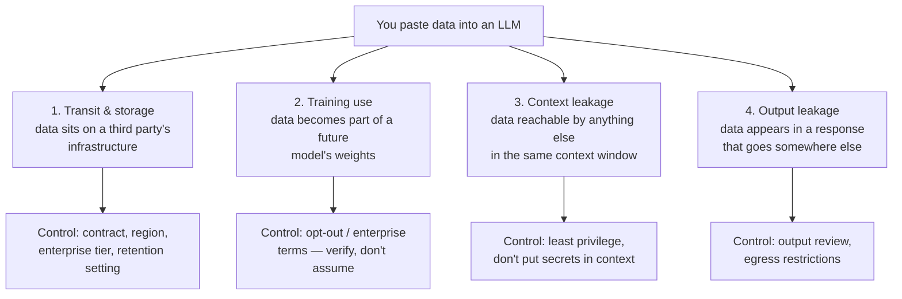

# Data Leakage and Privacy — What Not to Paste, and What Is Retained

This is the risk this audience is most likely to *cause* rather than suffer, and the one most easily reduced by a rule people can remember. Configuration baselines, release schedules, defect records, customer logs, and device identifiers are exactly the material that gets pasted into a chat window at 5pm on a Friday because it would take forty minutes to summarise by hand.

---

## 1. The four distinct leakage paths

People collapse these into one worry ("does it train on my data?"). They are different, with different controls.


*Caption: four leakage paths, four different controls. Getting one right does not cover the others.*

### 1. Transit and storage

The moment text leaves your machine it exists on someone else's infrastructure. Even with training use disabled, most providers retain conversations for a period (commonly ~30 days) for abuse monitoring, and staff may access them under defined circumstances. Zero-retention configurations exist on enterprise tiers, but are **opt-in and contractual, not default**.

The relevant questions, and they are procurement questions rather than technical ones:
- What is the retention period, and is there a zero-retention option?
- In which jurisdiction is the data processed and stored?
- Who at the provider can access it, under what process?
- Is there a data-processing agreement, and does it cover the categories we actually send?
- What is the sub-processor list, and how are we told when it changes?

### 2. Training use

The headline worry, and usually the *least* likely path for enterprise accounts — mainstream enterprise/API tiers generally do not train on customer content by default, whereas consumer tiers often do unless you opt out. But "generally" is doing work in that sentence, so: **verify per product, per tier, at delivery**, and record the answer in the policy artefact from `08`. Terms change, and the consumer/enterprise distinction is where most accidental exposure happens — an employee using a personal account for work data is outside every control you configured.

### 3. Context leakage — the one people miss

Anything in the context window is reachable by anything else in the context window. If a RAG pipeline retrieves ten chunks and one of them is a poisoned document (`01` §3), the injected instruction can ask for the *other nine*. If a system prompt contains an API key "so the model can format the call," that key is one successful injection from the output.

This is what OWASP calls **LLM02 Sensitive Information Disclosure**, and the two most common concrete instances are:
- **Secrets in the system prompt.** They do not belong there. Ever. Put credentials in the tool layer, where the model never sees them.
- **Over-broad retrieval.** A RAG index built on "the whole share drive because filtering was hard" will happily surface documents the asking user could not open directly. **The retrieval layer must enforce the same access control as the underlying system** — this is the single most common serious finding in internal LLM deployments.

### 4. Output leakage

The response goes somewhere: into a ticket, a wiki page, an email, a pull request, a log. Summarised confidential data is still confidential data, and it is now in a system with different access controls. Also note that Session 13's problem compounds this — the summary may be *wrong*, so you have simultaneously leaked and distorted.

---

## 2. A paste rule this team can actually use

Rules only work if they are short enough to recall at the moment of temptation. Four tiers, one question each.

| Tier | Examples from this team's work | Rule | Why |
|---|---|---|---|
| **RED — never** | Credentials, keys, certificates; customer PII; unreleased silicon specs; anything under NDA from a third party; export-controlled material; unfixed security-defect details | **Never paste into any external model**, enterprise tier or not | The harm is irreversible and may be contractual or legal, not just reputational |
| **AMBER — approved tools only** | Config baselines, release schedules, internal defect records, build/device logs, source code | Only in the **sanctioned, contracted** internal deployment. Never a personal account, never a browser extension, never a random "free" tool | The control is the contract and the tenancy, not the content |
| **GREEN — fine** | Public documentation, published release notes, open-source code, generic technical questions | Use freely | Already public |
| **UNKNOWN** | "I'm not sure which tier this is" | **Treat as RED until someone tells you otherwise** | The default must be safe, because the person asking is by definition not equipped to judge |

Two refinements worth stating explicitly, because both are common real-world failures:

**Sanitisation is harder than it looks.** Replacing customer names with `CUSTOMER_A` does not de-identify a log that contains device serial numbers, timestamps, and a firmware version. Re-identification from combinations of quasi-identifiers is a well-established result. If you are relying on redaction, redact **structurally** (drop fields) rather than **cosmetically** (mask strings), and have someone else check.

**Aggregation changes the tier.** Ten individually AMBER defect records may aggregate into a RED picture of an unreleased product's stability. Ask what the *collection* reveals, not just each item.

---

## 3. PII specifically

For anyone whose work touches customer or employee data, four rules cover most of the ground:

1. **Minimise before you send.** The model needs the log line, not the account it belongs to. Drop the identifier at the boundary, not after.
2. **Lawful basis does not travel automatically.** Data collected for support does not become available for "let's try an AI experiment" without a purpose check. Involve whoever owns privacy compliance *before* the pilot, not after it works.
3. **Deletion has to be possible.** If a data-subject deletion request arrives, can you delete their data from the vector index and the conversation logs? If the honest answer is "we would have to rebuild the index," say so now while it is cheap.
4. **Model output about a person is personal data too.** A generated summary of an individual's support history is a record about that person — including the parts the model invented.

> **The connection to Session 13 that people miss:** an LLM asked about a person will confidently *fabricate* details. That fabrication, stored in a ticket, is now an inaccurate personal record with your company's name on it. Hallucination is a privacy problem, not only a quality problem.

---

## 4. Python: a redaction and validation sketch

Deterministic pre-processing at the boundary. This is not a security guarantee — it is a way to make the *default* path safer and to make violations visible.

```python
# Boundary redaction + policy check.
# Deterministic, auditable, runs BEFORE anything reaches a model.
# Regex redaction is a safety net, not a control: it catches the patterns you
# anticipated. Structural field-dropping is stronger. Use both.

import re
from dataclasses import dataclass

PATTERNS = {
    "EMAIL":  re.compile(r"[\w.+-]+@[\w-]+\.[\w.]+"),
    "IPV4":   re.compile(r"\b(?:\d{1,3}\.){3}\d{1,3}\b"),
    "APIKEY": re.compile(r"\b(?:sk|api|key|token)[-_][A-Za-z0-9]{16,}\b", re.I),
    "SERIAL": re.compile(r"\bSN[-:]?[A-Z0-9]{8,}\b"),
}

# Words that mean "this text is probably not GREEN tier".
BLOCK_TERMS = ("unreleased", "export controlled", "under nda", "confidential")

@dataclass
class Screened:
    text: str
    redactions: dict
    blocked: bool
    reason: str

def screen(text: str) -> Screened:
    counts = {}
    out = text
    for label, pat in PATTERNS.items():
        out, n = pat.subn(f"[{label}_REDACTED]", out)
        if n:
            counts[label] = n
    hit = next((t for t in BLOCK_TERMS if t in text.lower()), "")
    return Screened(
        text=out,
        redactions=counts,
        blocked=bool(hit) or "APIKEY" in counts,
        reason=(f"blocked term: {hit}" if hit else
                "credential pattern detected" if "APIKEY" in counts else ""),
    )

sample = ("Crash on build 7.3 for SN-9A44BB21. Reported by alice@example.com "
          "from 10.2.14.7. Key sk-ABCDEFGH12345678IJKL was in the log.")

r = screen(sample)
print(r.text)
# Expected:
# Crash on build 7.3 for [SERIAL_REDACTED]. Reported by [EMAIL_REDACTED]
# from [IPV4_REDACTED]. Key [APIKEY_REDACTED] was in the log.

print(r.redactions)
# Expected: {'EMAIL': 1, 'IPV4': 1, 'APIKEY': 1, 'SERIAL': 1}

print(r.blocked, "|", r.reason)
# Expected: True | credential pattern detected
#
# NOTE the design choice: a credential match does NOT just get redacted, it
# BLOCKS the request and raises an alert. A leaked key must be rotated, and
# silently masking it would hide an incident you need to know about.

print(screen("How do I read a Keras confusion matrix?").blocked)
# Expected: False   -- GREEN-tier question passes through untouched
```

Three design points worth stealing:

| Choice in the code | Why |
|---|---|
| Screening happens **before** the model call, in ordinary Python | Deterministic, testable, auditable, cheap. Do not ask a model to police itself |
| A credential hit **blocks and alerts**, it does not silently redact | Silent redaction hides an incident. If a key reached this function, it is already in a log somewhere and needs rotating |
| Redaction counts are **returned**, not discarded | They are your telemetry: rising counts mean people are pasting things they should not, which is a training problem, not a tooling problem |

Pair this with the **output** validation from `01` §6b: screen on the way in, validate schema on the way out, and never let either one be the *only* control.

---

## 5. What to do on Monday

1. Publish the four-tier table with **your** organisation's real examples in it, on one page.
2. Name the sanctioned tool, and make it the easy path — leakage to personal accounts is almost always a symptom of the approved route being slower.
3. Check one RAG index against its underlying access control. If retrieval does not enforce the same permissions as the source system, that is a finding today.
4. Grep your system prompts for secrets. This takes ten minutes and is embarrassingly often productive.

---

*Sources for this file: OWASP Top 10 for LLM Applications 2025, LLM02 Sensitive Information Disclosure and LLM08 Vector & Embedding Weaknesses (see `resources/sources.md` #1, CC BY-SA 4.0); NIST AI 600-1 GenAI Profile, Data Privacy and Information Security risk categories (#2, US public domain). Vendor retention and training-use terms are **LINK-ONLY and volatile** — verify per product at delivery (#11).*
