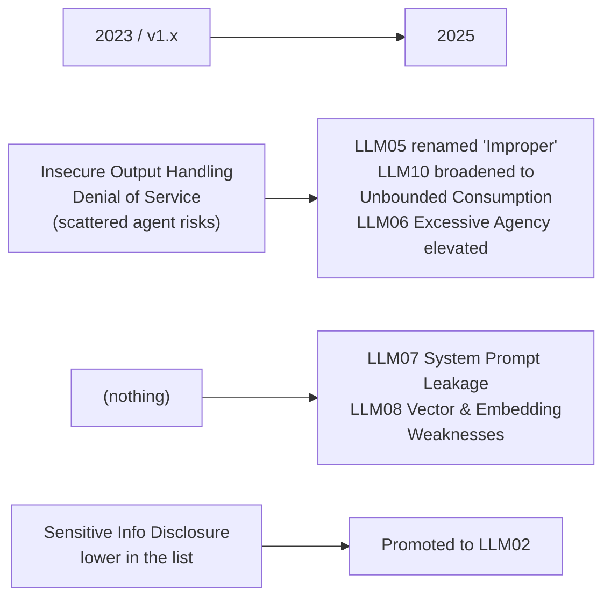

# The OWASP Top 10 for LLM Applications 2025 — Your Checklist

The single most useful artefact in this session. It is a community-maintained, vendor-neutral, **CC BY-SA 4.0** list — which means unlike almost everything else in the AI-security space, you can put it on a slide, print it as a handout, and adapt it into an internal review template, provided you keep the attribution.

> **Attribution required wherever this is reproduced:** *"OWASP Top 10 for LLM Applications 2025 — OWASP GenAI Security Project. Licensed CC BY-SA 4.0."*
> **ShareAlike caveat:** internal use is unproblematic. If you ever distribute derivative material **outside** Qualcomm, that derivative must itself carry CC BY-SA 4.0.
> **Verify at delivery:** the 2025 edition (published 2024-11-17) is current as of this writing. Check `https://genai.owasp.org/llm-top-10/` for a newer numbered edition before teaching.

---

## 1. The ten

| ID | Name | What it is, in one sentence | Where it shows up for this team |
|---|---|---|---|
| **LLM01** | **Prompt Injection** | User or content-supplied text alters the model's behaviour, because instructions and data share one channel | Every ingestion path: tickets, logs, wikis, vendor docs (`01`) |
| **LLM02** | **Sensitive Information Disclosure** | The system reveals data it should not — PII, secrets, internal documents | Over-broad RAG indexes; secrets in system prompts (`03`) |
| **LLM03** | **Supply Chain** | Compromised or untrustworthy models, datasets, adapters, plugins, or dependencies | Pulling a model or LoRA adapter from a public hub; an unvetted plugin/MCP server |
| **LLM04** | **Data and Model Poisoning** | Manipulated training, fine-tuning, or embedding data changes model behaviour | Fine-tuning on scraped internal text nobody reviewed; a poisoned RAG corpus |
| **LLM05** | **Improper Output Handling** | Downstream systems consume model output without validation | Model output turned into a shell command, SQL, HTML, or a config change (`01` §6b) |
| **LLM06** | **Excessive Agency** | The model has more permission, autonomy, or functionality than the task needs | Agents given broad tokens because scoping was tedious (`01` §5) |
| **LLM07** | **System Prompt Leakage** *(new in 2025)* | The system prompt is extracted — and worse, it contained something that mattered | Any internal assistant whose prompt encodes rules, thresholds, or credentials |
| **LLM08** | **Vector and Embedding Weaknesses** *(new in 2025)* | The retrieval layer itself is the attack surface: poisoning, cross-tenant leakage, inversion | Every RAG deployment on the roadmap (`03` §1.3) |
| **LLM09** | **Misinformation** | Confidently wrong output relied upon as fact | Session 13's entire subject, now as a *security* category |
| **LLM10** | **Unbounded Consumption** | Uncontrolled inference cost, resource exhaustion, or model theft via extraction | An agent loop with no budget cap; a public endpoint with no rate limit |

*Table content derived from the OWASP Top 10 for LLM Applications 2025 (CC BY-SA 4.0). The "where it shows up for this team" column is authored for this course.*

---

## 2. What changed from the 2023 edition, and why it matters

*Caption: the 2025 revision tracks two real shifts — agents became normal, and RAG became normal.*

**Read the diff as a story about deployment, not about research.** Between the two editions, two things became ordinary in industry: wiring models to tools, and wiring models to a vector database. The list moved accordingly.

### LLM07 — System Prompt Leakage

The new entry people find easiest to dismiss. The point is subtler than "someone read your prompt."

The *real* risk is not disclosure of the prompt; it is that teams **put things in the system prompt that were acting as security controls**: API keys, connection strings, internal thresholds ("approve refunds under $500"), role definitions, the names of internal systems. The 2025 guidance's actual position is worth internalising:

> A system prompt should be treated as **public**. Anything whose confidentiality matters does not belong in it, and any rule whose enforcement matters must also be enforced outside the model.

If your reaction is "but our prompt has nothing sensitive in it" — good, then leakage costs you nothing, which is exactly the design you want. Go and check, though. It takes ten minutes (`03` §5).

### LLM08 — Vector and Embedding Weaknesses

The entry that matters most for anything on a 2026 roadmap, because it names the RAG attack surface as its own category. Four distinct failure modes hide inside it:

| Failure mode | Mechanism | Control |
|---|---|---|
| **Index poisoning** | A document with an embedded instruction gets ingested and is retrieved for months (`01` §3) | Provenance on every ingested document; review before indexing; treat retrieved text as untrusted forever |
| **Access-control bypass** | Retrieval returns chunks from documents the asking user cannot open | Enforce source-system permissions **at retrieval time**, per user — not at ingestion time |
| **Cross-tenant / cross-project bleed** | One index serving multiple groups returns the wrong group's data | Separate indexes, or hard metadata filters that fail closed |
| **Embedding inversion / membership inference** | Embeddings retain enough information to partially reconstruct source text or confirm a document was indexed | Treat the vector store with the same classification as the source corpus — it is not "just numbers" |

The last row is the one that surprises people: **an embedding is not anonymisation**. If the source documents are confidential, the vector store is confidential.

---

## 3. Using it as a review gate

The list is more valuable as a *process artefact* than as reading. Here is the mitigation mapping to attach to any proposed internal AI use — this is the table to adapt into a real review template.

| OWASP ID | Question to ask in review | Evidence that satisfies it | Owner |
|---|---|---|---|
| LLM01 | Where does untrusted text enter? | An inventory of ingestion paths with the author of each named | Design |
| LLM02 | What can the system reach that the user cannot? | Least-privilege service identity documented; retrieval enforces per-user ACLs | Security / Config |
| LLM03 | Where did the model, adapters, and plugins come from? | Pinned versions, checksums, an approved-source list | Release |
| LLM04 | What data was used for fine-tuning or indexing, and who reviewed it? | Provenance record per corpus | Config |
| LLM05 | Is any output consumed by a machine? | Schema validation at the boundary; no `eval`, no shell, no unparameterised SQL | Dev |
| LLM06 | What is the minimum permission set for the task? | Scoped tokens; a written list of tools with a justification each | Design |
| LLM07 | Does the system prompt contain anything that matters? | Prompt reviewed; secrets moved to the tool layer | Dev |
| LLM08 | Does retrieval respect source permissions, and is the index classified? | ACL-aware retrieval test; vector store classified as the corpus | Config |
| LLM09 | What happens if the output is confidently wrong? | Named human gate with a competence statement (`05`) | Problem |
| LLM10 | What is the cost and rate ceiling? | Budget cap, rate limit, loop-iteration cap, alerting | Release / Ops |

**Two honest caveats about checklists**, which this course's voice requires us to state:

1. **A checklist is a floor, not a ceiling.** Ten boxes ticked does not mean secure; it means ten known categories were considered. The hazard method in `05` is what you use to find the risks that are not on anybody's list.
2. **The list is descriptive, not prescriptive.** OWASP tells you what goes wrong in the field. It does not tell you whether *your* use is worth the risk. That judgement is `05` and `08`.

---

## 4. Sibling frameworks and when to reach for each

| Framework | Licence | Answers the question | Use it for |
|---|---|---|---|
| **OWASP LLM Top 10 2025** | CC BY-SA 4.0 | "What commonly goes wrong?" | Design review, release gate — the day-to-day checklist |
| **NIST AI RMF 1.0 + AI 600-1 GenAI Profile** | US public domain | "How do we govern this as an organisation?" | Policy, roles, the Govern/Map/Measure/Manage cycle (`08`) |
| **MITRE ATLAS™** | Royalty-free with credit | "How would an adversary actually proceed?" | Threat modelling, red-team scoping, incident write-ups |

All three are slide-safe. Together they cover *what breaks*, *who is accountable*, and *how an attacker moves* — and none of them substitutes for the other two.

> **MITRE credit line, required wherever ATLAS material is reproduced:** *"© 2026 The MITRE Corporation. This work is reproduced and distributed with the permission of The MITRE Corporation."* First written mention should be "MITRE ATLAS™".

---

*Sources for this file: OWASP Top 10 for LLM Applications 2025, OWASP GenAI Security Project, CC BY-SA 4.0 (see `resources/sources.md` #1) — the ten names and their scope are derived from it and must carry attribution wherever reproduced. NIST AI RMF / AI 600-1 (#2, US public domain). MITRE ATLAS™ (#3, credit line required). The review-gate mapping table and the "where it shows up for this team" column are authored for this course.*
