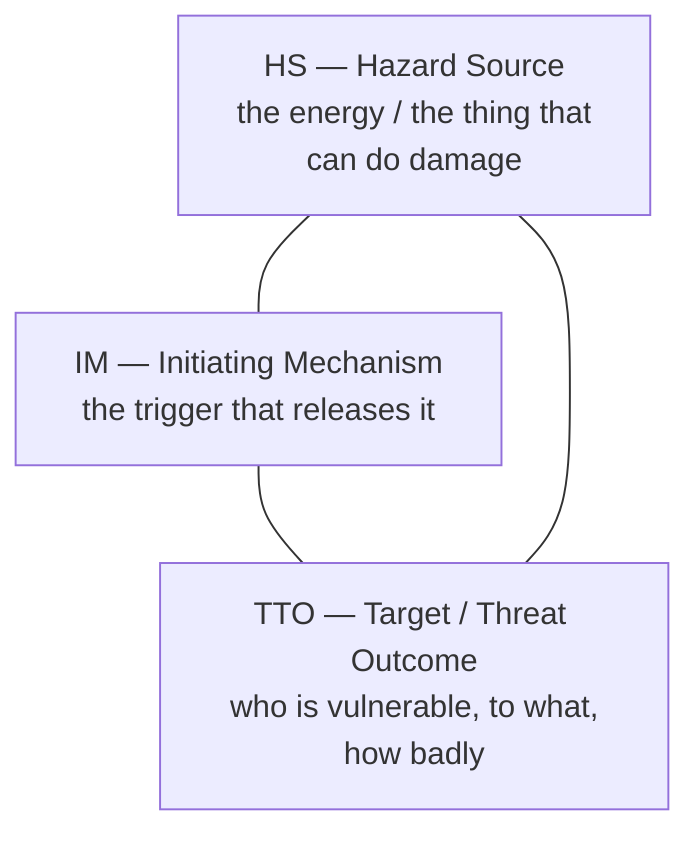
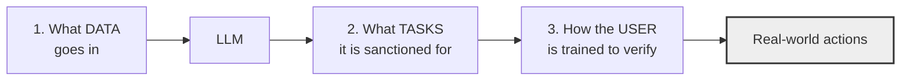
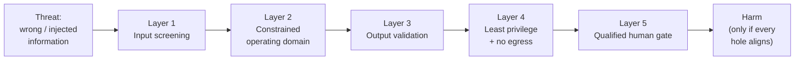

# The Hazard Triangle, the Operating Domain, and the Human Gate

Everything so far in this session named a problem. This file gives you the method for reducing one. It is the part of the source deck that is genuinely good and worth reusing — a set of tools imported from aviation and automotive system safety and pointed at LLMs. Credit where due: that port is the source deck's original contribution, even though the deck contains none of the adversarial material in `01`–`04`.

---

## 1. The hazard triangle: HS / IM / TTO

The claim is that every hazard has exactly **three** components, and that this is useful because it tells you *where to intervene*.

*Caption: the hazard triangle. Framing after the LLM-safety source deck (LINK-ONLY) — diagram original.*

**The two governing rules, and they are the whole point:**

1. **Reduce any one component → the triangle shrinks → the risk falls.**
2. **Eliminate any one component → the triangle collapses → the hazard is gone.**

The canonical non-software example: a car hitting a pedestrian. HS = a heavy object moving fast. IM = driver inattention or a control-system failure. TTO = an unprotected human body, struck, likely severe injury. You cannot eliminate the HS (the car must move) — so engineering attacks the IM (automatic braking, lane keeping) and the TTO (crumple zones, pedestrian-friendly bonnets, lower urban speed limits, separated infrastructure). Three levers, not one.

### The key abstraction for LLMs

Here is the move that makes the framework transfer:

> **For an LLM system, the hazard source reduces to a piece of wrong or suboptimal information.**

That is why `01`–`04` all belong under one method. Whether the wrong information arrived by hallucination (Session 13), by injection (`01`), by a jailbreak (`02`), or by a poisoned index (`04` LLM08), the hazard source is the same shape — and so the same three levers apply.

| Component | For an LLM system | Examples |
|---|---|---|
| **Hazard Source** | Wrong or suboptimal information | Training data; model architecture; the user's prompt; **unverified output**; an injected instruction; a poisoned retrieval chunk |
| **Initiating Mechanism** | What converts bad information into harm | An untrained, over-trusting human; **an API or pipeline that acts directly on model output**; no definition of sanctioned use; poor data-privacy management; a commercial environment that rewards over-claiming |
| **Target / Threat Outcome** | Who is hurt, how, how badly | **Individual:** financial loss, unfair treatment, hardship. **Business:** bad decisions, leaked data, shipped vulnerabilities, reputation. **Society:** systemic effects |

Note the second row, second bullet. The source deck listed *"an API that directly acts on an LLM"* as an initiating mechanism — one line, written before agents were common. That single line is the ancestor of `01` §4–5 and of the human-gate rule below. It was right, and it is now the most important row in the table.

### Worked example — an automated release-notes agent

A realistic proposal for this team. Suppose someone builds an agent that reads merged pull requests and closed defect records, drafts release notes, and **publishes them to the customer-facing portal** on a schedule.

| Component | Analysis |
|---|---|
| **HS** | Wrong information in the draft: a hallucinated fix claim, a defect summary that inverts cause and symptom, or text injected via a PR description or defect field written by an external contributor |
| **IM** | The publishing step runs unattended on a schedule. Nobody reads the draft before it is customer-visible |
| **TTO** | *Individual:* a customer acts on a fix claim that is false. *Business:* a public statement about product quality that is wrong, possibly one that discloses an unfixed security defect. Severity: high, and **irreversible** — a published page has been read before it is retracted |

Now apply the two rules:

| Lever | Concrete change | Effect on the triangle |
|---|---|---|
| Reduce **HS** | Restrict inputs to internally-authored fields; strip externally-authored PR/defect text; ground the draft in a reviewed changelog rather than free text | Smaller — fewer ways for wrong information to enter |
| Eliminate **IM** | **Remove the automated publish.** The agent drafts; a release manager reviews and publishes | **Collapses.** With no unattended action, wrong information cannot reach a customer |
| Reduce **TTO** | Publish to an internal staging page first; add a correction/retraction path; exclude security-defect content from the agent's scope entirely | Smaller — lower severity if it does happen |

Notice which lever was cheapest and most decisive: **removing the automated action**. That is the general finding, and it is why the human-gate rule (§4) is stated as a rule rather than a recommendation.

---

## 2. The operating domain: make it safer by letting it do less

The prescription that follows from the triangle. Define, in writing, three things:

*Caption: the operating-domain chain. Give every entity an explicit role — especially the user, who executes the real-world action. Framing after the source deck (LINK-ONLY).*

The source deck's exemplar is a law-firm assistant, and the instructive part is not what it may do but what it is **explicitly barred** from: it works only on internal case documents for a specific matter; it is used by qualified lawyers who can recognise a wrong output; it may **not** perform discovery (it would miss things, and nobody would know); it may **not** search the internet (it would import unverifiable content). Two hard exclusions, written down.

> **The sentence to remember:** *You make a system safer by constraining it to do less.*

### An operating-domain template you can fill in

| Field | Your answer |
|---|---|
| **Sanctioned tasks** (allowlist, not a guideline) | |
| **Explicitly barred tasks** (the part everyone skips — write at least two) | |
| **Permitted input data** (source and classification tier, per `03`) | |
| **Barred input data** | |
| **Who may use it** (role, and what competence they must have) | |
| **How output is verified, and by whom** | |
| **What actions the output may trigger, and what gates them** | |
| **Owner, review date, and the trigger for re-review (e.g. model change)** | |

Two notes on filling it in. First, **the barred rows are the valuable ones** — an allowlist with no exclusions is a wish, not a domain. Second, treat a model upgrade as a change requiring re-review: an operating domain validated against one model version is not automatically valid against the next, because refusal behaviour, tool-calling behaviour, and failure modes all move.

---

## 3. Swiss cheese: layered defence, honestly described

The layered-defence picture from Reason's model, and the reason it belongs here rather than as decoration: it is the correct mental image for `02` §3.4, where each guardrail is itself probabilistic.

*Caption: every layer has holes. Fewer tasks and conditions mean less surface area and fewer holes — so fewer chances for them to line up.*

The two things the picture is often used to obscure, stated plainly:

- **Layers are not independent.** If all five layers are LLM-based, a technique that defeats one often defeats several — the holes are correlated. A stack of five model-based guards is worth much less than three guards of *different kinds* (deterministic, architectural, human).
- **Adding layers has a cost curve.** Each one adds latency, expense, and false positives. Past a point, an extra guard makes the system annoying enough that people route around it, which opens a hole bigger than the one it closed.

---

## 4. The human gate — and why "human in the loop" is not enough

**The rule:**

> **No automated pipeline acts on model output without a qualified human gate.**

Three words in that sentence do work.

**"Automated"** — the danger is unattended action, not automation as such. Drafting is fine. Publishing, sending, merging, deploying, ordering, and closing are actions.

**"Qualified"** — Session 13 established that a human in the loop is necessary but **not sufficient**; you must also ask whether that person can actually catch the error. A gate staffed by someone who cannot evaluate the output is a rubber stamp that also creates the illusion of control, which is worse than no gate at all because it stops anyone looking further.

**"Gate"** — it must be able to *stop* the action, and stopping must be the default when the reviewer is unsure. A notification is not a gate. A gate with an auto-approve timeout is not a gate.

### The 99% / 1% trap, restated as a design constraint

The source deck's sharpest observation, and it inverts the intuition most people bring:

> If the model is right 99% of the time, catching the 1% gets **harder**, not easier.

System-safety research on automation has shown for decades that humans are poor at detecting infrequent failures in a system that is usually correct — vigilance decays, and the startle factor makes response slow when the rare event finally arrives. Applied here: **as the model improves, your human gate gets less reliable**, because the reviewer's prior shifts toward "it's fine" and they stop reading properly.

Design consequences that follow directly:

| Consequence | What to do |
|---|---|
| Vigilance decays with reliability | Don't rely on unaided review as the only control. Pair it with deterministic checks that do not get bored |
| Reviewers need a reason to look | Make the review *active*: require the reviewer to confirm specific facts, not to click "approve" |
| Sampling beats nothing | Spot-check a fixed percentage of approved outputs against ground truth, and track the error rate over time |
| Better models need **more** discipline, not less | Re-review the gate when the model is upgraded. The temptation to remove it will be strongest exactly when removing it is most dangerous |

---

## 5. Think in systems, not tasks

The closing reframe, and the one that connects this session to the audience's actual profession.

The source deck's diagnosis: fifteen years of app development trained everyone to optimise *tasks*, as though each task lived in a bubble. A system around an LLM includes people, processes, other systems, customers, and institutions — all of which absorb the consequences of that task.

> Ask not *"how do I make the model better at this task?"* but *"how does this task affect the system around it?"*

For a release, problem, or configuration manager this should feel less like a new idea than a familiar one. Change control, impact analysis, and root-cause analysis are systems disciplines. **The contribution of this session is not to teach you systems thinking; it is to point out that the AI tooling arriving in your organisation is being adopted task-by-task, largely outside the change-control discipline you already own.** The question "which system does this task sit inside, and who absorbs it when it is wrong?" is your question. Ask it about the AI tools too.

---

*Sources for this file: the HS/IM/TTO triangle, operating domain, Swiss cheese application, the 99%/1% observation, and "think in systems, not tasks" are all **framings from the LLM System Safety and Security source deck** (Nield, O'Reilly) — **LINK-ONLY** (see `resources/sources.md` #8). Concepts are paraphrased and re-expressed; all diagrams here are original, and the release-notes worked example, the operating-domain template, the correlated-layers caveat, and the design-consequences table are authored for this course. Reason's Swiss cheese model is general safety-science literature. NIST AI 600-1 (#2) supplies the Govern/Map/Measure/Manage vocabulary used in `08`.*
