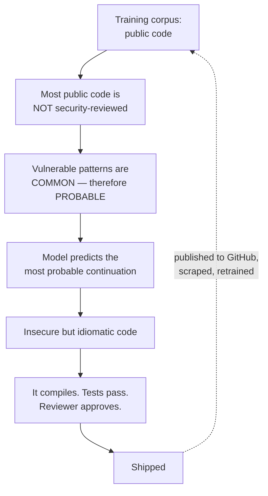

# Insecure Code Generation — Compiles and Works ≠ Secure

The one hard number this session carries, and the one most directly relevant to the developers in the room. It is also the finding most people assume has been overtaken by better models. It has not.

---

## 1. The 2021 study

**Pearce, Ahmad, Tan, Dolan-Gavitt and Karri (NYU), *Asleep at the Keyboard? Assessing the Security of GitHub Copilot's Code Contributions*** — arXiv:2108.09293, accepted at **IEEE Symposium on Security and Privacy (Oakland) 2022**.

| Element | Detail |
|---|---|
| Method | 89 security-relevant scenarios drawn from MITRE's CWE Top 25, varied along three axes: weakness diversity, prompt phrasing, and language/domain |
| Output | **1,689** generated programs, analysed with static security tooling and manual review |
| Headline result | **~40% vulnerable.** The commonly quoted precise figure is **39.33%** of top suggestions; the paper's own abstract rounds it to "approximately 40%" |
| Weakness types covered | 25 common CWE categories — SQL injection, path traversal, hardcoded credentials, improper input validation, buffer issues, weak crypto, and others |

**Report it as "~40% (39.33%)"** and be prepared to be precise about the denominator: it is the proportion of *top-ranked suggestions across security-relevant scenarios*, not "40% of all code Copilot writes is exploitable." A technical audience will and should push on that distinction — the scenarios were deliberately chosen to be security-sensitive. **Verify the exact figure against the paper before putting it on a slide.**

> **Correction note.** The source deck cites this study accurately (see `../../AI_input.md` §7). What the deck does *not* do is check whether the finding still holds four years later. That is §2, and it is the more important half.

---

## 2. It did not get better

The reasonable expectation was that bigger, better, more heavily post-trained models would close this. The evidence says otherwise.

| Study / source | Year | Scope | Result |
|---|---|---|---|
| Pearce et al. (Copilot / Codex) | 2021–22 | 89 scenarios, 1,689 programs | **~40% (39.33%)** vulnerable |
| FormAI benchmark | 2023 | Large C program corpus, GPT-3.5 | **~51%** of outputs contained vulnerabilities |
| FormAI replication across 9 models | 2024 | Multiple modern models | **~62%** vulnerable |
| Veracode / industry evaluation | 2025 | Many models, multiple languages | **~45%** of generated code introduced a security flaw; secure roughly 55% of the time |
| "Hidden Risks of LLM-Generated Web Application Code" (arXiv:2504.20612) | 2025 | Security-centric evaluation of web code | Large fractions non-compliant with secure-coding baselines |

**Read the trend honestly.** The methodologies differ — different languages, different scenario sets, different definitions of "vulnerable" — so these numbers are **not** a clean time series and you should not draw a line through them. What they support is a much weaker, much safer claim, and it is the claim to make:

> Across four years, multiple independent methodologies, and successive model generations, the fraction of security-relevant generated code containing a vulnerability has stayed in roughly the **40–60%** band. **The problem has not been solved by scale.**

*(All figures: verify at delivery. This is the fastest-moving table in the session.)*

---

## 3. Why it does not improve

Not a mystery, and not a bug that a patch release will fix.

*Caption: the mechanism, and the feedback loop that keeps it stable.*

Four contributing causes:

1. **The training data is the internet's code, and the internet's code is mostly not security-reviewed.** The model learns what is *common*, and insecure patterns are common. This is Session 1's mechanism applied to source code: it predicts the probable continuation, and "probable" has never meant "correct."
2. **Security is context-dependent in a way the model cannot see.** Whether string concatenation into a query is a vulnerability depends on whether the input is attacker-controlled — a fact about your architecture that is not in the prompt. The model is answering a narrower question than the one that matters.
3. **The optimisation target is plausibility, not safety.** Post-training rewards helpful, working code. "Working" is easy to evaluate; "secure" is not, so it is under-weighted in exactly the way you would predict.
4. **The feedback loop.** Generated code is committed, published, scraped, and becomes training data. The source deck names this pattern in general (its "ouroboros") and lists it as a Copilot-specific risk in its own Case #1: new programmers become fluent in the assistant's patterns, those patterns become the corpus, and the corpus reinforces the patterns.

---

## 4. What this changes for how you work

The finding is **not** "don't use AI coding assistants." Productivity gains are real, and this course is not in the business of pretending otherwise. The finding is that **the assistant shifts where the risk sits**, and your process has to move with it.

| The old assumption | What actually changed |
|---|---|
| Code review catches what the author missed | The author may not have *read* the code carefully — accepting a suggestion feels like reviewing it, and is not |
| Volume of code roughly tracks author effort | Volume can now far exceed review capacity. **Review, not authorship, is the new bottleneck** |
| A junior's mistakes are recognisably junior | Generated code looks idiomatic and confident at every skill level, so the usual "this looks off" signal is gone |
| "It works" is meaningful evidence | It never was, but the illusion is stronger now. **Compiling and passing tests is evidence about functionality only** |

Concrete practices, roughly in order of value per unit of effort:

| Practice | Why it earns its place |
|---|---|
| **Run SAST/SCA on generated code, always** | Deterministic tooling does not get bored, does not trust fluency, and catches the CWE categories these studies measure. This is the highest-return control by a distance |
| **Require the author to state what the code does** in the PR, in their own words | Cheap, and it surfaces "I accepted a suggestion I don't fully understand" without anyone having to admit it |
| **Treat generated code as third-party code** | It came from an unreviewed corpus. Apply the scrutiny you apply to a new dependency — which is a review posture your organisation already has |
| **Never accept generated code in the security-sensitive paths without expert review** | Auth, crypto, input validation, deserialisation, file paths, subprocess and shell invocation, SQL. These are exactly the scenarios in the studies |
| **Do not paste secrets or confidential code into unsanctioned assistants** | The `03` rule, restated where it actually bites |
| **Track it.** Tag PRs with AI-assisted content and measure defect rates | You cannot manage what you do not measure, and in a year you will want your own number, not a paper's |

---

## 5. The line to remember

> **Just because your code compiles and "works" does not mean it is secure.**

The source deck's phrasing, and it has aged well. Extend it one step for 2026:

> **And just because a newer model wrote it does not make it safer. Four years of evidence says the rate did not move.**

---

*Sources for this file: Pearce et al., arXiv:2108.09293 / IEEE S&P 2022 — the statistic is a citable fact; **do not reproduce the paper's figures or tables** (see `resources/sources.md` #5). FormAI, Veracode, and arXiv:2504.20612 figures likewise cited, not reproduced (#5). The "compiles and works ≠ secure" phrasing and the over-reliance feedback-loop framing come from the LLM-safety source deck Case #1 (#8, LINK-ONLY — paraphrased). OWASP LLM Top 10 2025 LLM03 Supply Chain and LLM05 Improper Output Handling are the relevant checklist entries (#1, CC BY-SA 4.0).*
