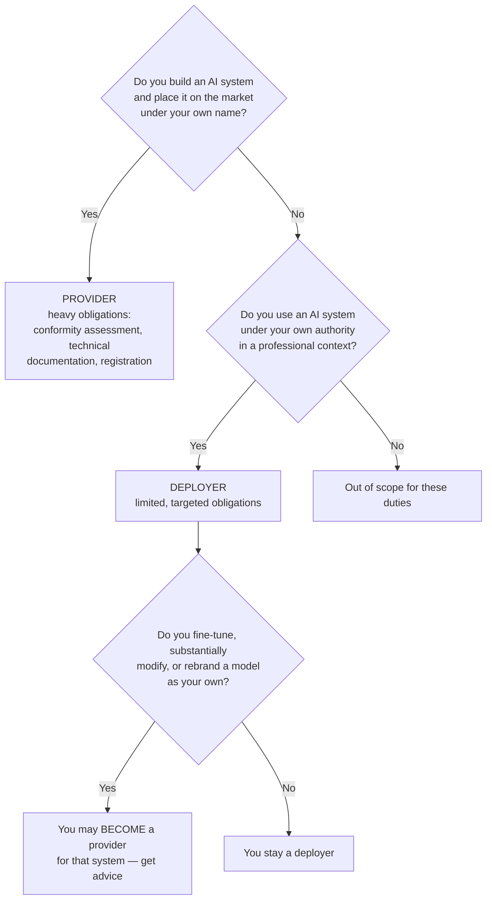
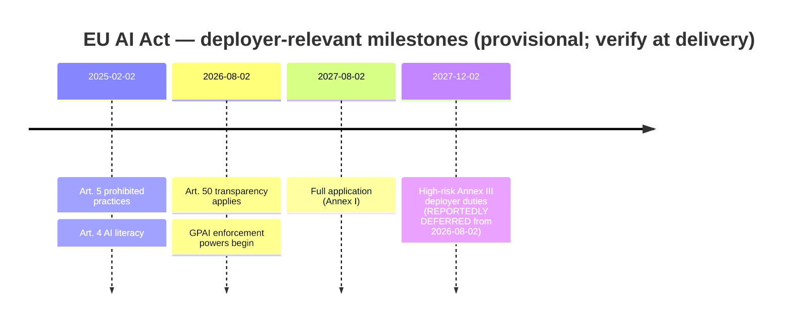

# The EU AI Act — One Honest Slide for a Deployer

Most EU AI Act material is written for *providers* — the organisations that build and place AI systems on the market. Almost none of it applies to a company that internally **uses** AI built by someone else. This file gives you the deployer's position, and marks clearly which parts are settled and which are not.

> ⚠️ **PROVISIONAL — VERIFY AT DELIVERY.** The dates below reflect the position as researched in **July 2026**, including a **reported provisional political agreement of 2026-05-07** ("Digital Omnibus") that would defer high-risk obligations. Provisional agreements change, and final text can differ from what is reported. **Re-check `https://artificialintelligenceact.eu/implementation-timeline/` and the Commission's own pages before teaching this, and say in the room that you did.** This is a training session, not legal advice; your legal and compliance function owns the actual position.

---

## 1. Which role are you?

The Act assigns duties by role, and this is the whole ballgame.

*Caption: role determines duty. Most internal Qualcomm AI use sits in the DEPLOYER box.*

**The practical read:** using a commercial model through an API or an enterprise product, for internal work, makes you a deployer. General-purpose AI (GPAI) *provider* obligations — model documentation, copyright policy, training-data summaries — are the model vendor's problem, not yours. Your interest in them is as a **downstream user**: keep the provider's documentation on file for the models you adopt.

**The trapdoor** is the bottom of the diagram. Fine-tuning a model substantially, or putting it on the market under your own name, can make you a provider for that system. If a team is considering either, that is a conversation with legal *before* the work starts, not after.

---

## 2. The deployer timeline

| Date | What applies | Status | What it means for you |
|---|---|---|---|
| **2025-02-02** | **Art. 5 — prohibited practices** | **In force** | The hard "don't" list. Applies to deployers. Includes social scoring, certain manipulative systems, untargeted facial-image scraping, and — note this one — **most emotion recognition in the workplace** |
| **2025-02-02** | **Art. 4 — AI literacy** | **In force** | Ensure staff who operate or oversee AI systems have adequate competence. **This training series directly supports that duty** |
| **2025-08-02** | GPAI provider obligations (Art. 53/55) | In force for providers | Not yours. Commission **enforcement powers, including fines, begin 2026-08-02** |
| **2026-08-02** | **Art. 50 — transparency** | **Applies from this date** | Disclose to people when they are interacting with an AI system; label AI-generated or manipulated content. Relevant if an internal tool presents as a chatbot to employees or customers |
| **~~2026-08-02~~ → 2027-12-02** | **High-risk (Annex III) deployer duties** | **PROVISIONAL — reportedly deferred** | Human oversight, input-data relevance, monitoring, log retention. **Verify the final date** |
| **2027-08-02** | Full application (Annex I — AI in regulated products) | Scheduled | Relevant only if AI is embedded in a regulated product |

*Caption: the deployer's dates. The 2027-12-02 entry is the provisional one — the others are settled.*

---

## 3. The five things a deployer actually does

Stripped of legal apparatus, the deployer position is short.

| # | Duty | What "done" looks like |
|---|---|---|
| 1 | **Stay out of the prohibited list** | A named check in your AI-use policy (`08`). The workplace emotion-recognition ban is the one internal teams stumble into — think twice about anything that infers employee mood, engagement, or stress |
| 2 | **AI literacy for anyone operating or overseeing AI** (Art. 4) | A training record. **This series is the artefact** — keep attendance, keep the material, note the date |
| 3 | **Plan Art. 50 disclosure for 2026-08-02** | Any tool that talks to a human says it is AI. Any AI-generated content that could be mistaken for human-made is labelled |
| 4 | **If anything you deploy is high-risk under Annex III, prepare oversight and logging** | Human oversight assigned to a competent person; input data relevant to purpose; logs retained; monitoring in place. Note these are things you should do anyway — `05` |
| 5 | **Keep provider documentation on file** | A register of adopted models with the vendor documentation attached. A configuration-management task, and therefore already someone's job here |

---

## 4. Why this belongs in a security session

Two reasons, and neither is "because compliance."

**The duties and the engineering agree.** Look at duty 4 against `05`: assign human oversight to a competent person; keep logs; monitor. That is the human gate and the audit trail, arrived at from a completely different direction. When a regulator and a system-safety engineer independently reach the same control, the control is probably right. Do it because it prevents incidents; the compliance benefit is a side effect.

**Art. 4 makes this session's existence a compliance artefact.** That is worth saying out loud, once, without smugness: an organisation that runs structured AI training for the people operating AI systems has evidence of AI literacy. An organisation that does not has a gap. **Keep the attendance record.**

---

## 5. What to tell the room, in sixty seconds

If the session is running long — and it will be (see the README agenda note) — this is the whole slide:

> You are a **deployer**, not a provider, so most of the Act is not yours. Three things: the **prohibited-practices** list applies today, and workplace emotion recognition is on it. The **AI-literacy** duty applies today, and this training is how we satisfy it. **Transparency** duties — telling people they are talking to an AI — apply from **August 2026**. High-risk deployer duties are **reportedly deferred to December 2027**, which is provisional, so we will confirm. Nothing here changes what we already decided to do in `05`.

---

*Sources for this file: European Commission regulatory-framework pages and the AI Act implementation timeline (see `resources/sources.md` #12); EU AI Office AI Act Service Desk, Article 4 (#13). Official EU material — reference and paraphrase; **all dates and the deferral in particular must be re-verified at delivery.** This file is training material, not legal advice.*
