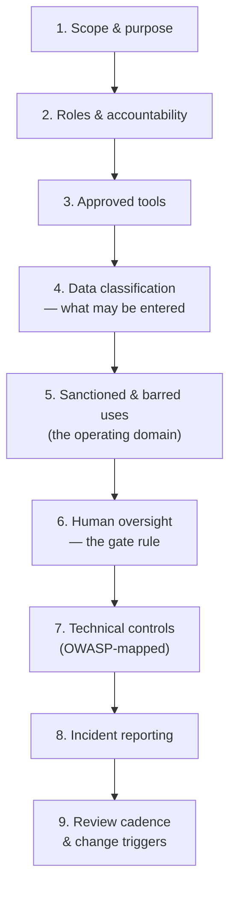

# Writing Your Own AI-Use Policy

The closing artefact. The source deck names organisational policy as an explicit learning objective and then delivers five exhortations rather than a template (`../../AI_input.md` §4, gap #6). This file fills that gap: reuse-safe source material, a structure that works, and a drafting exercise the team can complete in a single session.

---

## 1. Why the team writes it, not a consultant

Three reasons, and the third is the real one.

1. **You know your data.** Only this team knows that a certain defect field is customer-authored, that a certain baseline is under NDA, or that a certain log contains device serials. A generic policy cannot.
2. **Policy that is not owned is not followed.** A document nobody in the room helped write becomes a link in an onboarding email.
3. **The drafting *is* the risk assessment.** Filling in "what may not be pasted" forces the classification conversation from `03`. The document is a by-product; the conversation is the deliverable.

---

## 2. Reuse-safe source material

The open web for "AI use policy template" is dominated by vendor lead-generation. These are the credible, licence-clean alternatives.

| Source | Org | What it gives you | Licence | Verdict |
|---|---|---|---|---|
| **NIST AI RMF Playbook** | NIST (US) | Govern/Map/Measure/Manage sub-categories with suggested actions; downloadable as **PDF, CSV, Excel, JSON** — import the controls straight into a spreadsheet | **US public domain** | **SLIDE-SAFE** — the cleanest reuse of all |
| **UK Government AI Playbook** | UK GDS/DSIT (Feb 2025) | 10 principles plus a safe-and-responsible-use section (bias, privacy, security, governance) aimed at organisations *using* AI | **Open Government Licence v3.0** — copy, adapt, commercial use, with attribution | **SLIDE-SAFE** |
| **GSA Order CIO 2185.1C** | US GSA (Mar 2026) | A real, signed internal AI-use policy: applicability scope, roles, prohibited-input rules, GenAI output labelling | **US public domain** | **SLIDE-SAFE** — strip the US-statutory scaffolding when adapting |
| **OWASP LLM Top 10 2025** | OWASP GenAI Security Project | The technical risk register the policy's control section maps to (`04`) | CC BY-SA 4.0 | **SLIDE-SAFE** with attribution |
| **NSW AI Assessment Framework** | Digital NSW (Feb 2026) | A working **Excel** risk-triage self-assessment across the AI lifecycle | Copyright NSW, no CC stated | **ADAPT STRUCTURALLY / verify terms** |
| **CNIL AI self-assessment guide** | CNIL (French DPA) | Analysis grid + fact sheets for GDPR/AI maturity | French public body, no explicit CC | **REFERENCE / verify** |

**The recommended combination: NIST AI RMF Playbook + UK Government AI Playbook.** Public domain and OGL v3.0 respectively, both aimed at deployers, both adaptable without a licensing conversation. Use NIST for the control structure and UK for the readable principles text.

*Unverified as of the research date — do not assert their contents: the Australian DTA policy and the Singapore IMDA/PDPC framework. Check manually if you want them.*

---

## 3. A structure that works

Nine sections. Anything longer will not be read.

*Caption: nine sections. Sections 4, 5 and 6 are the ones that change behaviour; the rest is scaffolding.*

| § | Section | Must contain | Source to lean on |
|---|---|---|---|
| 1 | **Scope & purpose** | Who and what it covers; explicitly, whether personal accounts used for work are in scope (they are) | GSA 2185.1C structure |
| 2 | **Roles & accountability** | Who approves a new AI use; who owns each deployment; who the incident contact is. **Names or roles, not "the organisation"** | NIST **Govern** |
| 3 | **Approved tools** | The allowlist, with tier (enterprise vs. consumer) and what each is approved for. Plus: how to request an addition | Your own |
| 4 | **Data classification** | The RED / AMBER / GREEN / UNKNOWN table from `03`, with **your** real examples | `03` + NIST **Map** |
| 5 | **Sanctioned & barred uses** | The operating-domain template from `05`, per deployment. **At least two explicit exclusions each** | `05` |
| 6 | **Human oversight** | The gate rule verbatim; what "qualified" means here; that a gate must be able to stop the action | `05` §4 |
| 7 | **Technical controls** | The OWASP review-gate table from `04` §3, assigned to owners | `04` + NIST **Measure** |
| 8 | **Incident reporting** | What counts as an AI incident (include: suspected injection, leaked data, a confidently wrong output that reached a customer); who to tell; within what time | NIST **Manage** |
| 9 | **Review cadence** | A date, and the change triggers — **a model upgrade is a change trigger** (`05` §2) | NIST **Govern** |

### Two sections people get wrong

**Section 3, approved tools.** The failure mode is a policy that lists what is *forbidden* without making the approved path easy. If the sanctioned tool is slower or worse, people will use the unsanctioned one, and you have converted a manageable risk into an invisible one. **Treat tool provisioning as a security control, because it is one.**

**Section 8, incident reporting.** Most AI-use policies have no incident section at all, which means nothing is ever reported, which means the organisation believes it has had no incidents. Define the categories, make reporting blameless, and expect the first reports to be about people pasting the wrong thing — which is exactly what you want to hear about early.

---

## 4. The drafting exercise (the session's closing activity)

**Format:** four groups, one section each, 12 minutes drafting and 8 minutes reporting back. Run it in the Q&A block, or as follow-up homework if time has gone.

| Group | Section | Deliverable | Success looks like |
|---|---|---|---|
| **A** | §4 Data classification | The four-tier table populated with **ten real artefacts** from this team's work | At least one genuine disagreement about which tier something belongs in — that disagreement is the finding |
| **B** | §5 Sanctioned & barred uses | One operating domain, fully filled, for a **real** proposed AI use in the team | The barred rows are non-empty and specific |
| **C** | §6 + §7 Oversight & controls | The gate rule adapted, plus the OWASP table with an owner per row | Every row has a named owner; no row says "TBD" |
| **D** | §8 Incident reporting | The incident-category list and the reporting path, on one page | A junior engineer could follow it at 6pm on a Friday |

**Debrief questions:**
1. Which tier assignment did you argue about? What does that tell you about how clear this is to someone who was not in the room?
2. Which barred use was hardest to write down, and why? (Usually: because someone is already doing it.)
3. Which OWASP row had no obvious owner? That gap is the real output of this exercise.
4. What is the *first* thing someone should do on discovering they pasted something they should not have? Is that written anywhere today?

---

## 5. The four failure modes of AI policies

Worth reading before you write, because all four are common and all four are avoidable.

| Failure mode | Symptom | Fix |
|---|---|---|
| **Too long** | 30 pages, nobody past page 3 | Two pages plus appendices. If a rule cannot be recalled at the moment of temptation, it does not exist |
| **All prohibition, no path** | Lists what you may not do; silent on how to get approval | Every "no" gets a "here's how to ask" |
| **Written once** | Dated last year, names a tool the team stopped using and a model that was retired | §9 with real dates and a model-upgrade trigger |
| **No teeth and no telemetry** | No owner, no incident reports, no measurement | §2 names people; §8 defines incidents; track the redaction counts from `03` §4 |

---

## 6. The closing frame

The source deck ends its policy section with a call to action rather than a template — and while that is a gap, the sentiment underneath it is sound and worth carrying:

> Create AI policies tailored to *your* organisation's actual problems, weigh the human consequences, discuss it openly, and keep asking questions in a culture that rewards confidence over accuracy.

This session's addition is simply that a template beats an exhortation. **You now have both.**

---

*Sources for this file: NIST AI RMF Playbook (see `resources/sources.md` #2, US public domain — CSV/Excel importable); UK Government AI Playbook (#14, Open Government Licence v3.0 — attribution required); GSA Order CIO 2185.1C (#15, US public domain); OWASP LLM Top 10 2025 (#1, CC BY-SA 4.0); NSW AI Assessment Framework and CNIL self-assessment guide (#16, #17 — verify terms before reuse). The nine-section structure, the failure-mode table, and the drafting exercise are authored for this course. The closing sentiment is paraphrased from the LLM-safety source deck (#8, LINK-ONLY).*
