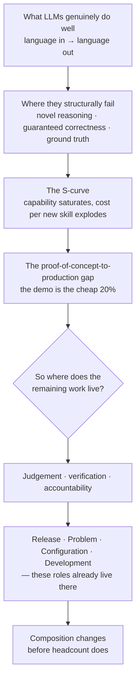

# Overview — Two Questions, One Answer

This session answers the two questions people actually have about AI, and it answers them in an order that matters: *what can this thing really do?* first, *what does that mean for my job?* second. Reversing the order produces either panic or complacency, because a job forecast built on a wrong capability model is just a mood.

---

## 1. The arc

*Caption: the session's argument in one path — capability limits determine cost structure, cost structure determines what stays human, and what stays human is what these four roles already do.*

## 2. The claim this session defends

> **AI changes the composition of these jobs before it eliminates any of them. The human moves up the stack toward judgement, verification and accountability — which is where release, problem, and configuration management already live.**

Two things to notice about that sentence, because they are both load-bearing and both easy to miss:

- **"Before"** is a word about *sequence*, not about *safety*. It says recomposition happens first. It does not promise that elimination never follows. `content/10-what-to-actually-do.md` §4 names the conditions under which the second thing starts happening, because a session that only makes the comfortable half of the claim is not honest.
- **"These roles already live there"** is the genuinely good news, and it is not flattery. A role whose value is *typing* is exposed. A role whose value is *deciding, under uncertainty, with your name on the decision* is much less exposed, because the thing that would have to be automated is not text generation — it is accountability, and accountability is not a capability, it is a social and legal relationship. You cannot page a model at 03:00 and hold it responsible.

## 3. What this session is not

| Not this | Because |
|---|---|
| "AI won't replace you, it will augment you." | True-ish, vacuous, and unfalsifiable. It survives no contact with a room that has read a layoff announcement. We do task-level analysis instead. |
| "AI will replace 40% of jobs by 20XX." | Every such number is a headline built on a task-count study with a stated methodology that the headline dropped. We will not add to the pile. |
| A prediction session. | We make one structural argument (the S-curve and the production gap) and derive consequences from it. Where the argument runs out, we say so. |
| A reassurance session. | Reassurance is what you offer when you have nothing specific to say. We have specifics. |

## 4. Why *this* audience gets the best seat

The single most useful fact in this session is that the corpus this course draws on has a recurring obsession — **the gap between the demo and production** — and that gap is not an abstract industry problem. It is a job description.

- Someone has to decide whether a build ships. That is **release management**.
- Someone has to work out why the thing that shipped is now misbehaving, and prevent recurrence. That is **problem management**.
- Someone has to know what is actually deployed where, and control what changes. That is **configuration management**.
- Someone has to write, review, and own the code. That is **development**.

Every one of those is a "the last 20% is the hard part" job. The technology whose defining economic feature is that *the last 20% is where the cost explodes* is not obviously the enemy of people who specialise in the last 20%. It is more likely to be their largest new workload.

That is the optimistic reading, and it is honest. The pessimistic reading is in `content/10`, and it is also honest: more workload with the same headcount is a productivity expectation, and productivity expectations are how composition change turns into headcount change. Both readings are in this session.

## 5. Reading order

| File | What it covers |
|---|---|
| `01-what-llms-do-well.md` | The four capability families, and the property they share. |
| `02-where-they-structurally-fail.md` | The three structural failures, derived from the mechanism — plus the can/can't table. |
| `03-the-s-curve.md` | Why capability saturates and cost explodes. The ~80% plateau. |
| `04-the-production-gap.md` | What actually lives between a working demo and a running system. |
| `05-the-three-buckets.md` | The framing: automate / augment / gets harder. Why "replaced vs. safe" is the wrong question. |
| `06-role-release-manager.md` | Task-level decomposition. |
| `07-role-problem-manager.md` | Task-level decomposition. |
| `08-role-configuration-manager.md` | Task-level decomposition. |
| `09-role-developer.md` | Task-level decomposition, including why review gets *more* important. |
| `10-what-to-actually-do.md` | Skills to build · what to delegate · what never to delegate · the honest caveats. |
| `99-key-takeaways.md` | The recap and the one-line close. |
