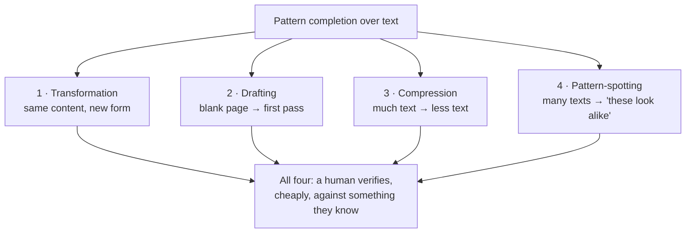

# What LLMs Genuinely Do Well

Before we can talk sensibly about jobs we need an honest capability model. This file is the "can" side. It is deliberately generous — if we understate what the technology does, everything downstream is worthless.

---

## 1. One property explains the whole list

Recall the mental model from Session 1: **an LLM is a pattern-completion engine over text, not a lookup engine over facts.** It has been trained on an enormous amount of language and it is very, very good at producing the text that plausibly follows the text you gave it.

Everything an LLM is genuinely excellent at inherits directly from that:

> **LLMs excel when the task is a transformation from one form of language into another form of language, where the information needed is already present in the input, and a human can cheaply check the result.**

Three clauses, all necessary:

| Clause | Why it matters | What breaks without it |
|---|---|---|
| **Language → language** | This is the trained competence. | Numerical accuracy, physical reasoning, and "look this up" are not language transformations, and results degrade sharply. |
| **Information already in the input** | The model is re-arranging, not discovering. | If the answer isn't in the input or reliably in the training data, the model produces the *shape* of an answer — a hallucination. |
| **Cheap human verification** | This is the safety property, and it is the one people skip. | If checking the output costs as much as producing it, you have saved nothing and added a risk. |

That third clause is the same decision rule the LLM-safety material lands on: an LLM application is defensible when the user can **easily verify** the output, or when **truth is irrelevant** (fiction, brainstorming, art). Hold onto it; the whole jobs analysis in `content/06`–`09` is an application of it (see `resources/sources.md` #2).

## 2. The four capability families

*Caption: four families, one mechanism, one shared safety requirement.*

### Family 1 — Language transformation

Same information, different form. Reformat, restructure, translate, change register, convert prose to a table, convert a table to prose, turn bullet points into a paragraph and back.

This is the single most reliable thing an LLM does, because the ground truth is sitting right there in the input. If you give it a change log and ask for the same change log grouped by component, you can check it by reading. Errors are *visible*.

**Worked example.** 40 merged pull-request titles in, "group these into user-facing changes, internal refactors, and dependency bumps, as a markdown table" out. Time saved: perhaps 25 minutes. Risk: a mis-categorised row, which a reviewer who knows the codebase spots in seconds. Excellent trade.

### Family 2 — Drafting

Producing a first pass over a blank page. The value is not that the draft is good; it is that **editing is cognitively cheaper than originating**, and the draft gives you something to react to.

The critical discipline here comes from the safety corpus's email-tone example: *the requirement that a human drafts or reviews before it goes out is not a limitation on the workflow — it **is** the safety control.* Remove the review step and a "safe" application becomes an unsafe one without any change to the model.

**Worked example.** A first-cut incident summary from a 900-line chat transcript. The model gets the sequence of events roughly right and the causal claim wrong. That is still a win, because "roughly right sequence, wrong cause" is exactly the artefact a problem manager is trained to correct — and correcting it is faster than writing it.

### Family 3 — Compression and summarisation

Many words in, fewer words out. Summaries, executive one-pagers, "what changed between these two documents," extracting the five decisions from an hour of meeting notes.

Two honest caveats, both from the hallucination taxonomy in Session 13:
- **Intrinsic hallucination** — the summary contradicts the source document. This is the failure mode of summarisation and of RAG. It is *detectable* by checking against the source, which is why summarisation stays in the "safe with verification" zone.
- **Lossy in a biased way.** Models tend to preserve what is *stated emphatically* over what is *stated once, quietly, in a subordinate clause*. In an incident transcript, the quiet clause is often the important one. Summarisation is not neutral compression.

### Family 4 — Pattern-spotting over text

Given many documents, "which of these look alike," "does anything here contradict anything else," "which of these 300 tickets are probably the same underlying issue."

This is the family with the most upside for this audience and the one people underuse. It is also the family where the model's output is a **hypothesis, never a finding**. "These 14 tickets look like the same root cause" is a lead worth an hour of a human's time. It is not a root cause.

## 3. The capability table

Bring this one to the slide. It is the reference artefact of Half A.

| Task shape | Verdict | Why | Required control |
|---|---|---|---|
| Reformat / restructure existing text | **Genuinely good** | Pure transformation; ground truth is in the input | Skim-read |
| Translate between natural languages | **Genuinely good** | Core trained competence | Native-speaker check if it's going external |
| Draft a first pass from notes | **Genuinely good** | Editing is cheaper than originating | Human edits and owns the result |
| Summarise a long document | **Good with verification** | Lossy and non-neutral; intrinsic hallucination possible | Spot-check against source; never summarise a document nobody has read |
| Explain unfamiliar code or a config file | **Good with verification** | Strong pattern match to public code | Verify any claim you would act on |
| Generate boilerplate code | **Good with verification** | Very strong pattern match | Review — see the ~39% finding, Session 14 |
| Cluster/correlate many tickets or logs | **Good as a hypothesis generator** | Genuine strength; no notion of correctness | Treated as a lead, never as a finding |
| Answer a factual question from memory | **Unreliable** | Pattern completion, not lookup | Ground it (RAG) or don't use it |
| Arithmetic / counting / precise aggregation | **Unreliable** | Not a language transformation | Use a tool; make the model call a calculator, not be one |
| Guarantee a property ("this config is correct") | **Structurally impossible** | No mechanism produces guarantees — see `02` | Use a checker, not a model |
| Reason about a genuinely novel situation | **Structurally weak** | Extrapolation, not interpolation — see `02` | Human |
| Decide, and be accountable for the decision | **Not a capability at all** | Accountability is a relationship, not an output | Human, named |

## 4. The trap hiding in this list

Every "genuinely good" row above shares a property that quietly sets up the second half of this session: **the model produces the artefact and a human absorbs the verification cost.**

That is a good trade at low volume. At high volume it is a different job. If your team's throughput of AI-drafted artefacts goes up 5×, and each one still needs a competent human to check it, you have not automated the work — you have **moved the work from producing to verifying**, and increased its quantity.

This is the *verification paradox* from Session 13, restated: the better the model gets, the more output it generates, the fewer errors it makes per artefact, and the harder those remaining errors are to spot — because the human is now reviewing a large volume of material that is nearly always right, which is precisely the condition under which human vigilance is known to fail.

Hold that thought. It is the mechanism behind every "gets harder" row in `content/06`–`09`.
