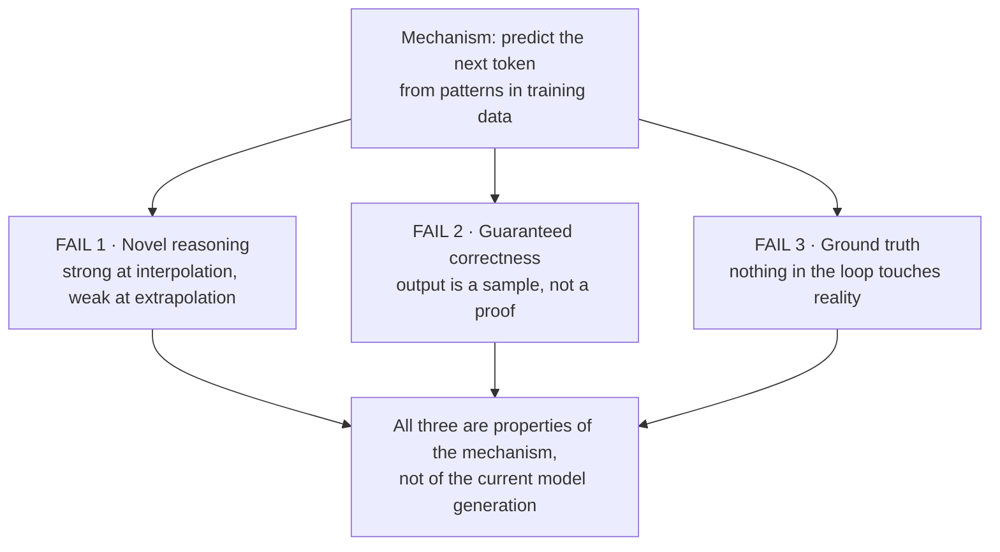

# Where LLMs Structurally Fail

"Structurally" is the operative word. This file is not a list of things that are hard *today* and will be fixed in the next model release. It is a list of things that follow from the mechanism, and would require a different mechanism to fix.

---

## 1. The distinction that makes this file worth reading

There are two very different sentences people say, and they get conflated constantly:

| Sentence | Meaning | Example | How to bet |
|---|---|---|---|
| **"It can't do that *yet*."** | A quantitative limit. More data, more compute, better training, and it improves. | Writing competent unit tests. Handling a 400-page document. | Assume it improves. Plan for it. |
| **"It can't do that, *structurally*."** | A qualitative limit. It follows from what the thing is. | Guaranteeing a config is correct. | Do not build a plan that depends on this being fixed. |

Most public discourse about AI limits is about the first category and is therefore obsolete within eighteen months. This file is deliberately restricted to the second. Three items only — a short list is more useful than a long one, and a short list is defensible.

*Caption: three failures, one root cause — each is inherited from "predict the next token," not from insufficient scale.*

---

## 2. Failure 1 — Novel reasoning (interpolation vs. extrapolation)

**The mechanism.** A model trained on a huge corpus builds a very rich map of the space of things people have written. Ask it something that sits **inside** that space — between points it has seen, densely surrounded by similar material — and it performs superbly. That is **interpolation**, and it covers an astonishing amount of useful work, because most of what any of us do at a keyboard has been done in similar form before.

Ask it something that sits **outside** that space and it does not fail loudly. It produces a fluent, confident, well-structured answer built by extending the nearest pattern it knows. That is **extrapolation**, and it is where hallucination lives. The model has no internal signal that says "I am now off the edge of the map."

**Why this matters to this audience specifically.** The situations that consume your time are, by definition, the ones that are not routine. A release that went fine is not a release you remember. The incidents that need a problem manager are the ones the runbook didn't cover. **Your professional value is concentrated precisely in the region where the model is weakest** — not because the model is stupid, but because your job is what's left after the patterned cases have been handled.

**The concrete form of the failure.** It is not "the model says I don't know." It is:
- A root-cause narrative that is coherent, plausible, mentions the right components, and is wrong.
- A remediation step that is exactly what you would do for the *similar-looking* problem, which this is not.
- A confident claim about a system behaviour that is true of the popular open-source project the model has seen ten thousand times, and false of your fork.

**What does *not* fix it.** "Reasoning" models — the ones that generate a long internal chain of thought before answering — genuinely improve performance on many multi-step problems, and you should use them for such problems. But they are still generating tokens from patterns; a longer chain of plausible steps is a better search over the space it knows, not an escape from it. The evidence in the corpus is blunt about this: reasoning modes sometimes *don't* help, and on some tasks the reasoning-tuned models hallucinate *more* than their non-reasoning siblings (see `resources/sources.md` #3). Do not plan around chain-of-thought converting extrapolation into interpolation.

## 3. Failure 2 — Guaranteed correctness

**The mechanism.** The model's output is a **sample from a probability distribution over token sequences**. That sentence contains the whole problem. A sample can be excellent. A sample cannot be a guarantee. There is no step in the process where anything is *proved*.

This is a different claim from "it makes mistakes." Compilers make mistakes. Humans make mistakes. The difference is the *shape* of the error distribution and whether you can bound it:

| System | Error behaviour | Can you bound it? |
|---|---|---|
| A schema validator | Deterministic. Same input → same verdict, always. | **Yes.** It is either correct or it has a bug you can find and fix once. |
| A unit test suite | Deterministic over what it covers. | **Yes**, to the coverage boundary — which you can measure. |
| An experienced engineer | Errors correlate with fatigue, unfamiliarity, time pressure. | **Partly.** You can manage the conditions. |
| An LLM | Errors correlate with distance from training distribution — which you **cannot observe**. | **No.** There is no coverage metric and no confidence signal you can trust. |

That last row is the one to sit with. You cannot ask the model how far off the map it is, because the thing that would answer is the same mechanism that is off the map. This is the pedestrian paradox from the safety corpus, generalised: *when a system has failed to recognise something, how would it recognise that it failed?* (see `resources/sources.md` #2).

**The practical consequence.** Anywhere your process currently depends on a *guarantee* — "this configuration matches the baseline," "these two builds are identical," "this change touches nothing outside module X" — **the LLM is the wrong tool and a deterministic checker is the right one.** The LLM's proper role there is to explain the checker's output to a human, not to be the checker.

> **A useful reflex for this room:** if the sentence you want to say contains the words *always*, *never*, *all*, or *exactly*, an LLM cannot be the thing that makes it true. Use a diff, a hash, a validator, a test. Then use the model to write the summary.

## 4. Failure 3 — Ground truth

**The mechanism.** There is no point in an LLM's operation at which anything is compared against reality. It is trained on text about the world. It generates text about the world. Reality is never in the loop.

This produces three distinct, well-documented production failures — all of which are, notably, *release/problem/configuration* concerns:

### 4a. Selection bias — the thing that was never in the data

The training set is a sample, and every sample has an edge. The classic case: an autonomous-vehicle system trained extensively on pedestrians and even deer, deployed in Australia, and defeated by a kangaroo — whose jumping motion broke the trajectory prediction as well as the classification. Nobody made a mistake in modelling. The mistake was in assuming the sample covered the domain (see `resources/sources.md` #1).

**Your version of the kangaroo** is the deployment topology nobody documented, the customer with the unsupported configuration, the legacy component that only exists in one region. Ask, of any AI-assisted process: *what is our kangaroo?*

### 4b. Outliers — and why there are always more than you budgeted for

The **law of truly large numbers**: over a large enough domain, anything outrageous is likely to be observed. Worse, outliers **combine** — a stop sign is fine, graffiti is fine, rain is fine, and the combination is a new case nobody tested. The number of combinations grows multiplicatively while your test matrix grows linearly.

Compounding this: every outlier class is a **class-imbalance problem**. The rare case is rare in the training data too, which is exactly the condition under which a model achieves excellent headline accuracy by quietly failing on the thing you care about — the "98% accurate and useless" parable from Session 13.

### 4c. Data rot — correctness has a shelf life

Data used to train a model works for a while and then goes stale, because the world moves. The canonical illustration comes from medical imaging: a model trained and tested on data from one hospital matches human radiologists in published results; move it to an older hospital down the street with an older machine and a slightly different imaging protocol, and performance degrades significantly — while any human radiologist can simply walk down the street and do fine (paraphrased; see `resources/sources.md` #1 — attribute the idea to Andrew Ng, do **not** quote on a slide).

The transferable point is not about hospitals. It is that **the model's competence was tied to a distribution, and the human's competence was not.** Humans generalise across a protocol change; models do not, and the model cannot tell you it has stopped working.

**Your version of data rot:** a model tuned on last year's log format, last year's component names, last year's release cadence. Config drift, but for the assistant. And nothing alerts you — it just gets quietly worse, which for a monitoring-minded audience should be the most alarming sentence in this session.

---

## 5. The consolidated can/can't table

| | **LLMs are good at** | **LLMs structurally cannot** |
|---|---|---|
| **Language** | Transforming, translating, restructuring, changing register | — |
| **Volume** | Reading more text than you can, quickly | Guarantee it didn't drop the one quiet clause that mattered |
| **Drafting** | Producing an editable first pass from nothing | Own the result |
| **Patterns** | Proposing that these things are alike | Establish that they *are* alike |
| **Familiar problems** | Interpolating brilliantly within the trained distribution | Extrapolate reliably outside it |
| **Correctness** | Being right very often | Be *provably* right, or report its own uncertainty honestly |
| **Reality** | Nothing | Contact ground truth; notice its data has gone stale; know what wasn't in its training set |
| **Judgement** | Enumerating options and trade-offs | Choose, under accountability, with consequences attached |

## 6. The bridge to the rest of the session

Notice what the "cannot" column is made of: **guarantees, ground truth, novelty, and accountability.**

Now notice what a release gate, a root-cause analysis, a CMDB, and a code review are made of.

They are made of exactly those four things. That is not a coincidence and it is not a rhetorical trick — it is why this technology lands on these particular roles the way it does, and it is the subject of the second half of this session.
