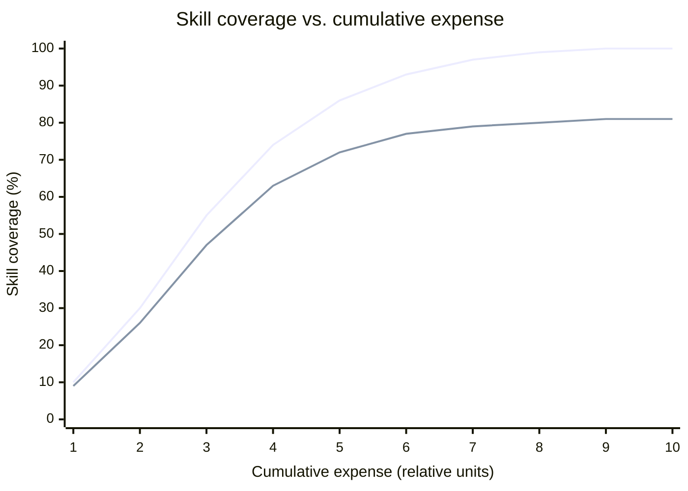
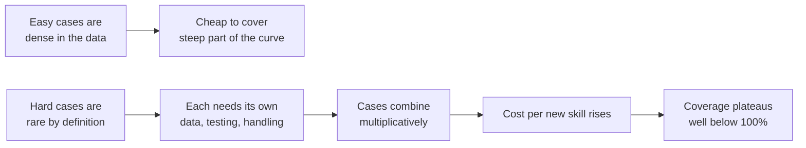

# The S-Curve — Capability Saturates, Cost Explodes

The most useful single idea in this session, and the one that turns "what can AI do?" from a technology question into an economics question. Once you have it, most AI roadmap claims become checkable.

---

## 1. The belief

The intuitive model almost everyone carries is **exponential**: AI capability doubles on some cadence, the way transistor counts did. Under that model, whatever a system can't do today it will do soon, and the only question is how many months.

It is an attractive model because it is *simple*, because early progress genuinely looks like it, and because — this matters — a great many people have a financial interest in you holding it.

## 2. The observation

What practitioners building real autonomous systems found instead was a **logistic curve** — an S-curve. Skill coverage rises fast at first, then bends, then flattens. And critically, it flattens **well short of 100%**.

*Caption: the hoped-for curve (upper line, reaching 100%) against what deployed systems actually produce (lower line, converging near ~80%). Same axes; the difference is the ceiling.*

If the xychart does not render in your viewer, the same information as a table — and honestly the table is the better slide, because the numbers are the argument:

| Cumulative spend (relative) | Coverage — hoped | Coverage — observed | Cost per additional 1% (observed) |
|---|---|---|---|
| 1 | 10% | 9% | 0.11 |
| 2 | 30% | 26% | 0.06 |
| 4 | 74% | 63% | 0.12 |
| 6 | 93% | 77% | 0.36 |
| 8 | 99% | 80% | **1.33** |
| 10 | 100% | 81% | **4.00** |

Read the right-hand column. Between the fourth and the sixth unit of spend you buy 14 points of coverage. Between the eighth and the tenth you buy **one**, for the same money. The capability curve is flattening; the cost-per-increment curve is going vertical.

## 3. The sentence

> **It is not AI capability that is exponential — it is the expense of producing it.**

(Framing after Stefan Seltz-Axmacher's post-mortem of Starsky Robotics, via the Day 3 source deck — **paraphrase on slides, do not quote**; see `resources/sources.md` #1.)

That inversion is the whole idea. People argue about *whether* AI will reach 100% coverage of some task domain. The better question is **what it costs to get from 80% to 95%**, and whether anyone will pay it.

## 4. Why it saturates — the mechanism

The S-curve is not mysticism about "diminishing returns." It has a specific cause, and it is one we already built in `content/02`:

*Caption: the tail is long, sparse, and combinatorial — three properties that each independently raise the cost of the last increment.*

1. **The common cases are common.** They appear thousands of times in the data. The model learns them almost for free. This is the steep part, and it is why every demo is impressive.
2. **The rare cases are rare.** That is what rare means. To cover one, you must find or manufacture examples of it, which is expensive, and you must test for it, which is more expensive.
3. **The rare cases combine.** Not "handle the kangaroo," but "handle the kangaroo *at dusk, in rain, partly occluded.*" Your test matrix grows linearly. The case space grows multiplicatively. You lose that race.
4. **Ground truth is expensive.** Labelled data for the tail is a manual effort. The AI industry runs on large, low-cost human labelling workforces — an open secret, and a substantial budget line for anyone building a real system (`resources/sources.md` #1).
5. **The target moves.** Data rot means coverage you already bought decays. Some of your spend goes on *staying at 80%*, not on getting past it.

## 5. Is the argument still valid in the LLM era?

**Ask this on the slide.** It is the best discussion prompt in Half A, and pretending it doesn't exist is exactly the kind of dishonesty this course is supposed to avoid.

The S-curve argument was made before the current scaling era, in the context of autonomous driving. Since then we have seen genuine step-changes in general language capability that a naïve reading of "it plateaus at 80%" did not predict.

Both sides, fairly:

| The argument has weakened because… | The argument has held because… |
|---|---|
| General-purpose pre-training moved *many* task curves at once, rather than one domain at a time — a shape the original argument didn't anticipate. | Coverage of *any specific, high-stakes, real-world* task still plateaus. The gap between "usually right" and "reliable enough to act on unsupervised" has proven extremely expensive. |
| Capabilities once called structural (fluent translation, competent boilerplate) became cheap and routine. | The saturation moved *up* the difficulty scale; it did not disappear. Everyone is now stuck at 80% of a harder task. |
| The tail can sometimes be covered by scale rather than by hand-built cases. | The three structural failures in `content/02` are not on the curve at all. No amount of spend buys a guarantee. |

**The honest synthesis, and the one to deliver:** the S-curve was wrong about the *height* of the ceiling and right about the *shape* of the cost. Capability rose far higher than the pessimists expected. The economics of the last mile behaved exactly as predicted. And since your professional life happens in the last mile, the prediction that held is the one that concerns you.

## 6. What to do with this on Monday

The S-curve is a question-generator. When a vendor or an internal initiative claims an AI system will handle some class of work:

| Ask | Because |
|---|---|
| "What coverage does it achieve today, on *our* data — not the demo data?" | Anchors the conversation on the curve, not the trajectory. |
| "What happens to the cases it doesn't cover?" | If the answer is "a human picks them up," you have just been assigned work. Find out how much. |
| "What did the last 5 points of coverage cost, and what will the next 5 cost?" | This is the whole argument, in the form of a purchase order. |
| "How do we detect that coverage has decayed?" | Data rot. If there is no answer, coverage is a one-time measurement, not a property. |
| "Who is accountable when it's in the uncovered 20%?" | The bridge to Half B. Somebody in this room, is the usual answer. |

The team that asks these questions well is not being obstructive. It is doing release, problem, and configuration management — on an AI system. Which, as the second half of this session argues, is the direction the work is actually moving.
