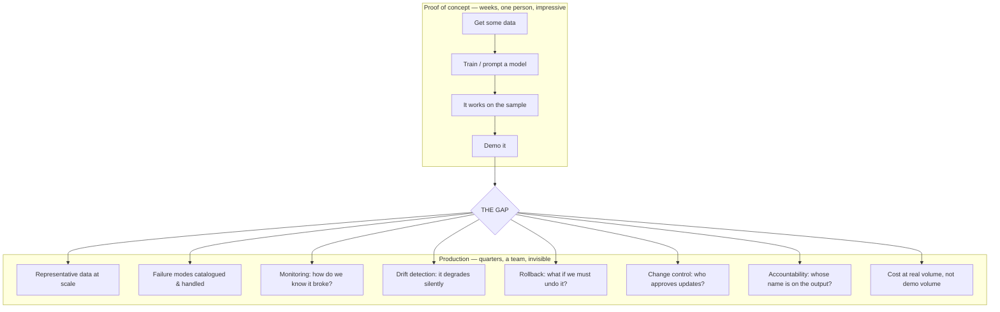
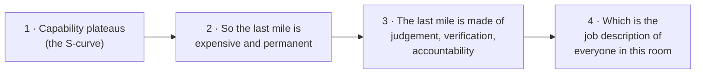

# The Proof-of-Concept-to-Production Gap

The recurring theme of the source corpus, the practical consequence of the S-curve, and — the point of this file — a precise description of what this team is for.

---

## 1. The claim

Paraphrasing Andrew Ng, who has made this point about healthcare AI and then explicitly generalised it to all of AI (see `resources/sources.md` #1 — **paraphrase, do not quote on a slide**):

> Machine-learning practitioners are extremely good at doing well on a test set. But deploying a system takes much more than doing well on a test set. All of AI has a proof-of-concept-to-production gap: the full lifecycle is finding the right data, deploying, monitoring, feeding data back, demonstrating safety — everything beyond the test set, which is unfortunately the part the field is best at.

The reason this quote appears in **two separate decks** in the source corpus is that it is the single most load-bearing observation in applied AI, and the industry keeps rediscovering it.

## 2. What actually lives in the gap

Here is the honest breakdown. The demo is the cheap part.

*Caption: everything to the right of the gap is operational discipline, not modelling. Read the eight boxes and notice how many are literally your job title.*

## 3. The gap, item by item — and who owns each item

This table is the hinge of the entire session. It is worth building as a slide even though it is dense, because the right-hand column makes the argument by itself.

| What lives in the gap | Why the model can't supply it | Whose job this is |
|---|---|---|
| **Representative data** | The model can't know what it wasn't shown (selection bias — the kangaroo) | Whoever knows the real deployment landscape — **configuration management** |
| **Failure-mode catalogue** | The model has no notion of "failure"; it always emits something | **Problem management** |
| **Monitoring** | Nothing in the mechanism watches the mechanism | Ops + **problem management** |
| **Drift / decay detection** | Data rot is silent by construction | **Configuration + problem management** |
| **Rollback** | A model has no transactional semantics | **Release management** |
| **Change approval** | Requires authority, not capability | **Release + configuration management** |
| **Go / no-go under uncertainty** | Requires accountability, which is a relationship | **Release management** |
| **Accountability for output** | Cannot be delegated to a non-agent | A named human, always |
| **Cost at real volume** | Demo economics ≠ production economics (Session 2) | Engineering + finance |
| **Security review of generated artefacts** | ~39% of suggestions carried a vulnerability (Session 14) | **Developers** |

## 4. Why the gap does not close

You might reasonably expect the gap to narrow as tooling matures. Some of it does. But three of its components are load-bearing and structural:

1. **It is downstream of the S-curve.** The gap *is* the last 20% of coverage plus everything needed to operate safely inside the uncovered part. As long as coverage plateaus, something must handle the remainder, and that something is a process with humans in it.
2. **It scales with deployment, not with capability.** A better model in *more* places produces *more* surface to monitor, more change approvals, more rollback plans. Improving the model does not shrink the operational estate; it grows it. This is why "the AI got better" and "we have more AI-related operational work" are perfectly compatible statements, and why both are currently true.
3. **Accountability cannot be automated even in principle.** Not "is hard to automate." Cannot. Accountability is the socially and legally recognised state of a *person* being answerable. You can automate the production of a decision. You cannot automate being the one who answers for it. Every governance regime — internal, contractual, regulatory — is built on there being a name.

## 5. The turn — say this out loud in the room

Here is the argument compressed into four steps. Deliver it as the transition into Half B.

*Caption: the turn from Half A to Half B. Four steps, no hand-waving, each one defended in the preceding files.*

## 6. The honest counterweight

That argument is genuinely good news, and if the session stopped there it would be doing exactly what the README warns against. So, immediately, the counterweight — and it should be on the same slide or the next one, not saved for later:

**"The remaining work is judgement and verification" is not the same as "the remaining work is the same size."**

- If AI-assisted throughput rises and verification is the bottleneck, the organisation's rational move is to **staff verification, not production** — which favours these roles.
- Or the organisation may decide that AI-assisted producers can **self-verify**, thin the verification layer, and accept a higher defect rate that shows up later as incidents. That disfavours these roles, and it is a decision made in a budget meeting, not by a model.
- Which of those happens is **a management choice, not a technology outcome.** It is influenced by how well the people in this room can articulate what verification catches — which is one of the concrete, actionable reasons `content/10` recommends measuring your own catch rate.

That last bullet is the most practical sentence in this session. The technology does not decide. The argument you can make about your own value does.
