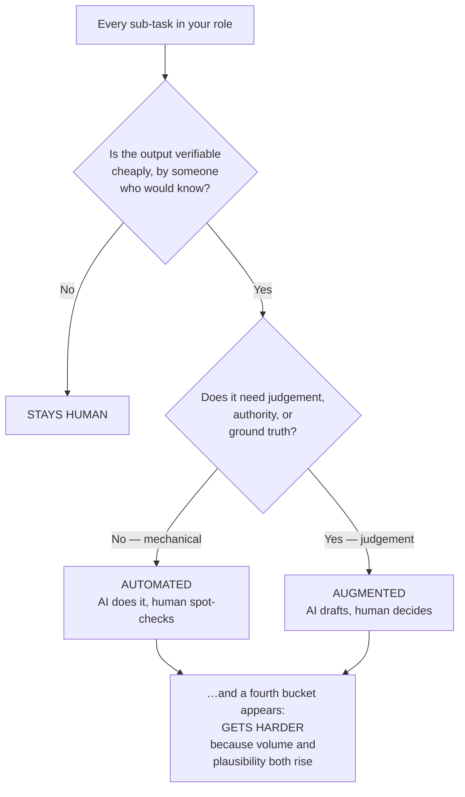

# Will AI Take Our Jobs? — Asking a Better Question

The question as usually posed is unanswerable, and its unanswerability is why the public conversation is so unsatisfying. This file replaces it with a question that has actual answers.

---

## 1. Why "will it replace me?" is the wrong question

"Replaced or safe" treats a job as an atom. It isn't. A job is a **bundle of tasks**, held together by history, org structure, and convenience. Automation does not act on jobs; it acts on tasks. Jobs change when the bundle is re-cut.

Three consequences that "replaced or safe" cannot express, and which are the actual story:

- A job can lose 40% of its tasks and become **more** valuable, if the 40% removed was the low-judgement portion.
- A job can lose no tasks at all and become **more demanding**, because the inputs it receives changed character.
- A job can be formally "safe" and functionally hollowed out, if what remains is verification of a firehose nobody staffed for.

Note also the framing found in the safety corpus: **job losses from over-automation appear there as a *hazard outcome*** — an entry in the list of harms alongside financial loss, security breaches, and reputational damage (see `resources/sources.md` #2). That is a genuinely useful reframing. Automating past the point of safe verification is not a business optimisation with an unfortunate side effect; it is a **hazard**, with a source, a trigger, and a set of victims. It belongs in a risk register, not only in a workforce plan.

## 2. The three buckets

*Caption: the decomposition. Note that "gets harder" is not a fourth input category — it is a consequence of the first two.*

| Bucket | Definition | The tell |
|---|---|---|
| **Automated** | The AI produces the artefact; a human spot-checks rather than reviews line by line. | The task was already mechanical and you disliked doing it. |
| **Augmented** | The AI produces a draft or a hypothesis; a human applies judgement and owns the result. | You will keep every part of the decision and hand over only the typing. |
| **Stays human** | The AI contributes nothing safe. Judgement under uncertainty, authority, negotiation, accountability. | If you imagine the AI doing it unsupervised, you feel something close to alarm. |
| **Gets harder** | A task whose difficulty *increases* because of AI adoption elsewhere. | Nothing about the task changed — but the input changed, or the volume did. |

## 3. The fourth bucket is the one nobody talks about

Everyone can name the first three. The fourth is where the real change lands, and it is the reason this session exists.

**Three distinct mechanisms make work harder:**

### 3a. Everyone else's output is now AI-shaped

The artefacts arriving at your desk — change descriptions, incident write-ups, design docs, PR descriptions, vendor responses — are increasingly AI-drafted. They are consequently:

- **Longer**, because generation is free and brevity requires effort nobody spent.
- **More fluent**, so the usual heuristic of "this is poorly written, I should look harder" no longer correlates with "this is poorly thought through." Fluency has been decoupled from competence, and you have spent your entire career using fluency as a proxy for competence.
- **More uniform**, so the outlier no longer looks like an outlier.
- **Confidently wrong in a specific way** — plausible structure, correct-looking specifics, an error in one clause.

A reviewer's core skill was pattern-matching for signals of sloppiness. Those signals have been sanded off. You must now read for *substance* on every item, which is slower per item, at exactly the moment the item count went up.

### 3b. The verification paradox (Session 13, applied to your calendar)

If a system is right 99% of the time, the human checking it must stay alert across 99 correct items to catch the hundredth. Human factors research is unambiguous that people are poor at catching infrequent automation errors — the "startle factor." Vigilance decays. **The better the AI gets, the worse the human reviewer gets**, and these are not independent effects; the second is *caused* by the first.

So: a model improving from 90% to 99% correct is a genuine ninefold reduction in errors *and* an increase in the chance that any given error ships. Both. Simultaneously.

### 3c. Volume without a matching increase in verification capacity

If developers ship 30% more change and the release process has the same number of people, the verification-per-change budget fell by 23%. Nobody decided that. It is arithmetic, and it happens silently, and the first visible symptom is an incident.

## 4. The through-line, stated precisely

> **AI changes the composition of these jobs before it eliminates any of them. The human moves up the stack toward judgement, verification, and accountability.**

For this audience there is a second sentence that makes the first one mean something:

> **These four roles already live at the top of that stack. The change is therefore less about *what* you do and more about *how much of it* there is, and how much harder each unit has become.**

That is the claim. `content/06`–`09` test it against each role. `content/10` deals with what to do, and with the conditions under which the comfortable reading stops holding.

## 5. How to read the role sections

Each of the next four files has the same structure, so you can compare across roles:

1. **What the role is actually for** — one paragraph, stated in terms of accountability rather than activity.
2. **The task decomposition table** — every meaningful sub-task, placed in a bucket, with a reason.
3. **The three things that get harder** — with the mechanism named.
4. **What stays human, and why it isn't sentiment** — the structural argument, not the flattering one.
5. **The uncomfortable part** — the genuine exposure. Every role has one. A section that claims otherwise is not worth reading.

Read your own role first. Then read one you don't hold — the exposure patterns differ more than people expect, and the differences are the most interesting part of the Q&A.
