# Role: Release Manager

**Headline: release notes get drafted, not decided.** The artefacts of release management are highly automatable. The act of release management is not, because it is a decision made under uncertainty by someone who will answer for it.

---

## 1. What the role is actually for

Strip away the tooling and a release manager exists to answer one question repeatedly: **does this go out, and if it does, on whose authority and with what fallback?**

Everything else — the notes, the calendar, the matrix, the checklist, the chase-up emails — is instrumentation supporting that judgement. This distinction is the whole analysis. AI is very good at the instrumentation and structurally incapable of the judgement, for the reasons in `content/02`: go/no-go is a decision under uncertainty, in a novel situation (every release is), requiring a guarantee that cannot be sampled, with accountability attached.

## 2. Task decomposition

| Sub-task | Bucket | Reasoning |
|---|---|---|
| Draft release notes from commits/tickets | **Automated** | Textbook language transformation. Input contains the content; a human who knows the release verifies by reading. |
| Rewrite technical notes for a non-technical audience | **Automated** | Register change — the most reliable LLM capability there is. |
| Translate release notes into other languages | **Automated** | Core competence. Native check if externally facing. |
| Produce a first-cut release calendar / dependency view | **Augmented** | Good at extracting stated dependencies. Blind to the unstated ones — which is where release risk lives. |
| Summarise the state of a release across many trackers | **Augmented** | Real time-saver. Non-neutral compression: it will faithfully report the status field and miss the comment thread where someone flagged a concern. |
| Draft go/no-go meeting material | **Augmented** | Assembling the pack is mechanical. Deciding what belongs in the pack is judgement. |
| Assess whether known open defects are acceptable | **Stays human** | Requires business context, customer knowledge, risk appetite, and a name on the outcome. |
| **Go / no-go decision** | **Stays human** | Accountability is a relationship, not an output. This does not become automatable via better models. |
| Cross-team negotiation ("we need one more day") | **Stays human** | Organisational, political, relational. A model has no standing to make or accept a commitment. |
| Own the consequences of a bad release | **Stays human** | By definition. |
| Decide and communicate a rollback under pressure | **Stays human** | Novel-situation reasoning plus authority plus consequence. Every structural failure at once. |
| Verify AI-drafted notes are accurate and complete | **NEW WORK** | Did not exist three years ago. It exists now, it recurs every release, and nobody has been given time for it. |
| Judge whether an AI-assisted change set was adequately reviewed | **GETS HARDER** | See §3. |

```mermaid
flowchart LR
    subgraph Auto["AUTOMATED — the artefacts"]
      A1["Notes drafting"]
      A2["Audience rewrite"]
      A3["Translation"]
    end
    subgraph Aug["AUGMENTED — the assembly"]
      B1["Calendar / dependency draft"]
      B2["Cross-tracker status"]
      B3["Go/no-go pack"]
    end
    subgraph Human["STAYS HUMAN — the decision"]
      C1["Defect acceptability"]
      C2["GO / NO-GO"]
      C3["Negotiation"]
      C4["Rollback call"]
      C5["Accountability"]
    end
    Auto --> Aug --> Human
    Human --> D["Time freed by Auto<br/>is consumed by verifying Auto<br/>and by a larger change volume"]
```

*Caption: the freed time does not become free time. It moves right, and then it comes back as verification load.*

## 3. What gets harder

**(a) Change volume rises faster than review capacity.** If AI-assisted development increases merged change per sprint, the release manager's per-change scrutiny budget falls proportionally, with no decision having been made. You are the constriction point of a pipe whose input just widened.

**(b) Change descriptions became fluent.** Your professional radar for "this ticket description is vague, the author hasn't thought it through" was calibrated on human writing. AI-drafted descriptions are well-structured and complete-looking regardless of whether the underlying thinking happened. **You lost a heuristic you had spent a career building and did not consciously know you were using.** Replace it with explicit questions ("what did you test?", "what is the rollback?") rather than trusting a feeling that no longer tracks.

**(c) You must now verify a thing that is usually right.** AI-drafted release notes are correct most of the time. Reviewing 40 correct release notes to find the one that omitted a breaking change is exactly the vigilance task humans are documented to be bad at. Mitigation is structural, not motivational: **diff the generated notes against a deterministic source of truth** (the actual commit range, the actual ticket set) rather than reading for errors. Machines catch omissions; humans catch significance.

## 4. What stays human — the structural argument

Not "because people are special." Because of four properties, each traced to `content/02`:

| Property of go/no-go | Which structural failure it hits |
|---|---|
| Every release is different in some respect | **Novel reasoning** — extrapolation, the weakest mode |
| Requires "this is safe enough," not "this is probably fine" | **Guaranteed correctness** — unavailable from a sampler |
| Depends on the real deployed estate, not on documentation | **Ground truth** — the model reads documents, not reality |
| Someone answers for it afterwards | **Accountability** — not a capability at all |

A release gate is the archetypal instance of everything an LLM cannot do. That is a strong position, and it is not sentimental.

## 5. The uncomfortable part

**Exposure 1 — if your role has drifted into coordination, you are exposed.** Some release-management roles are, in practice, 80% chasing status and assembling artefacts. That 80% is automatable *now*, not eventually. The defensible core is real but it is smaller than the job as currently performed, and an organisation looking for efficiency will find that gap before you do. Know which portion of your week is which. That is not rhetorical — do the audit in `exercises/lab.md`.

**Exposure 2 — "the tool said it was fine" is a hazard, not a defence.** As AI-generated go/no-go evidence becomes normal, there is real pressure to treat a green summary as sufficient. It is not, and the accountability does not transfer. You will absorb the consequence of a machine's confident summary. The mitigation is to make the *provenance* of the evidence explicit in the pack: which items were machine-generated, which were human-verified, and by whom.

**Exposure 3 — the honest one.** Fewer, more senior release managers with better tooling is a plausible organisational outcome. The role does not vanish; the number of people in it might fall while each becomes more valuable. Whether you are in the remaining set depends on whether you are demonstrably in the judgement business or demonstrably in the coordination business.

## 6. Net assessment

| | |
|---|---|
| **Automatable share of current tasks** | Moderate — high on artefacts, near zero on decisions |
| **Direction of the role** | Fewer artefacts produced, more evidence verified, more scrutiny per unit of change |
| **Trend in demand for the judgement core** | **Up** — more change, faster, with more machine-generated evidence to adjudicate |
| **Main risk** | Coordination-heavy variants of the role; verification load without verification headcount |
| **Best defensive move** | Make the judgement visible. Document what the gate caught, in writing, every release. |
