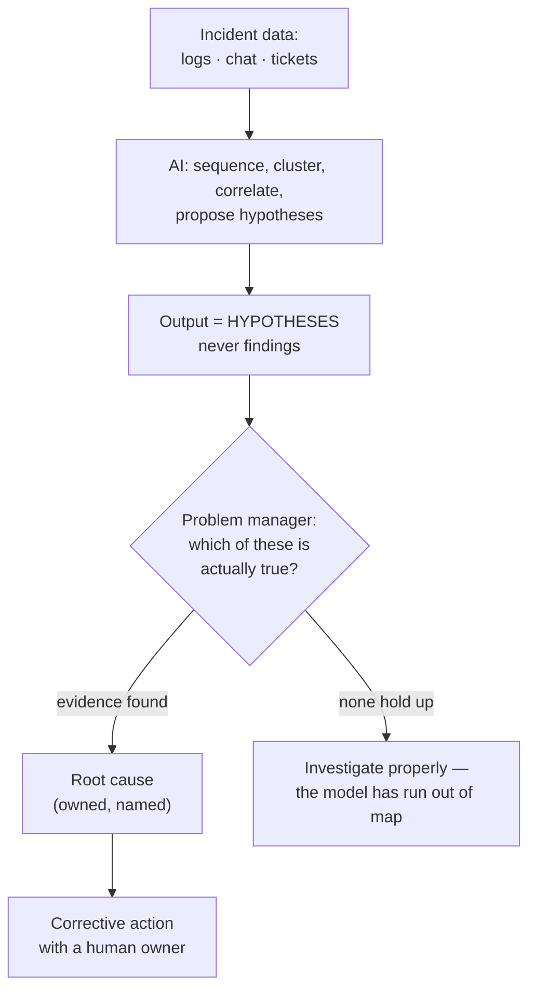

# Role: Problem Manager

**Headline: incident summaries and correlation get much faster; root-cause judgement does not.** This is the role where AI's genuine strength (pattern-spotting over text) collides most directly with its structural weakness (novel reasoning, no ground truth) — and the collision happens in the same task.

---

## 1. What the role is actually for

A problem manager exists to answer: **why did this really happen, and what must change so it doesn't happen again — and to get an organisation to agree and act on that answer.**

Two halves, and both matter. The analytical half is finding the cause. The social half is running a blameless post-mortem in which people tell the truth, and then converting the finding into a change someone actually owns. AI touches the first half substantially. It does not touch the second half at all.

## 2. Task decomposition

| Sub-task | Bucket | Reasoning |
|---|---|---|
| Draft an incident timeline from chat/logs/tickets | **Automated** | Sequencing stated events is transformation. The single biggest time saving in this role. |
| Draft the incident summary for stakeholders | **Automated** | Register change from technical to executive. Reliable. |
| Translate a technical write-up for a customer | **Automated** | Core competence. |
| Search history for "have we seen this before?" | **Augmented** | Genuinely strong — semantic similarity beats keyword search over ticket text. Output is a **lead**. |
| Cluster many tickets into candidate problem records | **Augmented** | Real strength. Also produces confident, spurious clusters. Treat as a hypothesis. |
| Correlate an anomaly across log sources | **Augmented** | Fast at proposing correlations. Has no concept of causation and will not tell you which correlation is coincidence. |
| Draft candidate hypotheses for a cause | **Augmented** | Useful for breaking a stuck investigation. Dangerous as an anchor — see §3(a). |
| Draft the "five whys" chain | **Augmented** | It will produce a fluent, plausible chain. Plausible is exactly the failure mode. |
| **Decide the actual root cause** | **Stays human** | Novel situation; requires ground truth; requires being wrong in public if you're wrong. |
| Decide which anomaly matters | **Stays human** | Requires knowing the business consequence. Not present in the logs. |
| Facilitate a blameless post-mortem | **Stays human** | The output is *psychological safety*, not a document. |
| Push through an unpopular corrective action | **Stays human** | Organisational authority and persistence. |
| Own the recurrence when it happens again | **Stays human** | Accountability. |
| Verify AI-generated timelines are complete | **NEW WORK** | Omission from a timeline is invisible in the timeline. |
| Detect an AI-drafted post-mortem that reads well and concludes nothing | **GETS HARDER** | See §3. |

*Caption: the correct topology. The AI's output enters as a hypothesis set and exits through a human gate. Every failure mode in this role comes from removing that gate.*

## 3. What gets harder

**(a) Anchoring on a plausible wrong cause.** This is the most serious professional risk in the entire session, and it deserves its own paragraph.

An AI-generated root-cause narrative is fluent, structured, technically literate, and mentions the right component names. Cognitive anchoring is well established: once an investigator has a plausible explanation in hand, subsequent evidence is unconsciously fitted to it and disconfirming evidence is discounted. Previously a wrong hypothesis arrived with a colleague's uncertainty attached ("maybe it's the cache?"). Now it arrives with a confident, well-organised prose paragraph and no uncertainty markers whatsoever.

**A wrong root cause is worse than no root cause**, because a problem record is closed, a corrective action is taken against the wrong thing, budget is spent, and the real cause is still live — now with a record saying it was addressed.

*Practical countermeasure:* require the model to produce **at least three competing hypotheses with the disconfirming evidence for each**, never one narrative. Prompt for the strongest argument *against* its own leading explanation. This is a specific, teachable prompting habit and it directly mitigates a specific, documented cognitive failure.

**(b) Knowing which anomaly matters got harder, not easier.** AI correlation over logs produces *more* candidate anomalies. It has no notion of business impact. Triage volume rises; the triage judgement is unchanged and now applies to a bigger pile. This is a pure workload increase disguised as a capability gain.

**(c) Post-mortem documents that read well and say nothing.** An AI-assisted post-mortem is well-formatted, complete against the template, and can be entirely free of the uncomfortable specific finding that makes a post-mortem worth writing. Completeness against a template is now free; **it therefore stopped being evidence of thoroughness.** Your review criterion must shift from "is it complete?" to "does it contain a specific claim that someone could disagree with?"

## 4. What stays human — the structural argument

| Property of root-cause work | Which structural failure it hits |
|---|---|
| Every incident worth a problem record is, by definition, not the routine case | **Novel reasoning** |
| Requires establishing causation, not proposing correlation | **Guaranteed correctness** — a sampler cannot establish anything |
| Requires knowing what the system actually does, not what the docs say | **Ground truth** — this is the pedestrian paradox: a model cannot know what it failed to see |
| The post-mortem's real output is people telling the truth | **Not a capability at all** — trust is a relationship |

That last row is under-appreciated and worth saying out loud in the room. A blameless post-mortem works because a human with standing creates conditions under which people admit mistakes. No document generator produces that. It is arguably the highest-value and least automatable activity discussed in this entire session.

## 5. The uncomfortable part

**Exposure 1 — the write-up-heavy variant of the role is exposed.** If a large fraction of the week is producing incident documentation rather than investigating, that fraction is automatable now. Same warning as release management: know your own split.

**Exposure 2 — "the AI found the correlation, so we're done."** There will be pressure to close records faster because a plausible cause arrived quickly. Closure rate is measurable; correctness of closure is not, until recurrence. **This is a metric-gaming hazard with a delayed feedback loop** — precisely the structure Session 13 warned about. Expect it, name it early, and make "recurrence rate of closed problems" a tracked metric before anyone starts celebrating closure velocity.

**Exposure 3 — the honest one.** Level-1 triage and first-line correlation work is genuinely shrinking. If your organisation's problem-management pipeline has a large early-stage staffing footprint, that footprint is where change lands first, and the people in it need a path upward into the judgement work rather than a reassurance that nothing is happening.

## 6. Net assessment

| | |
|---|---|
| **Automatable share of current tasks** | **High on documentation and correlation; near zero on causal judgement and facilitation** |
| **Direction of the role** | Much less writing, much more adjudicating between machine-generated hypotheses |
| **Trend in demand for the judgement core** | **Up** — more systems, more anomalies surfaced, more plausible-but-wrong narratives to reject |
| **Main risk** | Anchoring on a fluent wrong cause; closure-velocity metrics |
| **Best defensive move** | Institutionalise "three competing hypotheses, with disconfirming evidence" as the standard AI-assisted investigation prompt |
