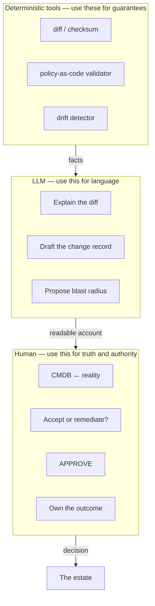

# Role: Configuration Manager

**Headline: drift detection and diff summarisation get automated; remediation ownership, change approval, and CMDB truth do not.** This role has an unusual property that makes it the most defensible of the four — and one specific, serious new exposure that the other three do not share.

---

## 1. What the role is actually for

A configuration manager exists to answer: **what is actually deployed, where, in what state — and who authorised it to change?**

Note the word *actually*. The role's entire value is the correspondence between a record and a reality. That correspondence is **ground truth**, which `content/02` identified as the thing an LLM structurally cannot supply. The role is, almost literally, the human maintenance of ground truth for the estate.

There is a second unusual property. Much of the mechanical work in this role — comparing states, detecting differences, validating against a schema — is **deterministically automatable and always has been**. `diff`, checksums, policy-as-code, and drift detectors are not LLMs and are strictly better than LLMs at this, because they produce guarantees rather than samples. **The correct tool for most of the automatable portion of this job is not AI.** Saying so plainly builds more credibility with this audience than any amount of AI enthusiasm.

## 2. Task decomposition

| Sub-task | Bucket | Reasoning |
|---|---|---|
| Detect drift between intended and actual state | **Automated — but by a deterministic checker, not an LLM** | Needs a guarantee. Use policy-as-code / a drift detector. An LLM here is a downgrade. |
| Summarise a large diff in human terms | **Automated (LLM)** | "312 lines changed" → "TLS settings and two timeouts changed." Genuine, real value. |
| Explain what an unfamiliar config parameter does | **Augmented** | Strong on public/standard software. Confidently wrong on internal conventions and forks. Verify anything you'd act on. |
| Draft a change record from a diff | **Augmented** | Good first pass; the *rationale* field is the part that matters and the model does not have it. |
| Assess the blast radius of a proposed change | **Augmented** | Can propose affected components from documented dependencies. Blind to undocumented ones — which is where outages come from. |
| Draft a remediation plan for drift | **Augmented** | Plausible plan. Order of operations and reversibility are the hard part and need a human. |
| Reconcile the CMDB against reality | **Stays human** | The definitional ground-truth task. A model has no access to reality. |
| **Approve a change** | **Stays human** | Authority. Not a capability. |
| Decide whether drift is acceptable or must be remediated | **Stays human** | Requires business context, risk appetite, and consequences. |
| Own the outcome of a remediation | **Stays human** | Accountability. |
| Arbitrate between teams over a shared configuration | **Stays human** | Organisational. |
| Verify AI-summarised diffs did not omit the significant line | **NEW WORK** | An omission from a summary is invisible in the summary. Critical. |
| Detect config generated by AI that is plausible and wrong | **GETS HARDER** | See §3(a). This is the serious one. |

*Caption: the correct division of labour. Facts come from deterministic tools, readability from the LLM, truth and authority from the human. Inverting any arrow is a defect.*

> **Say this in the room, in these words:** *if the sentence contains "always," "never," "all," or "exactly," an LLM cannot be the thing that makes it true.* Configuration management runs on exactly those words.

## 3. What gets harder

**(a) AI-generated configuration is plausible and wrong in a new way — and this is the most dangerous single item in this session.**

Models generate configuration files fluently: the right file format, the right key names, sensible-looking values. And the failure mode is specific and nasty: **a value that is syntactically valid, semantically plausible, and wrong for your environment.** A timeout that suits the public example and not your latency profile. A permission set copied from the documentation's example, which is broader than yours should be. A flag that was correct in the previous major version.

Why this is worse here than elsewhere: a wrong config **often passes validation**. It parses, it deploys, the service starts. It fails later, under load, or in one region, or as a security finding six months on. There is no compiler and frequently no test. And it enters the estate through a change record that reads perfectly, because that was AI-drafted too.

This is the direct configuration-management analogue of the ~39% insecure-code-suggestion finding from Session 14 — and arguably worse, because configuration has weaker automated checking than code does.

*Countermeasure, and it is not optional:* every AI-generated configuration change must pass a **deterministic policy check** before a human reviews it, and the human review must be against **your** baseline, not against plausibility. Do not review AI config by reading it and thinking "that looks right." That is the exact judgement the model has already optimised to satisfy.

**(b) The CMDB is now polluted by fluent records.** Change records used to be terse and sometimes bad. Now they are long, complete-looking, and sometimes vacuous — a paragraph of well-formed prose in the rationale field that does not state a reason. **Completeness stopped being evidence of thought.** Review for a specific, falsifiable claim, not for a filled-in field.

**(c) Change volume, again.** Same arithmetic as release management. More changes, same approval capacity, silently reduced scrutiny per change.

## 4. What stays human — the structural argument

| Property of configuration management | Which structural failure it hits |
|---|---|
| The record must correspond to reality | **Ground truth** — the defining limitation |
| Assertions must be guarantees ("these two match") | **Guaranteed correctness** — use a checker, not a model |
| Undocumented dependencies dominate real blast radius | **Ground truth** + selection bias (the kangaroo) |
| Approval is an exercise of authority | **Not a capability** |
| Estates drift; yesterday's knowledge decays | **Data rot** — and the model's picture of your estate rots silently |

The last row is the elegant one for this audience: **data rot is config drift, applied to the model's knowledge.** The model's picture of your environment was accurate at some point and is now stale, and nothing alerts you. Managing exactly that class of problem is the job.

## 5. The uncomfortable part

**Exposure 1 — the manual-reconciliation variant of the role is exposed, and mostly not by AI.** Much of it should have been automated by deterministic tooling years ago. AI adoption programmes tend to bring budget and attention that finally get that automation done. The work disappears; the fact that AI wasn't the thing that replaced it is no consolation.

**Exposure 2 — you will be asked to approve more, faster, with better-looking evidence.** Approval throughput is easy to measure; approval quality is not, until an incident. The pressure is structural and predictable. Say now, in writing, what your approval actually requires — before the pressure arrives and it looks like resistance.

**Exposure 3 — the honest one.** This role is the *least* exposed of the four to displacement and the *most* exposed to workload increase without headcount. That is a real problem with a different shape: not "will I have a job" but "will this job be sustainable." It is worth raising with management explicitly and early, with numbers.

## 6. Net assessment

| | |
|---|---|
| **Automatable share of current tasks** | Moderate — and much of it belongs to deterministic tools, not AI |
| **Direction of the role** | From detecting and documenting → to adjudicating and approving, at higher volume |
| **Trend in demand for the judgement core** | **Up, sharply** — AI-generated config is a new and poorly-checked source of defects |
| **Main risk** | Plausible-and-wrong config entering the estate through a well-written change record |
| **Best defensive move** | Insist on deterministic gates in front of every AI-generated change. Never let plausibility be the check. |
