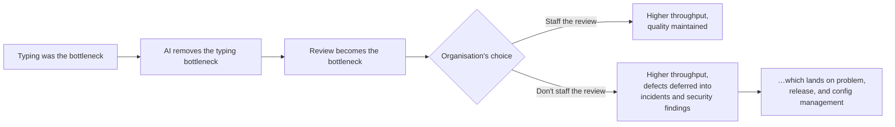

# Role: Developer

**Headline: code gets generated; review, accountability, and secure-by-design judgement become MORE important, not less.** This is the role where AI adoption is furthest along, where the productivity gain is most real, and where the honest analysis is least comfortable — because the change here is genuinely larger than in the other three.

---

## 1. What the role is actually for

A developer exists to **make a system do a thing correctly, safely, and maintainably — and to be answerable for it.**

Note that "produce code" is not on that list. Code is the medium, not the purpose. This distinction has always been true and was easy to ignore while typing was the bottleneck. Typing is no longer the bottleneck, so the distinction is now the entire story.

## 2. Task decomposition

| Sub-task | Bucket | Reasoning |
|---|---|---|
| Boilerplate, scaffolding, glue code | **Automated** | Dense in training data. Highest-value, lowest-risk use. |
| Test scaffolding and fixtures | **Automated** | Structural, repetitive. Note: the model writing tests for its own code is not independent verification. |
| Translating between languages/frameworks | **Automated** | Transformation, the core competence. |
| Writing docstrings and comments from code | **Automated** | Reliable — and it describes what the code *does*, which may not be what it *should* do. |
| Explaining unfamiliar code | **Augmented** | Very strong. Confidently wrong on your fork's divergences from the upstream it has memorised. |
| Implementing a well-specified function | **Augmented** | Good draft. Correctness is the developer's, always. |
| Debugging assistance | **Augmented** | Excellent at generating hypotheses from a stack trace. Same anchoring risk as problem management. |
| Refactoring suggestions | **Augmented** | Good proposals; no knowledge of why the ugly thing is ugly. Often the ugliness is a fix for a bug the model can't see. |
| Architecture and design decisions | **Stays human** | Novel reasoning, trade-offs against constraints not present in any document. |
| **Security judgement — is this design safe?** | **Stays human** | See §3(a). The model is measurably part of the problem here. |
| Deciding what to build, and what not to | **Stays human** | Product and business judgement. |
| **Code review of AI-generated code** | **Stays human, and it is the growth area** | See §3. |
| Owning a defect that reaches production | **Stays human** | Accountability. |
| Reviewing far more code than before | **GETS HARDER** | Volume, fluency, and vigilance decay simultaneously. |
| Maintaining code nobody fully understands | **GETS HARDER** | Accepted-without-full-comprehension code accumulates. |

*Caption: the bottleneck moved, and where it lands next is an organisational decision, not a technical one. Note where path F terminates — the other three roles in this session.*

## 3. What gets harder

**(a) Security review — and there is a number.**

The empirical finding from the source corpus, and the hardest number in this session: in a controlled study of AI code-completion suggestions, **approximately 39% of the top-ranked suggestions in security-relevant scenarios contained a vulnerability** (Pearce et al., *Asleep at the Keyboard?*, IEEE S&P 2022 — see `resources/sources.md` #4). The corpus's summary of it is the line worth remembering: **just because your code compiles and "works" does not mean it is secure.**

Two honest caveats, because misrepresenting this number would undermine the point:
- It was measured on a specific model generation in **deliberately security-sensitive scenarios**. It is not "39% of all AI code is vulnerable."
- Models have improved since.

And two reasons it still matters more than the caveats:
- The **mechanism** has not changed. The model reproduces patterns from a training corpus that contains an enormous amount of insecure public code. There is nothing in "predict the next token" that prefers the secure pattern over the common one — and insecure patterns are often *more* common, because they are shorter and appear in tutorials.
- The **volume** went up. A lower rate applied to far more generated code is not obviously fewer vulnerabilities.

Therefore: **secure-by-design judgement is now a more valuable developer skill than it was, not less.** The developer who can look at working code and ask "what's the injection surface, what's the authz assumption, what happens on the error path" is doing something the generator structurally cannot do.

**(b) Review, at volume, of code that is usually fine.** The verification paradox in its sharpest form. Reviewing large volumes of nearly-always-correct code is exactly the vigilance task humans fail at. Compounding factors:
- AI code *looks* idiomatic. Your reviewer heuristic "this looks like a junior wrote it, read carefully" no longer fires.
- It is often *longer* than necessary, and length reduces review quality.
- It handles the common path well and the error path poorly — and the error path is where incidents live.

*Countermeasures that actually work:* mandatory deterministic gates (SAST, dependency scanning, type checking, tests) **in front of** human review, so humans spend attention on design and intent rather than on things a machine finds better; explicit review checklists rather than reading-for-smells; and requiring the *author* to be able to explain the code they submitted.

**(c) Comprehension debt.** A team can accumulate a codebase where every line passed review and no one holds a complete mental model, because generated code is accepted at a comprehension level of "I understand what this does" rather than "I could have written this and I know why it's this way." The bill arrives during a 03:00 incident. **Enforce the rule that you own code you submit, whoever typed it** — including being able to explain it without the assistant.

## 4. What stays human — the structural argument

| Property of development work | Which structural failure it hits |
|---|---|
| Design trade-offs against unstated constraints | **Novel reasoning** |
| "This is secure" is a guarantee | **Guaranteed correctness** |
| Knowing how the system actually behaves in production | **Ground truth** |
| Deciding what to build | Not a capability |
| Being answerable for a defect | **Accountability** |

## 5. The uncomfortable part

This is the section to deliver without softening, because a developer audience will already know it and any hedging will cost you the room.

**Exposure 1 — the productivity gain is real, and real gains have consequences.** For well-specified, well-trodden implementation work, AI assistance produces a genuine and large speed-up. Pretending otherwise is not honest. An organisation that gets more output per developer may choose more output, or may choose fewer developers. That is a business decision and it is not determined by the technology.

**Exposure 2 — the junior pipeline is the sharpest problem in this entire session.** The tasks traditionally given to junior developers — boilerplate, small well-specified changes, simple bug fixes — are exactly the tasks AI does best. If those tasks stop being assigned to people, **the training path to senior judgement is cut**, while the demand for senior judgement rises. That is an industry-level problem with a several-year fuse and no obvious solution. It is worth naming explicitly in the room, because the seniors present will have noticed and the juniors present are living it. Do not resolve it; there is no honest resolution available. Naming it is the contribution.

**Exposure 3 — "AI wrote it" is not a defence, and the accountability did not move.** It stayed exactly where it was. In practice the effect is that a developer is now accountable for more code that they read rather than wrote — an increase in exposure, not a decrease.

**Exposure 4 — the honest one about levels.** The distribution of developer work shifts toward review, design, integration, and debugging, and away from implementation. Developers whose value is concentrated in implementation speed are exposed. Developers whose value is in design, debugging, and judgement are more valuable. That is a real redistribution and it does not fall evenly, and where it falls correlates uncomfortably with seniority.

## 6. Net assessment

| | |
|---|---|
| **Automatable share of current tasks** | **High** on implementation — the highest of the four roles |
| **Direction of the role** | From writing → to specifying, reviewing, securing, integrating, and debugging |
| **Trend in demand for the judgement core** | **Up** — especially security judgement and design |
| **Main risks** | Volume-driven review degradation; comprehension debt; a broken junior→senior pipeline |
| **Best defensive move** | Become excellent at the things generation can't do: security reasoning, debugging in production, and system design. Deterministic gates in front of every human review. |
