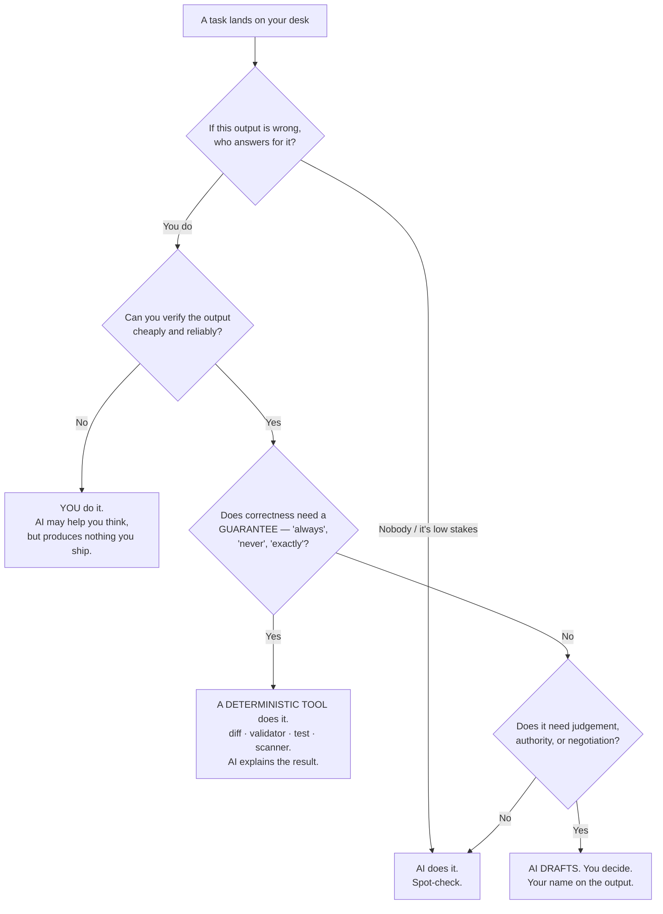

# What To Actually Do About It

Analysis without a next action is just anxiety with footnotes. This file is the practical half: the decision rule to apply on Monday, the skills worth building, what to delegate, what never to delegate, and the honest caveats that keep the whole argument from being a comfort blanket.

---

## 1. The decision rule — task → who owns it

This is the artefact to take away. It applies to any task, in any of the four roles, and it is deliberately conservative at the top.

*Caption: the take-away artefact. Note the third branch — a large share of "should we use AI for this?" questions correctly resolve to "no, use a checker." Print this one.*

**The three questions in plain language:**
1. **Who answers for it?** If the answer is you, the AI cannot own it. Ever.
2. **Can you check it cheaply?** If not, you cannot safely use a generated draft, because you will end up either trusting it or redoing it.
3. **Do you need a guarantee?** Then use something that produces guarantees. An LLM never does.

## 2. Skills to build

Ranked by return on effort for this audience. The first three are the ones that matter.

| # | Skill | Why it pays | How to start this month |
|---|---|---|---|
| 1 | **Verification design** — building processes that catch machine errors, rather than catching them personally | The scarce resource is trustworthy verification, and doing it by hand does not scale | For one recurring artefact, replace "read it carefully" with a deterministic check plus a targeted human question |
| 2 | **Structured skepticism** — the habits from Sessions 13–13 applied to AI output: base rates, "what's the disconfirming evidence," "what's not in this summary" | The specific failure mode is *plausible and wrong*; generic care does not catch it | Adopt the three-competing-hypotheses prompt (`content/07` §3a) as a standing habit |
| 3 | **Articulating your own judgement** — being able to state what your gate catches, in writing, with examples | Judgement that isn't visible is judgement that gets optimised away in a budget meeting | Keep a running log for one quarter: what did your review catch that the tooling didn't? |
| 4 | **Practical prompting** (Sessions 10–11) | The difference between a 20% and a 60% time saving on the automatable tasks | Build three reusable prompts for your three most repetitive artefacts |
| 5 | **Reading the tool's limits** — the S-curve questions from `content/03` §6 | You will be asked to evaluate AI tooling; these five questions are the evaluation | Ask them at the next vendor or internal-initiative meeting |
| 6 | **Secure-by-design reasoning** (developers especially) | The ~39% finding; generation volume is up | Build a personal review checklist for the top five vulnerability classes in your stack |
| 7 | **Facilitation** (problem managers especially) | Least automatable activity discussed in this session | Nothing technical — practise running the meeting where people admit mistakes |

Notice that only one of the seven is about operating an AI tool. The tools change every few months; the judgement skills compound.

## 3. Delegate / never delegate

| **Delegate to AI, deliberately** | **Never delegate** |
|---|---|
| First drafts of anything you will edit and own | The decision to ship |
| Reformatting, restructuring, register changes | Approval of a change |
| Translation | The determination of a root cause |
| Summarising documents **you or a colleague have read** | Reconciliation of a record against reality |
| Generating multiple competing hypotheses | Choosing between them |
| Explaining unfamiliar code or config **to you** | Assertions of correctness or security |
| Extracting structure from unstructured text | Anything requiring a guarantee — use a checker |
| Boilerplate code, scaffolding, fixtures | Accountability, in any form |
| Rehearsing an argument before a difficult meeting | The difficult meeting |

**One test that resolves most edge cases:** *if the output goes out with your name on it and you have not personally verified it, you have delegated accountability — which is the one thing that cannot be delegated.* Not because a policy forbids it, but because it does not work: the accountability stays with you regardless of what you believe you handed over.

## 4. The honest caveats

The through-line of this session is that composition changes before headcount does. That is well supported and it is not unconditional. Four conditions under which it stops holding — say all four out loud:

**(a) If verification is not staffed, the argument fails.** The whole case for these roles rests on organisations valuing verification enough to pay for it. If throughput rises and verification headcount does not, the outcome is not "these roles become more valuable" — it is "these roles become impossible, then get blamed." Watch the ratio of change volume to review capacity. If it is moving against you, escalate it early with numbers, not late with an incident.

**(b) "Composition first" describes a sequence, not a guarantee.** It says recomposition precedes elimination. In a role that becomes 70% automatable, fewer people can cover the remaining 30%. The role survives; the headcount need not. Which specific roles are exposed to this is an organisational question this session cannot answer, and it is a fair Q&A question with no reassuring answer available.

**(c) The junior pipeline problem is real and unsolved.** If the tasks that trained juniors into seniors are automated, the supply of the senior judgement everything above depends on falls — several years later, quietly. Nobody has a good answer. Naming it honestly is better than a fake one.

**(d) Some of this displacement will not come from AI at all.** A significant fraction of the automatable work in these roles could have been automated years ago with deterministic tooling. AI programmes bring attention and budget that finally get it done. The work still goes away, and it is worth being precise about the cause when it does — because the mitigation differs.

## 5. The four questions to ask your own management

Concrete, askable, and each one surfaces something. Ask them.

1. *"As AI-assisted throughput rises, how does our verification capacity scale with it?"*
2. *"When AI-generated output causes a defect, where does accountability sit in our process — explicitly?"*
3. *"What deterministic gates run before a human reviews AI-generated code or configuration?"*
4. *"How do junior people acquire the judgement this whole process depends on, if the tasks that used to teach them are automated?"*

A management team with good answers to all four is running a serious programme. A management team with no answer to any of them has bought a productivity story and not yet met the operating model, and you have just done them a favour.

## 6. The one thing to do this week

Do the self-audit in `exercises/lab.md`. Twenty-five minutes, on your own role, with the three buckets and the fourth.

Then look at the "gets harder" column, because that is where your next twelve months actually live — and it is the column nobody plans for.
