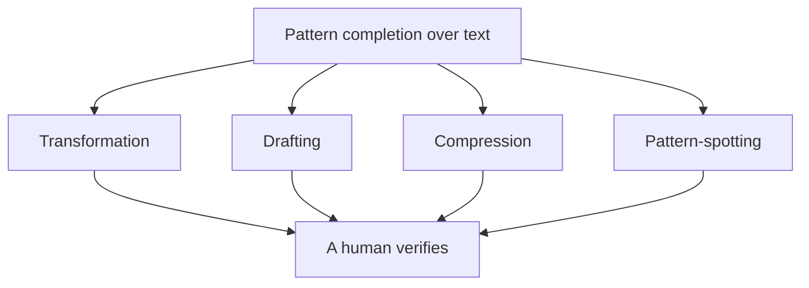
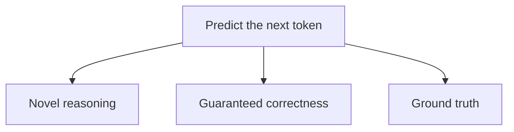
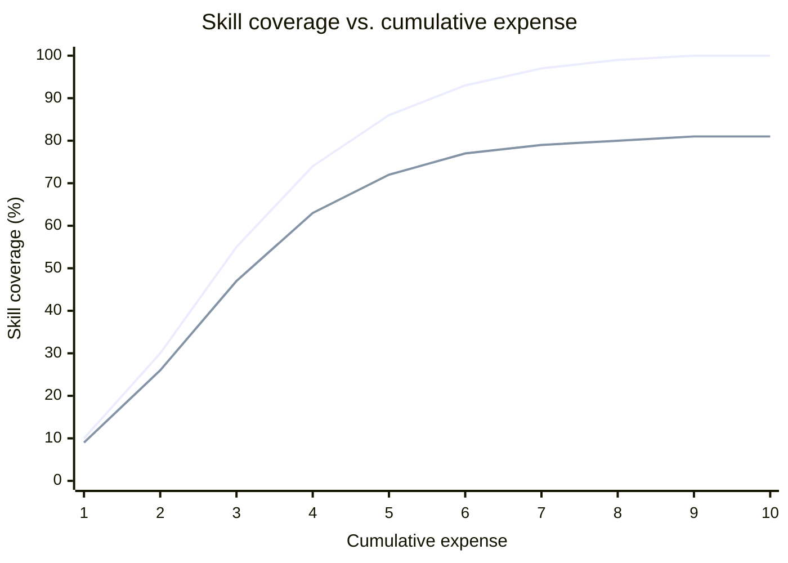
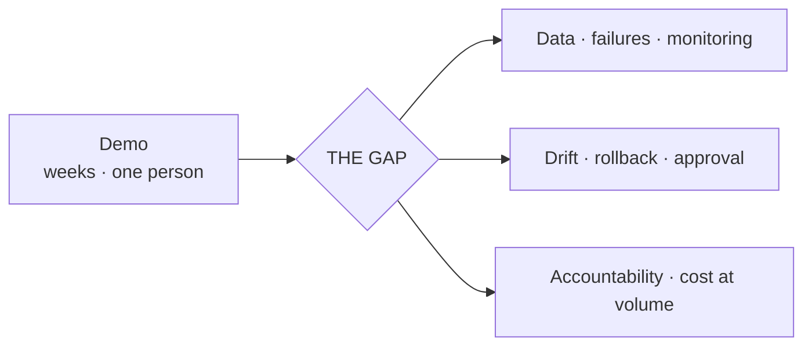
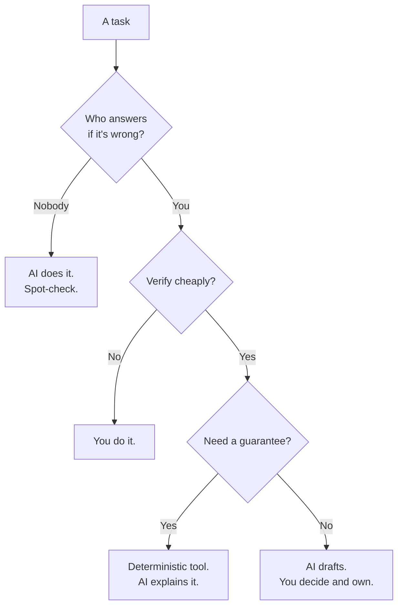

# Slide Outline — Session 15: What AI Can and Can't Do — and Will It Take Our Jobs?

Build per `../../powerpoint_instructions.md` (§7 note for Session 15: *the per-role job analysis is the emotional centre; build it honestly per role; confirm candour level with the requester*).

**Deck shape:** 1 title + 1 agenda + **17 content** + 1 discussion + 1 resources = **21 slides**. Target 45 minutes.

**Delivery notes for the whole deck:**
- Slides 12–15 (the four roles) are the emotional centre. **2.5 minutes each, hard.** Do not let them run.
- Announce at slide 2 that questions are held to the end. This deck generates interruptions and the budget cannot absorb them.
- Deliver Half B flat and factual. The material is strong enough; warmth applied to it reads as evasion.
- **Licence discipline:** the entire role analysis (slides 11–17) is authored for this course and is SLIDE-SAFE. Half A derives ideas from LINK-ONLY commercial decks — **paraphrased and redrawn only, never reproduced.** No Ng or Chollet quotation appears on any slide.

---

## Slide 1 — Title

**On-slide text**
> **Session 15 — What AI Can and Can't Do**
> **…and Will It Take Our Jobs?**
> AI Training Series · Block: Judge it · Goals 8 & 9
> 45 min + 15 min Q&A

**Speaker notes:** This is the session most people signed up for. Set expectations in one sentence: the first half is about capability, the second half is specific and names your roles. Say plainly that there is no reassurance segment and no prediction segment — the aim is that everyone leaves able to decompose their own job.
**Visual:** Series title layout.
**Source/licence:** Original.

---

## Slide 2 — Agenda

**On-slide text**
> - What LLMs genuinely do well
> - Where they structurally fail
> - The S-curve: capability vs. cost
> - The production gap
> - Your job, role by role
> - What to actually do
> - Questions — held to the end

**Speaker notes:** Mirror the README minute budget. Flag the ground rule now: hold questions, we have a full fifteen minutes and you will want them. Note that the four role slides move fast by design and the detail is in the written material.
**Visual:** Agenda layout.
**Source/licence:** Original.

---

## Slide 3 — Hook: both of these are true

**On-slide text**
> **"AI writes a third of our code."**
> **"Our AI pilot never made it to production."**
>
> Which one matches your last twelve months?

**Speaker notes:** Both statements are commonplace and both are true, in different organisations and often in the same one. The tension between them is not hypocrisy — it is the S-curve, and by the end of the first half the audience will be able to say why. Take a show of hands. It is a genuine temperature check and it usually splits the room, which is exactly the setup you want.
**Visual:** Two-column quote layout, no imagery.
**Source/licence:** Original framing.

---

## Slide 4 — One property explains everything LLMs are good at

**On-slide text**
> LLMs excel when:
> - Language in → language out
> - The information is already in the input
> - A human can **cheaply** check the result
>
> All three clauses are required.

**Speaker notes:** Callback to Session 1 — pattern completion, not lookup. Walk each clause and what breaks without it: arithmetic fails the first, hallucination is the second failing, and the third is the safety property everybody skips. The third clause is the same decision rule the system-safety material lands on: defensible when the user can easily verify, or when truth is irrelevant. Everything in the second half of this session is an application of that one sentence.
**Visual:** Three stacked clauses, each with a one-word failure label.
**Source/licence:** Framing after Nield, *LLM System Safety and Security* (LINK-ONLY) — **paraphrased, re-authored**.

---

## Slide 5 — Four things it genuinely does well

**On-slide text**
> **Transformation** · same content, new form
> **Drafting** · blank page → first pass
> **Compression** · much text → less text
> **Pattern-spotting** · "these look alike"
>
> All four: the human absorbs the verification cost.

**Speaker notes:** Be generous here — understating capability makes the second half worthless. Give one concrete example per family from this audience's world: PR titles into grouped release notes; a first-cut incident summary from a chat transcript; a diff summarised in human terms; 300 tickets clustered into candidate problem records. Then land the bottom line: the model produces the artefact and a human pays for the checking. Hold that; it is the mechanism behind the whole second half.
**Visual (render this Mermaid):**

**Source/licence:** Original diagram.

---

## Slide 6 — The capability table

**On-slide text** (table layout — abbreviate to 8 rows for legibility; full version in `content/01`)

| Task | Verdict |
|---|---|
| Reformat / restructure text | Genuinely good |
| Draft a first pass | Genuinely good |
| Summarise a long document | Good **with verification** |
| Generate boilerplate code | Good **with verification** |
| Cluster tickets / logs | Good as a **hypothesis** |
| Arithmetic, counting | Unreliable |
| Guarantee a property | **Structurally impossible** |
| Decide, and be accountable | **Not a capability** |

**Speaker notes:** This is the reference artefact of Half A; tell people to photograph it. Draw attention to the bottom three rows — the shift from "unreliable" to "structurally impossible" to "not a capability at all" is the argument of the next slide. "Cluster tickets" is the row this audience most often gets wrong: it is a genuine strength producing a *lead*, never a finding.
**Visual:** Table layout. Use shape/label, not colour alone, to mark the three verdict tiers (greyscale-safe).
**Source/licence:** Original.

---

## Slide 7 — "Can't yet" vs. "can't, structurally"

**On-slide text**
> **"Can't yet"** — quantitative. More data, more compute. Assume it improves.
> **"Can't, structurally"** — follows from what the thing is. Do not plan around it changing.
>
> Only three things are in the second list.

**Speaker notes:** This distinction is why most public commentary about AI limits is obsolete within eighteen months — it is all about the first category. The next slide is deliberately a short list; a short defensible list beats a long one that ages badly. Invite the audience to hold you to it: if any of the three gets solved, the mechanism itself will have changed.
**Visual:** Two-column contrast layout.
**Source/licence:** Original.

---

## Slide 8 — Three structural failures

**On-slide text**
> **1 · Novel reasoning** — brilliant inside the trained distribution, unreliable outside it, with no signal telling you which
> **2 · Guaranteed correctness** — the output is a sample, never a proof
> **3 · Ground truth** — nothing in the mechanism ever touches reality
>
> All three follow from "predict the next token."

**Speaker notes:** Failure 1: interpolation versus extrapolation — and the point that lands with this room is that *your job is what's left after the routine cases*, so your professional value sits precisely where the model is weakest. Failure 2: errors correlate with distance from the training distribution, which you cannot observe — so there is no coverage metric and no trustworthy confidence signal. Failure 3: three production forms — selection bias (the kangaroo that was never in the data), outliers (which combine multiplicatively while your test matrix grows linearly), and data rot (the medical-imaging case — a model that works at one hospital and degrades at an older one down the street, while any human radiologist just walks down the street and does fine). Paraphrase that last one; do not quote.
**Visual (render this Mermaid):**

**Source/licence:** Ideas after Nield, *Deep Learning for Beginners* Day 3 and *LLM System Safety* (both LINK-ONLY) — **paraphrased and redrawn**. Ng radiology point **paraphrased, not quoted**.

---

## Slide 9 — The reflex

**On-slide text**
> If your sentence needs
> **always · never · all · exactly**
> an LLM cannot be the thing that makes it true.
>
> Use a diff. A hash. A validator. A test.

**Speaker notes:** This is the most portable line in the session and the one people quote back to you months later. It is especially pointed for configuration management, whose entire vocabulary is made of those four words. Note explicitly that the right answer is often "don't use AI for this at all, use a deterministic checker" — being willing to say that is what makes the rest of the session credible.
**Visual:** Single-statement slide, large type.
**Source/licence:** Original.

---

## Slide 10 — The S-curve: capability saturates, cost explodes

**On-slide text**
> Belief: capability is **exponential**.
> Observation: capability is a **logistic curve** — and it plateaus short of 100%.
>
> **It is not AI capability that is exponential. It is the expense of producing it.**

**Speaker notes:** Walk the two curves. Then the cost-per-increment numbers, which are the real argument: between the fourth and sixth unit of spend you buy fourteen points of coverage; between the eighth and tenth you buy one, for the same money. Then the mechanism in one breath — common cases are dense and cheap, rare cases are sparse and expensive, rare cases combine multiplicatively, ground-truth labelling is manual, and data rot means some spend just keeps you where you are.
**Visual (render this Mermaid; if the renderer is unreliable, use the table from `content/03` §2 — it is arguably the better slide):**

**Source/licence:** Framing after Seltz-Axmacher via Nield Day 3 (LINK-ONLY) — **paraphrased; curve redrawn from our own numbers.** Do not reproduce the source figure.

---

## Slide 11 — Was the S-curve wrong?

**On-slide text**
> It was made before the scaling era. Ask it honestly.
>
> **Wrong about:** the height of the ceiling.
> **Right about:** the shape of the cost.
>
> And you work in the last mile.

**Speaker notes:** Do not skip this slide — the argument is stronger for being challenged, and the room contains people who will challenge it anyway. Give both sides fairly: general pre-training moved many task curves at once, which the original argument did not anticipate; but coverage of any specific high-stakes real-world task still plateaus, and the gap between "usually right" and "reliable enough to act on unsupervised" has proven extremely expensive. The saturation moved up the difficulty scale rather than disappearing. This is the transition into the production gap.
**Visual:** Two-column for/against layout.
**Source/licence:** Original analysis.

---

## Slide 12 — The gap: everything that isn't the demo

**On-slide text**
> Beyond a working demo:
> - Representative data · failure catalogue
> - Monitoring · drift detection
> - Rollback · change approval
> - Accountability · real-volume cost
>
> Read that list again.

**Speaker notes:** Paraphrase the proof-of-concept-to-production point: the field is excellent at doing well on a test set, and deploying takes far more than that. Then deliver the turn slowly — every item on that list is a release, problem, or configuration management responsibility. And the gap does not close: it is downstream of the S-curve, it grows with deployment rather than shrinking with capability, and accountability cannot be automated even in principle, because it is a relationship rather than an output. You cannot page a model at three in the morning.
**Visual (render this Mermaid):**

**Source/licence:** Ng's production-gap point **paraphrased, not quoted** (LINK-ONLY source). Diagram original.

---

## Slide 13 — The turn

**On-slide text**
> 1. Capability plateaus
> 2. So the last mile stays expensive
> 3. The last mile is judgement, verification, accountability
> 4. Which is your job description
>
> **But:** "the same kind of work" ≠ "the same amount of work."

**Speaker notes:** Deliver steps 1–4, pause, then deliver the "but" immediately — do not let the good news sit alone, because the counterweight is what makes the session honest. Either the organisation staffs verification, which favours these roles, or it thins verification and accepts deferred defects, which does not. That is a management choice, not a technology outcome, and it is influenced by how well people in these roles can articulate what their judgement catches. That last point returns on the closing slide.
**Visual:** Four-step horizontal flow, with the "but" as a separate band beneath.
**Source/licence:** Original.

---

## Slide 14 — Release manager

**On-slide text**
> **Automated:** notes drafted · rewritten for audience · translated
> **Augmented:** calendar, cross-tracker status, go/no-go pack
> **Stays human:** go/no-go · defect acceptability · negotiation · rollback · accountability
> **Gets harder:** more change through the same gate; change descriptions are now fluent

**Speaker notes:** Release notes get drafted, not decided. The gate is the archetypal instance of everything an LLM can't do — novel situation, needs a guarantee, needs ground truth, needs a name on it. The "gets harder" line deserves twenty seconds: your radar for "this description is vague, the author hasn't thought it through" was calibrated on human writing, and fluency has now been decoupled from competence. Replace the feeling with explicit questions. Uncomfortable part, said plainly: coordination-heavy variants of this role are exposed, and that portion is automatable now, not eventually.
**Visual:** Four-band role layout (the same layout on slides 14–17 for comparability).
**Source/licence:** **Original — SLIDE-SAFE.**

---

## Slide 15 — Problem manager

**On-slide text**
> **Automated:** timelines · incident summaries · stakeholder write-ups
> **Augmented:** "seen this before?" · clustering · correlation · candidate hypotheses
> **Stays human:** root cause · which anomaly matters · blameless facilitation · recurrence
> **Gets harder:** anchoring on a fluent wrong cause

**Speaker notes:** This is the role where AI's real strength and real weakness meet inside the same task. Spend most of the time on anchoring — it is the most serious professional risk in the session. Once a plausible narrative is in hand, evidence gets fitted to it; previously a wrong hypothesis arrived with a colleague's uncertainty attached, now it arrives as confident prose. And a wrong root cause is worse than none, because the record closes and the real cause stays live. The countermeasure is concrete and teachable: demand three competing hypotheses with disconfirming evidence, never one narrative. Also note that a blameless post-mortem's real output is people telling the truth — no generator produces that.
**Visual:** Four-band role layout.
**Source/licence:** **Original — SLIDE-SAFE.**

---

## Slide 16 — Configuration manager

**On-slide text**
> **Automated:** diff summarised in human terms — *drift detection belongs to a deterministic tool, not an LLM*
> **Augmented:** change-record drafts · blast-radius proposals
> **Stays human:** CMDB ↔ reality · approval · remediation ownership
> **Gets harder:** AI-generated config that is plausible, valid, and wrong

**Speaker notes:** The unusual property of this role: much of the automatable work should go to deterministic tools, and saying so builds credibility. Then the serious item — generated configuration is syntactically valid, semantically plausible, and wrong for *your* environment, and unlike code it often has no compiler and no test. It parses, it deploys, it fails later or shows up as a security finding. This is the config analogue of the ~39% insecure-code finding from Session 14, and arguably worse for having weaker checking. Countermeasure: deterministic policy check before human review, and review against your baseline, not against plausibility — plausibility is exactly what the model optimised for.
**Visual:** Four-band role layout.
**Source/licence:** **Original — SLIDE-SAFE.** The ~39% finding cited (Pearce et al., IEEE S&P 2022) with attribution.

---

## Slide 17 — Developer

**On-slide text**
> **Automated:** boilerplate · scaffolding · fixtures · translation
> **Augmented:** explanation · implementation · debugging · refactor proposals
> **Stays human:** design · security judgement · review · accountability
> **Gets harder:** reviewing far more code that is *usually* fine
>
> ~39% of top suggestions in security-relevant scenarios carried a vulnerability *(IEEE S&P 2022)*

**Speaker notes:** Give the caveats on the number honestly — specific model generation, deliberately security-sensitive scenarios, models have improved. Then why it still matters: the mechanism is unchanged (nothing in next-token prediction prefers the secure pattern over the common one, and insecure patterns are often more common because they are shorter and appear in tutorials), and volume went up. So secure-by-design judgement is worth *more* now, not less. Then name the junior-pipeline problem out loud — the tasks that trained juniors into seniors are exactly the tasks AI does best, demand for senior judgement is rising, and nobody has a good answer. Do not resolve it. Naming it is the contribution.
**Visual:** Four-band role layout, with the finding as a footer band.
**Source/licence:** **Original — SLIDE-SAFE.** Finding attributed to Pearce et al., *Asleep at the Keyboard?*, IEEE S&P 2022 — cite, do not reproduce figures.

---

## Slide 18 — Task → who owns it

**On-slide text**
> Three questions, in order:
> 1. **If it's wrong, who answers?**
> 2. **Can you verify it cheaply?**
> 3. **Do you need a guarantee?**

**Speaker notes:** The take-away artefact — tell people to photograph this one too. Walk one real example through it live; a change approval works well. Emphasise the third branch: a large share of "should we use AI for this?" questions correctly resolve to "no — use a checker." Being the person who says that is what makes you credible when you say yes.
**Visual (render this Mermaid):**

**Source/licence:** **Original — SLIDE-SAFE.**

---

## Slide 19 — Delegate / never delegate

**On-slide text**

| Delegate | Never delegate |
|---|---|
| First drafts you will edit and own | The decision to ship |
| Reformatting, translation | Approval of a change |
| Summaries of documents someone read | The root cause |
| Competing hypotheses | Choosing between them |
| Boilerplate code | Any assertion of correctness or security |
| Rehearsing a hard argument | The hard conversation itself |

**Speaker notes:** The one test that resolves edge cases: if it goes out with your name on it and you have not verified it, you have delegated accountability — and that does not work, because the accountability stays with you regardless of what you believe you handed over. Then the four questions to take to management (verification capacity, where accountability sits, what deterministic gates run first, how juniors acquire judgement). A management team with good answers to all four is running a serious programme; one with no answers has bought a productivity story and not yet met the operating model.
**Visual:** Two-column table.
**Source/licence:** **Original — SLIDE-SAFE.**

---

## Slide 20 — Discussion

**On-slide text**
> **Poll:** which bucket is the biggest share of *your* week — automatable, augmentable, or human-only?
>
> Then: the four questions in `exercises/discussion.md`.
>
> *If you remember one thing:* your exposure is not being replaced. It is being handed the verification load without the time.

**Speaker notes:** Run the poll first — it gets people talking about their own work rather than about AI in the abstract, which is the whole point. Then take the prompts in order of provocation, not order of comfort. Do not answer the headcount question with reassurance; say honestly what the analysis supports and where it runs out. See the facilitation notes in `exercises/discussion.md`.
**Visual:** Discussion/poll layout.
**Source/licence:** Original.

---

## Slide 21 — Resources & credits

**On-slide text**
> - Session material: `content/` — the four role sections are the take-away
> - Self-audit: `exercises/lab.md` (25 min, your own role)
> - Full sources & licences: `resources/sources.md`
> - Concepts after Nield (O'Reilly) and Seltz-Axmacher — **paraphrased, link-only**
> - Insecure-suggestion finding: Pearce et al., IEEE S&P 2022

**Speaker notes:** Point people at the written role sections — they carry detail the 2.5-minute slides could not. Note that the role analysis is original to this course. Close by inviting the audience to bring their completed self-audit to a follow-up conversation.
**Visual:** Resources & credits layout.
**Source/licence:** Attributions per `resources/sources.md`.
