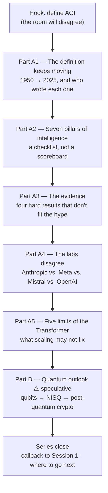

# Overview — What Is AGI, and an Outlook on Quantum

The closing session of the series. Two horizon topics, one method: **ask what the evidence actually shows, and notice who benefits from the claim.**

---

## Why this session exists, and why it is last

Fourteen sessions have built a working vocabulary and a working skepticism. Session 16 spends both on the two questions that get asked most often and answered worst:

1. **"Is AGI coming, and when?"** — asked by everyone, answered mostly by people with equity in the answer.
2. **"What about quantum computers?"** — asked because it is in the news, answered mostly by people selling something.

We put them together deliberately. They are the two topics in this series where the gap between the public conversation and the technical reality is widest. The tools for closing that gap are the same in both cases, and you already have them.

## The arc of the session

*Figure: the session arc. Everything before the dashed line of Part B is evidence-led; Part B is explicitly labelled as the most speculative content in the series.*

## What each content file does

| File | Covers | Why it is here |
|---|---|---|
| `01-the-moving-definition-of-agi.md` | Seven definitions, 1950–2025, and their authors' incentives | You cannot evaluate a claim about AGI until you know which AGI is meant |
| `02-seven-pillars-of-intelligence.md` | Reasoning · memory · learning · language · perception · self-awareness · motivation/values | A structured checklist beats a vibe |
| `03-the-evidence-what-is-still-missing.md` | The gap table + four hard empirical results + benchmark status | The core of the session |
| `04-what-the-labs-say.md` | Anthropic, Meta, Mistral, DeepSeek, AI2, OpenAI — positions and disagreements | The strongest available anti-hype argument comes from inside the industry |
| `05-limits-of-the-transformer.md` | O(n²) · shallow vectorised reasoning · architectural rigidity · no embodiment · monoculture | Architecture-level reasons the current path may not arrive |
| `06-quantum-outlook.md` | Qubits, superposition, entanglement, NISQ, error correction, the AI intersection, post-quantum crypto | Goal 11, fully authored, honestly caveated |
| `07-series-close-and-where-to-go-next.md` | Callback to Session 1; a reading and practice path | Closing fifteen sessions properly |
| `99-key-takeaways.md` | Tight recap | The one-page artefact |

## Three ground rules for this session

**1. Every number is provisional.** Benchmark scores, model names, and lab positions in this material are tagged **`[verify at delivery]`**. They were true when written and may not be true when read. This is not a disclaimer bolted on — it is the subject matter. A field whose headline facts expire in months is a field where confident long-range predictions deserve suspicion.

**2. "We don't know" is a permitted answer.** Several questions in this session have no settled answer: whether current architectures can reach general intelligence, whether the seven pillars are the right decomposition, when (or whether) fault-tolerant quantum computing arrives. Saying so is more useful than guessing, and it models the behaviour we want in production decisions.

**3. Skepticism is not cynicism.** The systems discussed in this series are genuinely useful and genuinely improving. The argument here is narrow and specific: *the leap from "useful and improving" to "general intelligence is imminent" is not supported by the evidence we have.* Both halves of that sentence matter.

## What this session is not

- **Not a prediction.** We give no date for AGI. Anyone who gives you one — including a lab CEO — is expressing a belief, not a finding.
- **Not a physics course.** The quantum segment is deliberately shallow on mechanism and deliberately firm on implications.
- **Not a dismissal.** "Not imminent" is not "not important." Two of the five Transformer limits are being actively attacked by serious research programmes, and post-quantum cryptography is a real, dated, funded engineering problem.

## The question that runs underneath both halves

> **Who made this claim, what does it measure, and what would it look like if it were false?**

That is the four-question benchmark checklist from Session 13, generalised. It works on AGI claims. It works on quantum claims. It will work on whatever the next horizon topic turns out to be — which is the actual, portable takeaway of this session and arguably of the series.
