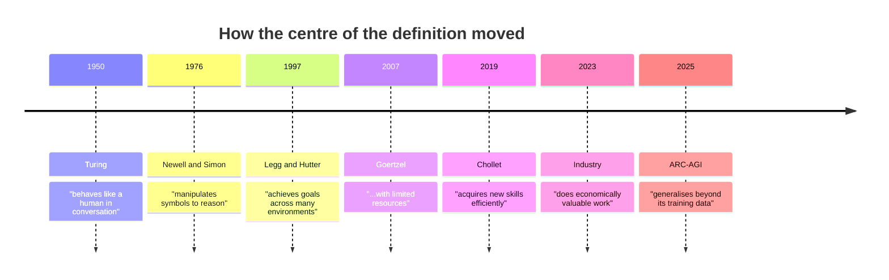
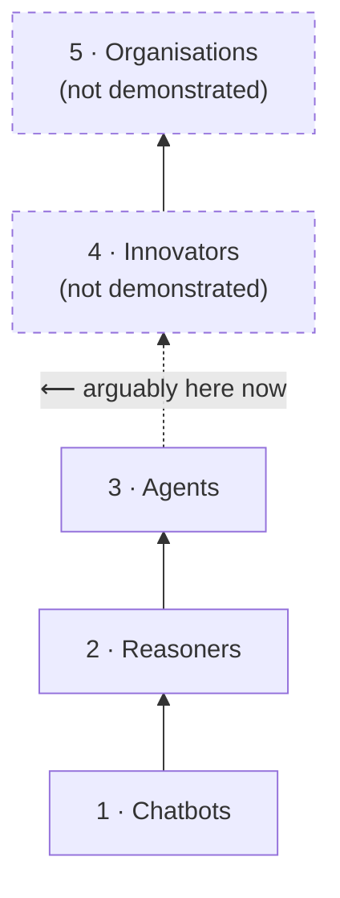
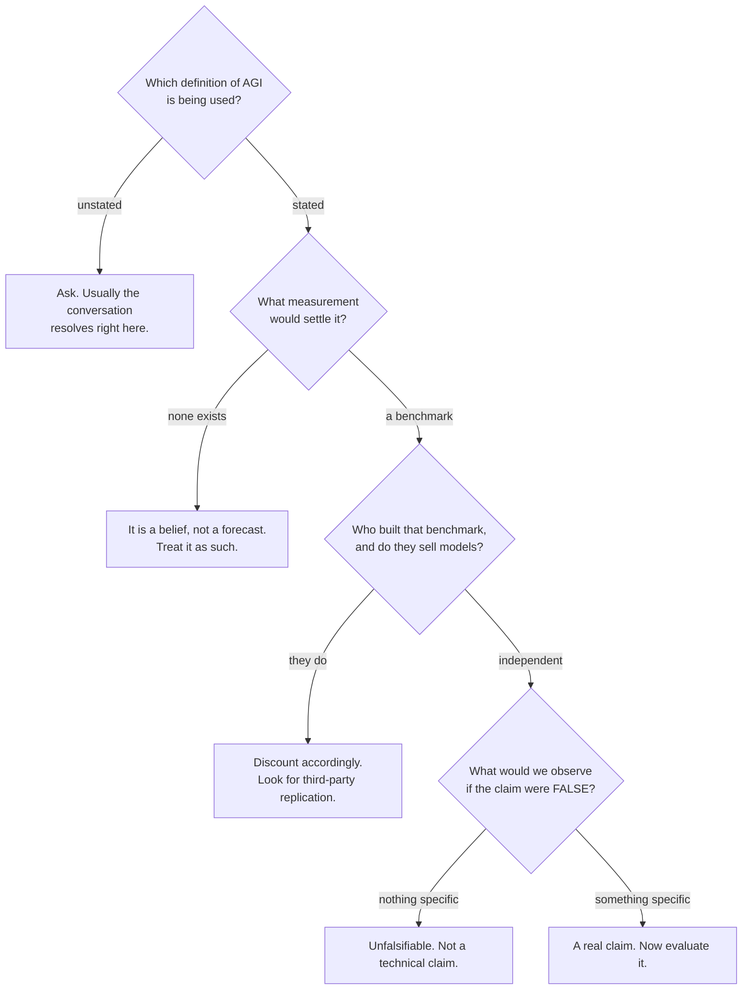

# 1 — The Definition of AGI Keeps Moving

"Artificial General Intelligence" has been redefined roughly every decade since 1950. Each definition was reasonable for its moment; each also happened to be measurable by the tools its author had. That pattern is the first thing to understand about the term.

---

## 1.1 The problem with the question "is AGI close?"

Ask five people in a room to define AGI and you will get five answers. Some common ones:

- "A machine that can do any intellectual task a human can."
- "A machine that is conscious / self-aware."
- "A machine that can replace most jobs."
- "A machine that can improve itself."
- "A machine that passes as human in conversation."

These are not variations on one idea. They are **five different claims with five different evidence requirements**, and they can be simultaneously true and false of the same system. GPT-class models already outperform most humans at some intellectual tasks and fail at others a seven-year-old handles. Whether that counts as "close to AGI" depends entirely on which definition you picked before you looked.

> **The operational point.** When someone says "AGI by 2027", the useful reply is not "I disagree." It is **"which definition, and what measurement would settle it?"** Most of the time there is no answer to the second half, and the conversation ends there — correctly.

## 1.2 The timeline of definitions

*(Framing after the AGI-definitions timeline in the source deck — see `resources/sources.md` #1; wording, grouping commentary and the incentives column are our own. `[verify at delivery]` for the 2023–2025 rows, which are still moving.)*

| Era | Year | Author | The definition, in brief | What it puts at the centre | What it conveniently measures |
|---|---|---|---|---|---|
| **Classical** | 1950 | **Alan Turing** | If a machine converses indistinguishably from a human, call it intelligent | **Behavioural imitation** | A conversation — the only test available in 1950 |
| **Classical** | ~1976–80 | **Allen Newell & Herbert Simon** | A physical symbol system has the necessary and sufficient means for general intelligent action | **Symbol manipulation, internal reasoning** | Symbolic programs — exactly what their lab built |
| **Emergent** | ~1997–2007 | **Shane Legg & Marcus Hutter** | Intelligence measures an agent's ability to achieve goals across a wide range of environments | **Generality, formalised** (the AIXI programme) | Reinforcement-learning agents across task suites |
| **Emergent** | 2007 | **Ben Goertzel** | AGI is achieving complex goals in complex environments **using limited resources** | **Generality under real constraints** | Efficiency, not just capability — a genuine advance |
| **Modern** | 2019 | **François Chollet** | Intelligence is **skill-acquisition efficiency** across a wide range of tasks, independent of priors | **Generalisation over memorisation** | ARC-AGI — a benchmark he designed to be resistant to memorisation |
| **Modern** | 2023–2025 | **OpenAI / much of industry** | AGI is a system broadly smarter than humans at **economically valuable work** | **Practical utility and market impact** | Economic task benchmarks (e.g. GDPval) — which the same organisation publishes |
| **Modern** | 2025 | **ARC-AGI community** | A system that can **efficiently acquire new skills outside its training data** | **Generalisation, not pretraining scale** | ARC-AGI-2 |

*Figure: the centre of gravity moves from **imitation** → **reasoning** → **generality** → **efficiency** → **economics** → **generalisation**. Note the 2023 outlier: it is the only definition whose centre is not a property of the system.*

## 1.3 Two things this table tells you

**(a) Each definition retreats from the last one that got solved.**
Turing's test was, in a loose conversational sense, passed — and the response was not "we have AGI" but "the Turing Test was never a good test." That is not cheating; it is how a field discovers that its proxy was a proxy. But it does mean the target moves *by construction*, and any claim of the form "we are N years from AGI" inherits that instability.

**(b) The 2023 industry definition is a different kind of object.**
Every other definition describes a property of the *system*: does it reason, does it generalise, does it acquire skills efficiently. The industry definition describes a property of the *economy*: does it outperform humans at valuable work. That shift matters for three reasons:

| | Property-of-system definitions | The economic definition |
|---|---|---|
| **What it measures** | capability, generality, efficiency | labour-market substitution |
| **Who can verify it** | researchers, with benchmarks | economists, after the fact |
| **Moves when…** | the system improves | *labour markets or prices change* |
| **Commercially useful to…** | nobody in particular | organisations raising capital on the claim |

The economic definition can be satisfied by a system that is not general at all — a narrow tool that happens to be cheaper than a human — and it can fail to be satisfied by a genuinely general system that is too expensive to deploy. It is a **business milestone wearing a scientific term.**

> **The incentive point, stated plainly.** Several of the most-cited AGI benchmarks are published by organisations that also sell models. Session 13's benchmark checklist applies directly: *who made it, what is it testing, how often is it updated, is it measuring what it claims?* When an organisation defines the goalpost, builds the measuring tape, and announces the score, the score is not worthless — but it is marketing evidence before it is scientific evidence.

## 1.4 A ladder that is worth knowing (and worth doubting)

A widely-circulated framing from OpenAI's leadership describes five levels of AI capability `[verify at delivery — this framing has been restated in several forms]`:

| Level | Name | Description | Rough exemplar |
|---|---|---|---|
| 1 | **Chatbots** | Conversational language ability | GPT-3.5-class |
| 2 | **Reasoners** | Multi-step logical problem solving | o1-class "reasoning" models |
| 3 | **Agents** | Take actions in the world using tools and memory | current agent frameworks — *arguably where we are* |
| 4 | **Innovators** | Generate genuinely novel ideas or inventions | not demonstrated |
| 5 | **Organisations** | Multi-agent systems operating like a coherent human team | not demonstrated |

*Figure: the five-level ladder. Dashed levels have no demonstrated example. Use the ladder as vocabulary, not as a schedule.*

**Why it is useful:** it separates capabilities that are genuinely different in kind. "Can hold a conversation," "can plan a multi-step solution," and "can act on the world" really are distinct engineering problems, and the room will recognise them from Sessions 9–13.

**Why to doubt it:** a ladder implies the rungs are evenly spaced and that climbing continues. Neither is established. The gap from 3 to 4 — from *executing tasks* to *inventing* — is not known to be the same kind of gap as 1 to 2. It may not be a gap at all so much as a different building. Present the ladder as a **taxonomy of capabilities**, never as a **timeline**.

## 1.5 What to do with all of this in practice

When you next meet an AGI claim — in a vendor pitch, a strategy deck, a headline, or a colleague's enthusiasm — run four questions:

*Figure: a four-question filter for horizon claims. It works on quantum claims too — we reuse it in `content/06`.*

---

**Section takeaway.** AGI is not one hypothesis with one truth value. It is at least seven distinct claims, written across seventy-five years, by people whose available tools and commercial interests shaped what they chose to measure. Before you can answer "is it close?", somebody has to say **which one**.
