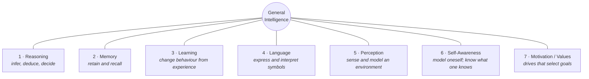
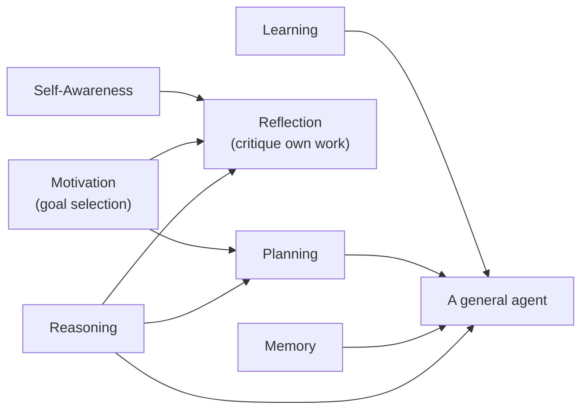

# 2 — Seven Pillars of Human Intelligence

If "AGI" means a machine with general intelligence, it helps to decompose what *general intelligence* is made of. This file presents a seven-part framework and, for each part, asks the same question: **what does a current system actually do here, and what does it not?**

---

## 2.1 Why decompose at all

"Is it intelligent?" is unanswerable. "Does it maintain a persistent, revisable model of its own knowledge?" is answerable — and the answer is informative. Decomposition converts an argument into a checklist.

The seven pillars used here come from the source deck's organising framework (`resources/sources.md` #1) and are re-stated in our own words. They are **not** a standard of the field. Cognitive science offers several competing decompositions, and reasonable people would draw the lines differently — memory and learning in particular blur into one another. Use the framework as a **thinking tool**, not as a taxonomy with authority.

> **Honest caveat, worth saying out loud in the room.** Any list of "the components of intelligence" is a hypothesis about intelligence, not a measurement of it. This one is useful because it maps cleanly onto things we can test in machines. That is its virtue and also its bias: it may over-weight what happens to be testable.

## 2.2 The seven pillars

*Figure: the seven pillars as a concept map. They are not independent — the composites in §2.4 matter as much as the pillars themselves.*

| # | Pillar | Plain definition | The machine question |
|---|---|---|---|
| 1 | **Reasoning** | Drawing conclusions and making decisions by logic and inference | Does it *derive* the answer, or retrieve a pattern that resembles one? |
| 2 | **Memory** | Retaining and recalling information and experience over time | Does it remember, or is it re-reading a transcript we pasted in? |
| 3 | **Learning** | Changing knowledge or behaviour through experience | Does it improve *after* deployment, without a retraining run? |
| 4 | **Language** | Expressing and interpreting thought through symbols | Does it manipulate symbols, or understand what they refer to? |
| 5 | **Perception** | Using sensory input to build a model of an environment | Is there a world behind the words, or only the words? |
| 6 | **Self-awareness** | Recognising oneself; knowing the limits of one's own knowledge | Can it reliably say "I don't know"? |
| 7 | **Motivation / values** | Internal drives and principles that select goals | Are its goals its own, or entirely ours? |

## 2.3 Pillar by pillar: the classical idea, the modern idea, the machine reality

Each pillar below follows the same three beats: **where the idea comes from**, **what cognitive science added**, and **what today's systems actually do**. The evidence backing the third column is in `content/03`.

### Pillar 1 — Reasoning

- **Classical.** Aristotle's "rational animal", and the distinction between *discursive* reasoning (step-by-step inference) and *intuitive* reasoning (grasping something immediately). Consider crossing a street with a car approaching: you do not solve a velocity problem, you *intuit* the gap. Both are reasoning; only one is serial.
- **Modern.** Philosophers of neuroscience (notably Paul and Patricia Churchland) argue reasoning is an **emergent property of massively parallel neural activity**, not a symbolic engine running in the head. If true, that is encouraging for neural networks — reasoning need not be built in explicitly.
- **Machines today.** "Reasoning models" force the discursive mode: generate intermediate steps, then answer. This measurably helps on some tasks and measurably does not on others — and it costs latency, sometimes severely. Crucially, chain-of-thought text is a *token stream*, not a verified proof; the model can produce a correct-looking derivation and a wrong answer, or the reverse.

### Pillar 2 — Memory

- **Classical.** Aristotle treats memory as the thread connecting past experience to present behaviour, conditioned by time. Hume adds that memory and imagination both trade in *mental images of past perceptions* — a suspiciously thin line between the two.
- **Modern.** Human memory is **reconstructive, not a recording.** We rebuild a memory each time we recall it, and the rebuild introduces errors: false memories, drift, confabulation. **This is the Session 1 idea returning** — the mechanism that makes human memory efficient is the mechanism that makes it unreliable, and the parallel with LLM hallucination is striking (though the parallel is an analogy, not an identity claim).
- **Machines today.** Two distinct things get called memory:
  - **Short-term** = the context window. It is not memory; it is *re-reading*. Known failure modes: needle-in-a-haystack retrieval failures and positional bias.
  - **Long-term** = external stores (vector databases, graph memory, agent "notepads") plus fine-tuning. This works, but it is memory the way a filing cabinet is memory.
  - The **extended-mind** argument (Clark & Chalmers' thought experiment about "Otto", who uses a notebook in place of biological memory) is the philosophical warrant for counting external tools as genuine memory: *if it plays the functional role of memory, it is memory.* This is the strongest available defence of RAG-as-memory — and it is a philosophical argument, not an empirical result.
  - Empirically, agent long-term memory helps **mainly when future tasks resemble past ones** `[verify at delivery]`. That is a meaningful limitation: it is closer to caching than to learning.

### Pillar 3 — Learning

- **Classical.** The empiricism/rationalism split: do we learn from experience, or from reason and innate structure? Chomsky's argument that children cannot acquire language from exposure alone — that some structure must be innate — sits on the rationalist side.
- **Modern.** Neural networks learn by adjusting weights from examples, which is at least a family resemblance to synaptic change. In-context (few-shot) learning showed that an LLM can adapt behaviour from examples in the prompt without any weight change at all — "on-the-job training" that vanishes when the conversation ends.
- **Machines today.** **This is the sharpest gap in the whole framework.** A deployed LLM does not learn. Training halts; weights freeze; the model is shipped with a knowledge cutoff it can recite. Everything that looks like post-deployment learning is either (a) text put back into the context, (b) an external store being written to, or (c) a separate, expensive retraining run. *The ability to acquire new skills on the fly is arguably the defining feature of "general" intelligence — and it is the one current systems most clearly lack.*

> **Memory vs. learning — keep these separate.** Memory is *storing and retrieving*. Learning is *changing behaviour*. A system with excellent memory and no learning will make the same mistake forever, with a perfect record of having made it.

### Pillar 4 — Language

- **Classical.** Aristotle: spoken words symbolise mental experience, written words symbolise spoken words. Languages differ; the underlying concepts do not. In classical thought, language marked the boundary between mind and non-mind.
- **Modern.** The syntax–semantics problem: **can manipulating symbols ever amount to understanding meaning?** Searle's Chinese Room says no — a person following symbol-manipulation rules produces fluent Chinese without understanding a word, and neither the person nor the room understands. Dennett's rebuttal says understanding can emerge at the level of the *system* even if no part of it understands, and that if the whole system behaves as though it understands, that may be all "understanding" ever was.
- **Machines today.** This is the pillar where machines are strongest, and it is precisely why it misleads. Fluency is the one capability that humans instinctively read as evidence of general intelligence, because in humans it always was. The Turing Test bakes in Dennett's position; if you hold Searle's, fluent output is no evidence at all. **Practical consequence for this room: never evaluate a system on the quality of its prose.** Evaluate it on consistency, calibration, and whether it holds up under a check.

### Pillar 5 — Perception

- **Classical.** Aristotle: the senses receive the *form* of an object without its matter. Descartes: the senses deceive. Hume: sensory impressions are the foundation of every idea we have.
- **Modern.** Direct realism (we perceive the world) versus representationalism (we perceive a construction, shaped by expectation). The representationalist view implies that what a system *expects* colours what it *perceives* — which has an obvious machine analogue.
- **Machines today.** Multimodal models convert images, audio and screens into token-like representations and process them in the same stream as text. This works impressively for description and increasingly for interaction (computer use). What it does not clearly produce is a **grounded world model** — a persistent internal representation of objects, states and physics that survives across steps. The chess probe in `content/03` is the sharpest test of this, and the result is not encouraging.

### Pillar 6 — Self-awareness

- **Classical.** Descartes' *cogito*: the thinking self is the one indubitable certainty.
- **Modern.** Dennett: the self is not an entity but a **narrative construct** — a "centre of narrative gravity", the protagonist the brain writes into the story it tells about its own experience. Split-brain and dissociative cases suggest the mind can host multiple self-representations, which complicates any notion of a unitary self.
- **Machines today.** Do not chase consciousness here — it is unfalsifiable and a time sink in a 45-minute session. The **testable** proxy is **calibration**: does a system's stated confidence match its actual accuracy? If it says 60% confident, is it right about 60% of the time? A system that knows what it does not know can say *"I don't know"* and *"I should check this"* — which is the operationally useful part of self-awareness and, for this audience, the part that matters. Fine-tuning and good prompting both measurably improve calibration `[verify at delivery]`. Reasoning models, notably, did **not** uniformly improve factual reliability (see `content/03`).

### Pillar 7 — Motivation and values

- **Classical.** Plato divides the soul into appetite, spirit and reason, with virtue arising when reason governs. Hume goes further: **reason alone cannot motivate action** — it tells you *how* to reach ends that come from sentiment, never *which* ends to have.
- **Modern.** Damasio's clinical work: patients who lose emotional processing lose effective decision-making. Somatic markers — bodily signals tied to past outcomes — guide choice. Emotion is not the opposite of rationality; it is part of its machinery. In machine learning, reinforcement learning uses **explicit reward functions as a stand-in for motivation**, sometimes with intrinsic-motivation terms (novelty bonuses) to drive exploration. **All of them are specified by a human.**
- **Machines today.** Current systems have no drives. They have objectives we wrote. Alignment work (RLHF, constitutional methods) is the practice of getting our values into the objective — which immediately raises **value pluralism**: whose values? Training data skews heavily English and Western, so the defaults embedded in a model are not neutral. Some value systems are not even structured as right/wrong dichotomies — traditions built on harmony or virtue frame the question differently. **Knowing which defaults are in the box is part of using it responsibly.**

## 2.4 The pillars are not independent — the composites are where it gets hard

This is the framework's most useful move: real capabilities are **combinations**.

*Figure: composite capabilities. Planning ≈ reasoning + motivation. Reflection ≈ reasoning + motivation + self-awareness. A general agent needs reasoning + memory + planning + the ability to learn.*

| Composite | Pillars combined | Where you have already met it |
|---|---|---|
| **Planning** | reasoning + motivation | Plan-and-execute agent patterns (Session 11 context) |
| **Reflection** | reasoning + motivation + self-awareness | "Critique your own answer" prompting (Session 10) |
| **Deep research** | planning + execution + reflection | Multi-step research agents |
| **General agency** | reasoning + memory + planning + learning | Not demonstrated |

**Why this matters for evaluation.** Benchmarks almost always isolate **one** pillar — a logic test, a recall test, a coding test. General intelligence is defined by the *composition*. A system can top every single-pillar benchmark and still fail the composite, and that is not a paradox; it is what you would predict. This is the deepest reason benchmark scores and AGI claims come apart.

## 2.5 The pillar scorecard

The honest, hedged summary. **Every row is contestable and every row should be re-checked at delivery.**

| Pillar | Current systems | Confidence | The specific gap |
|---|---|---|---|
| Reasoning | ⚠️ **Partial** | medium | Works on familiar problem shapes; degrades on novel structure and long compositions |
| Memory | ⚠️ **Partial / external** | high | Context re-reading + bolt-on stores; no native consolidation from short- to long-term |
| Learning | ❌ **Largely absent** | high | Weights frozen at deployment; no on-the-fly skill acquisition |
| Language | ✅ **Strong** | high | Strong on form; "understanding" contested and not needed for the capability |
| Perception | ⚠️ **Partial** | medium | Multimodal input works; a persistent grounded world model does not clearly exist |
| Self-awareness | ⚠️ **Partial (calibration)** | medium | Calibration improvable by training/prompting; still unreliable "I don't know" |
| Motivation/values | ❌ **Externally specified** | high | No intrinsic drives; values are ours, unevenly represented, and imperfectly installed |

**Read the scorecard correctly.** It is not "AGI is 2 pillars away." Nobody knows whether the pillars are additive, whether they are the right seven, or whether the missing ones are the *hard* ones. What the scorecard does support is a narrower and firmer claim: **the gaps are not cosmetic, they are not all obviously closed by scale, and at least two of them (learning, grounded perception) are architectural.**

---

**Section takeaway.** Decompose before you argue. Machines are strongest exactly where humans are most easily fooled — language — and weakest on the pillar most central to the word *general*: learning new skills after deployment. And because real intelligence is composite, single-pillar benchmark wins tell you much less than the headlines imply.
