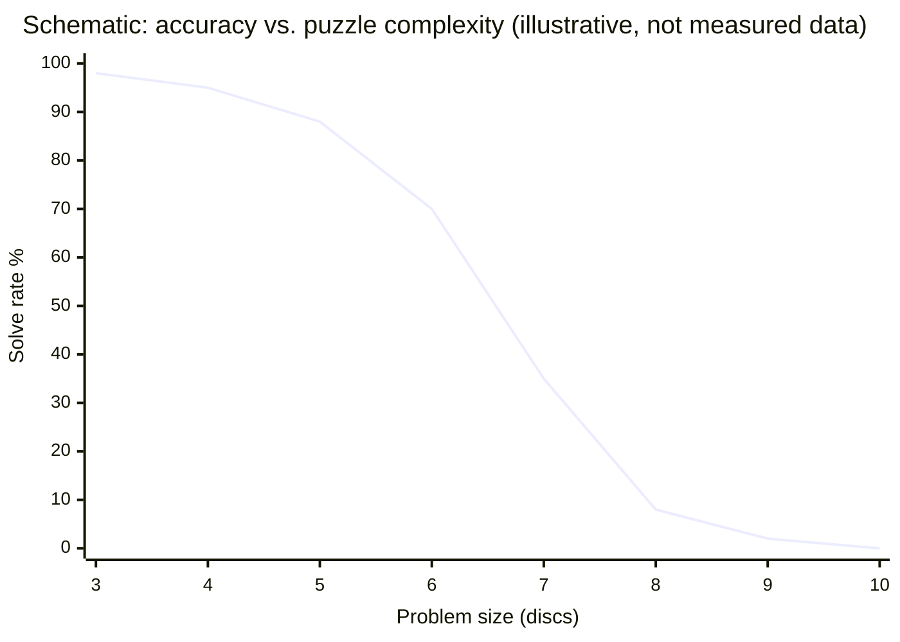
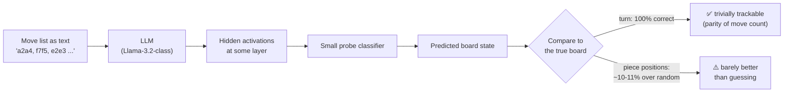
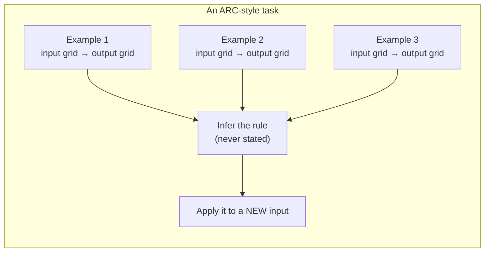

# 3 — The Evidence: What Is Still Missing

This is the centre of the session. Four specific empirical results, none of them cherry-picked from failures of old models, all of them awkward for the "AGI is imminent" story. **Every number below carries `[verify at delivery]` — re-check before presenting.**

---

## 3.1 Why negative results deserve the airtime

Positive results are published loudly and often by the organisation that produced them. Negative results — "we tried the obvious improvement and it did not help" — are published quietly or not at all. That asymmetry is not a conspiracy; it is ordinary publication incentive, familiar to anyone who has read a vendor benchmark.

The consequence is that **the public picture of AI capability is systematically biased upward**, and correcting for that bias requires deliberately going and finding the negative results. This file collects four.

> **Method note.** A negative result is only interesting if the positive result was expected. All four below are cases where a reasonable person would have predicted success: reasoning should help on puzzles, world models should emerge from enough text, better models should hallucinate less, and a benchmark solved at 75% should fall entirely. None of those happened.

## 3.2 Result 1 — Reasoning models fail puzzles children solve

**The setup.** Apple researchers published *The Illusion of Thinking*, testing "thinking" versus "non-thinking" variants of frontier models on controlled puzzle environments — the **Tower of Hanoi** among them — where problem difficulty can be scaled precisely by adding discs. `[verify at delivery — check for replications and rebuttals; this paper has been actively debated]`

**Why Tower of Hanoi is a good test.** It is:

| Property | Why it matters |
|---|---|
| **Algorithmically simple** | A three-line recursive rule solves any instance |
| **Precisely scalable** | Add a disc, double the required moves — difficulty is a dial, not a judgement |
| **Contamination-resistant at scale** | Small instances are all over the internet; large ones are not |
| **Solvable by children** | 3–4 discs is a primary-school activity |
| **Verifiable** | A solution is checkably right or wrong, no rubric needed |

**The finding.** Performance did not degrade gracefully with complexity — it **collapsed** past a threshold. And the more troubling detail: at high complexity, models sometimes *reduced* their reasoning effort rather than increasing it, despite having budget remaining. A system that genuinely had the algorithm would apply it mechanically at any size; a system pattern-matching on familiar instance shapes would look exactly like this.

*Figure: the qualitative shape of the result — high performance, then a cliff. **This chart is a schematic for teaching, not measured data**; label it as such on any slide. Cite the paper for actual figures.*

**The honest counter-argument, which you should present.** Critics responded that some failures reflect **output-length limits** rather than reasoning limits — a 10-disc solution requires 1,023 moves, and a model may simply run out of tokens. That is a fair objection and it weakens the strongest reading of the paper. It does **not** dissolve the result: a system with the algorithm could say *"the solution is 2ⁿ−1 moves; here is the recursive rule"* rather than attempting to enumerate and failing. The inability to abstract *is* the finding.

**What to conclude.** Statistical correlation over training data is not the same as executing an algorithm. Chain-of-thought produces text that *looks like* derivation; whether derivation occurred is a separate question that the text cannot settle.

## 3.3 Result 2 — The chess world-model probe beat random by ~10%

**The question.** If you give a language model a list of chess moves in text — no board image, no explicit state — does it build an internal representation of where the pieces are? If yes, that is evidence for a genuine world model emerging from text alone, which would be a big deal for the perception pillar.

**The method: probing.** Probing means testing what knowledge is encoded in a model's parameters by training a small classifier on its internal activations. If a simple probe can read the board position out of the hidden states, the board is represented in there.

*Figure: the probing setup and its two very different results.*

**The results** `[verify at delivery]`:

| What was probed | Result | Interpretation |
|---|---|---|
| **Whose turn is it?** | 100% correct | Impressive-sounding, actually trivial — it is the parity of the move count |
| **Where are the pieces?** | ~10–11 percentage points better than guessing the *initial* board | Some information is there. Not a board. |

**Why the ~10% is the headline and not a footnote.** A real internal board representation would score near-perfectly — chess state is fully determined by the move list, with no ambiguity and no hidden information. A margin of ten points over a naive baseline is consistent with "the model has learned which pieces tend to have moved by move 20", not with "the model is tracking a board."

**Scope the claim carefully.** This is *one* probe, on *one* model family, at *one* layer, on *one* domain. Other work has found stronger internal representations in models trained specifically on board games. The correct conclusion is not "LLMs have no world models ever." It is: **a general text-trained LLM does not, by default, get a usable world model for free**, and the burden of proof sits with anyone claiming otherwise.

## 3.4 Result 3 — Reasoning models hallucinated *more*

**The expectation.** A model that thinks step-by-step before answering should catch its own errors and be more factually reliable. That is the whole pitch.

**The finding.** On basic factual-recall evaluations — for example person-focused trivia datasets — some reasoning models (o3, o4-mini) showed **higher hallucination rates than the earlier non-reasoning 4o** `[verify at delivery — check the current vendor evaluation hub; these numbers change with every release]`.

| Model class | Expected factual reliability | Observed |
|---|---|---|
| Non-reasoning (4o-class) | baseline | baseline |
| Reasoning (o3 / o4-mini-class) | ↑ better | **↓ worse on recall benchmarks** |

**Why this is more than a curiosity.** It breaks the mental model most people carry — that capability improvements are monotonic, that a newer, more capable, more expensive model is better at everything. It is not. **Capability is not a scalar.** A model optimised for multi-step derivation can regress on single-step recall, plausibly because generating more text creates more opportunities to assert something unsupported.

**The operational lesson for this room, which is the real reason it is in the deck:**

> **You cannot assume a model upgrade is a strict improvement.** If you have a working prompt, a working pipeline, or a working eval on model N, you must re-test on model N+1. This is exactly the regression-testing discipline release and configuration management already applies to every other dependency — and it is routinely skipped for models because "the new one is better." That is a configuration-management failure with a familiar shape.

## 3.5 Result 4 — ARC-AGI-2 is human-solvable and AI-unsolved

**What ARC-AGI is.** The Abstraction and Reasoning Corpus, designed by François Chollet, is a benchmark deliberately built to resist the thing every other benchmark rewards: memorisation at scale.

*(Source: `github.com/fchollet/ARC-AGI` — **Apache-2.0, SLIDE-SAFE.** Tasks and figures may be shown and screenshotted with attribution.)*

Its design properties:

| Property | Consequence |
|---|---|
| **Grid-based visual puzzles** | Coloured cells; no language, no world knowledge to recall |
| **Few-shot only** — 2–4 examples per task, then a test | No fine-tuning on the task; you must infer the rule |
| **Every task uses a novel rule** | Cannot be solved by having seen the rule before |
| **Requires symbolic, compositional reasoning** | Rules combine (e.g. "find the odd shape, then recolour it") |
| **Humans solve them, usually within two tries** | There is a demonstrated existence proof of solvability |

Chollet's underlying thesis: **skill is not intelligence.** A system that is superb at a task it was trained on demonstrates skill. Intelligence is *skill-acquisition efficiency* — how fast you can get good at something you have never seen. ARC-AGI tries to measure the second thing.

*Figure: the ARC task structure. The rule is never given — it must be induced from a handful of examples and then applied. A concrete worked example is in `exercises/lab.md`.*

**Status** `[verify at delivery — this is the fastest-moving number in the session]`:

| Benchmark | Human performance | Best AI | Status |
|---|---|---|---|
| **ARC-AGI-1** | high | ~75% (o3-class, at very high compute cost) | **Effectively solved** — but note the cost caveat |
| **ARC-AGI-2** | solvable by humans | far below human | **Open** |

**Two things to say about the ARC-AGI-1 result honestly:**

1. **It is a real achievement.** A benchmark explicitly designed to be memorisation-proof was substantially beaten. Anyone dismissing that is not being skeptical, they are being stubborn.
2. **The cost matters and is part of the measurement.** The high scores came with compute costs per task orders of magnitude above what a human needs. Under Chollet's own definition — *efficiency* of skill acquisition — brute-forcing a generalisation test with enormous search is a partial answer at best. Goertzel's 2007 phrase, *"using limited resources"*, was doing real work.

**And then ARC-AGI-2 exists.** A harder version, still solvable by ordinary people, on which systems perform poorly. This is the single cleanest fact in the whole session:

> **There exists, right now, a class of problems that untrained humans solve and frontier AI does not.** Whatever else is true about the trajectory, "general" is not yet an accurate adjective.

## 3.6 The consolidated gap table

Pulling `content/02` and this file together — the "what's missing" summary. **All entries `[verify at delivery]`.**

| Pillar | What works today | What is missing | The evidence | How hard does it look? |
|---|---|---|---|---|
| **Reasoning** | Multi-step CoT on familiar problem shapes; strong on code and maths with structure | Reliable algorithm execution; graceful degradation with complexity | Tower-of-Hanoi collapse (§3.2) | **Hard** — may be architectural |
| **Memory** | Long contexts; RAG; external stores; agent notepads | Native consolidation short→long term; recall that improves with experience | Agent memory helps mainly on repeat tasks | **Medium** — active research |
| **Learning** | In-context learning within a session; offline fine-tuning | Any post-deployment skill acquisition | Frozen weights, stated knowledge cutoffs | **Hard** — the defining gap |
| **Language** | Fluency, translation, transformation, summarisation | Grounded reference (words → things) | Chinese Room; letter-counting failures | **Contested** — may not be needed |
| **Perception** | Multimodal input; screen understanding; computer use | A persistent world model that survives across steps | Chess probe ~10% over random (§3.3) | **Hard** — LeCun's central claim |
| **Self-awareness** | Calibration improvable by fine-tuning and prompting | Reliable "I don't know"; stable self-model | Reasoning models hallucinate more (§3.4) | **Medium** |
| **Motivation/values** | Alignment via preference training and constitutional methods | Intrinsic goals; robust, plural value representation | Value monoculture in training data | **Hard, and partly a choice** |

## 3.7 The benchmark-status table

What the scoreboard looks like, and what each entry does *not* prove. `[verify all scores at delivery]`

| Benchmark | What it tests | Status | The caveat |
|---|---|---|---|
| **Turing Test** (informal) | Conversational indistinguishability | Effectively passed | The field responded by declaring it a bad test — which it was |
| **MMLU** | Broad multiple-choice knowledge, 57 subjects | Saturated near/above expert level | Multiple choice; heavy contamination risk; measures recall more than reasoning |
| **GSM8K / maths word problems** | Grade-school arithmetic reasoning | Largely solved | Contamination; also solvable by writing code |
| **TruthfulQA** | Resistance to common falsehoods | Improved | Built in part by a lab that also ships models |
| **SWE-bench** | Real GitHub issue resolution | Strong and rising | Measures software engineering, not general intelligence — check that you care |
| **Humanity's Last Exam** | Very hard expert questions | Open, improving | Composition is STEM-heavy and idiosyncratic; hard ≠ general |
| **ARC-AGI-1** | Skill acquisition from few examples | ~75%, effectively solved | Achieved at extreme compute cost — which undercuts the efficiency claim |
| **ARC-AGI-2** | Same, harder | **Open — humans yes, AI no** | The cleanest current counter-example to "general" |
| **GDPval** | Economically valuable task performance | Emerging | Published by an organisation whose AGI definition it operationalises |

**The pattern across the whole table:** benchmarks fall reliably, and the field learns something *other than* what the benchmark claimed to measure. Every saturated row above was, at the time, described as a meaningful step toward general intelligence. Each turned out to measure something narrower. This is the single most reliable regularity in the field's history, and it is a strong prior for how the next saturation will read.

---

**Section takeaway.** Four independent results, all in the same direction: reasoning that collapses rather than degrades, world models that are not there, factual reliability that went backwards with a "better" model, and a benchmark that ordinary people pass and machines do not. None of this says the systems are not useful — they demonstrably are. It says the specific claim *"general intelligence is imminent"* is not supported by the measurements we have.
