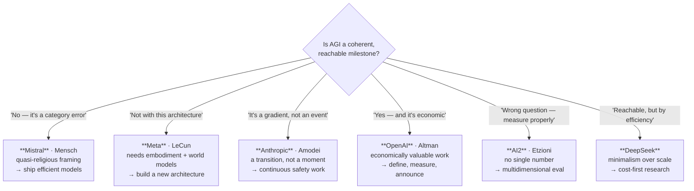

# 4 — The Labs Themselves Disagree

The strongest argument against AGI hype does not come from critics. It comes from the people building the systems, who do not agree with each other about what they are building or whether it is coming.

**All positions in this file are `[verify at delivery]`** — lab leadership, published positions and public statements move faster here than anywhere else in the series.

---

## 4.1 Why disagreement is the finding

If AGI were a well-defined engineering milestone with a visible trajectory, the organisations closest to the work would broadly agree on what it is and roughly when. In physics, the people building a detector agree on what they are detecting.

They do not agree here. Not on the timeline, not on the definition, not on whether the current architecture is the right one, and in at least one case not on whether the concept is coherent at all.

> **The inference to draw.** Disagreement of this kind is not evidence that AGI is far away. It is evidence that **the question is not yet in a state where confident answers are possible**. Anyone giving you a date — optimist or doomer — is expressing a belief. Treat unanimity as more suspicious than disagreement, not less.

## 4.2 The positions

**Licence note:** the quotes below are **paraphrased or short attributed fragments**. On slides, **paraphrase in your own words and attribute the person, not the source deck** (`resources/sources.md` #1 is LINK-ONLY). Link primary sources on the resources slide.

| Lab | Core position | The stance in one line (paraphrase on slides) | What follows from it |
|---|---|---|---|
| **Anthropic** | **AGI is a gradient, not an event.** Leadership largely avoids the term. Prioritises behavioural traits over benchmark scores; treats benchmarks as "partial at best" for missing social reasoning, long-horizon planning and robustness. | Dario Amodei: *AGI is not a moment — it's a transition.* | If there is no threshold, there is no announcement to wait for. Safety work must be continuous, not gated on a declaration. |
| **Meta** | **Benchmarks are not understanding.** Today's models lack the ability to plan and reason about the physical world even when they ace tests. True intelligence requires **embodiment** and world models — hence the research bet on video/world-model architectures. | Yann LeCun: today's models are *smart parrots*, far from AGI. | The current architecture is a dead end for generality. A different one is required, and Meta is building it. |
| **Mistral** | **Skeptical of the concept itself.** Frames the AGI pursuit as quasi-religious. Prioritises efficiency, deployability and small open-weight models over leaderboard position and scaling narratives. | Arthur Mensch: *I don't believe in God… so I don't believe in AGI.* | AGI is a category error. Optimise for shipping useful, cheap, deployable systems. |
| **DeepSeek** | **Progress is efficiency, not scale.** Demonstrated frontier-adjacent performance at dramatically lower training cost, arguing scaling laws are not the only path. Internal metrics favour training cost, inference latency and generalisation over headline scores. | *We aim to explore the essence of AGI through minimalism and performance.* | If capability is achievable far more cheaply, the "compute moat" story about the path to AGI weakens. |
| **AI2** | **Evaluation must be multidimensional.** Tests reasoning, bias, safety and accuracy across many domains; open science and public red-teaming tooling. | Oren Etzioni: *you can't evaluate AGI with a single number.* | Any single-score AGI claim is malformed by construction. |
| **OpenAI** | **AGI as economic threshold.** Defines AGI as autonomous systems outperforming humans at most economically valuable work; frames alignment of a potential superintelligence as an existential priority. | Sam Altman: *we'll hit AGI sooner than most think — and it will matter less.* | An announceable milestone exists, and the organisation defining it also measures it. |

*Figure: six labs, six incompatible answers to the same question. Note that these are not degrees of optimism along one axis — they disagree about **what kind of thing** the question is.*

## 4.3 Reading the positions against the incentives

This is not an accusation of bad faith. It is the ordinary observation that **research agendas and public positions tend to be mutually supporting**, and that noticing this is part of reading the literature.

| Position | Consistent with which commercial or research strategy? | Does that make it wrong? |
|---|---|---|
| "AGI is economically valuable work, and it's coming soon" | Raising capital at scale; justifying very large compute commitments | No — but expect the definition to be measurable by benchmarks the same organisation publishes |
| "Today's models are smart parrots; we need world models" | A research programme built on non-LLM architectures | No — but it is also a critique of competitors' core product |
| "AGI is a religious idea" | Competing on efficiency and open weights, not on frontier-scale training runs | No — but it is a convenient stance for a lab that is not winning the scale race |
| "AGI is a gradient, safety must be continuous" | Safety-forward positioning; recurring-revenue products rather than milestone announcements | No — but it also removes any moment at which the claim could be falsified |
| "Progress is efficiency, not scale" | An efficiency-led research identity | No — and it is the position best supported by a concrete demonstration |

> **The honest summary.** *Every* public AGI position is held by someone with a stake in it. That includes the skeptics, and — worth saying in the room — it includes this training material, whose skeptical framing is itself a stance. The response is not to discount all of them. It is to weight **demonstrations** over **declarations**, and to ask of each position: *what observation would change this person's mind?*

## 4.4 What to do with the disagreement, as a manager or developer

Four practical consequences, all of which are actionable this quarter:

**1. Do not plan around a date.** No lab agrees on one. Plan around **capabilities you can currently test**, and re-test on a schedule. This is the same discipline you already apply to any external dependency.

**2. Treat "AGI" as a marketing term in a procurement context.** If a vendor's pitch relies on it, the useful question is `content/01`'s: *which definition, and what would falsify it?* Then return to the specific, boring, answerable question — *what does this system do on my data, at what error rate, at what cost?*

**3. Notice which position a claim assumes.** "This will be obsolete in two years because AGI" assumes OpenAI's framing. "This will plateau because LLMs can't reason" assumes LeCun's. Both are contested. Making the assumption visible usually improves the conversation.

**4. Continuous over threshold.** Whatever else is disputed, the *gradient* framing is the more useful operating assumption: capability will keep arriving in increments, unevenly, with regressions (see `content/03` §3.4). Build processes that re-evaluate continuously. There will be no announcement.

---

**Section takeaway.** The people with the most information, the most compute and the most at stake do not agree about whether AGI is coming, what it would be, or whether the concept means anything. That disagreement is the most reliable public signal available — and it is a much better reason for calibrated uncertainty than any outside critic's argument.
