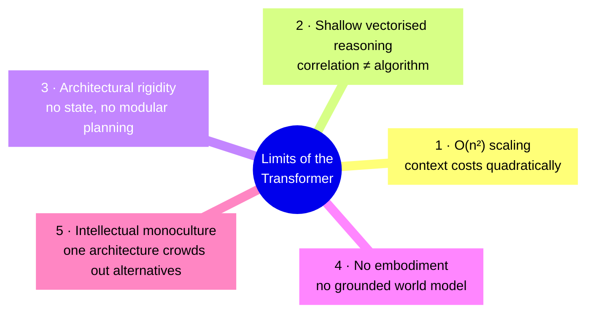
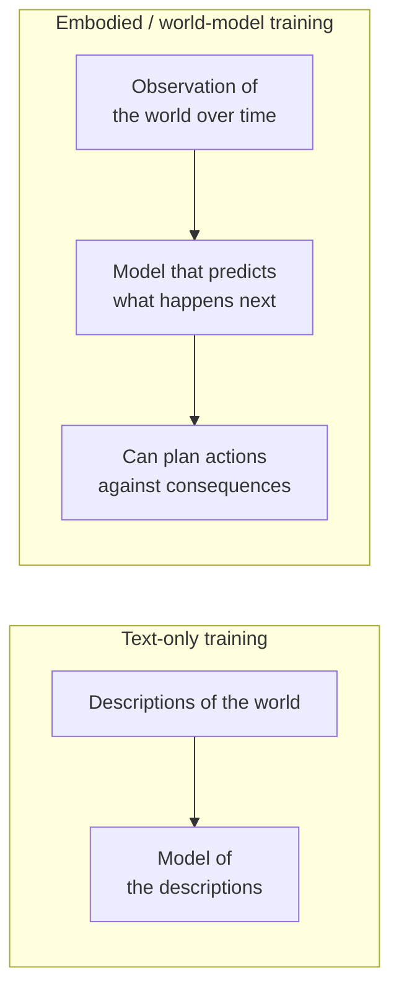
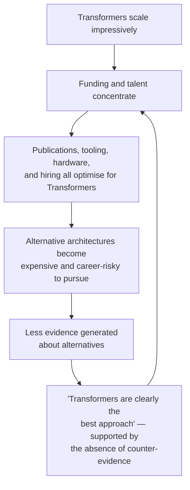

# 5 — Five Structural Limits of the Transformer

The previous files argued from *evidence*. This one argues from *architecture*: five properties of the Transformer that are not obviously fixed by making it bigger. Session 9 explained how attention works; this is the bill for how it works.

---

## 5.1 Why architecture-level arguments matter more than benchmark arguments

A benchmark failure tells you a system cannot do something *today*. An architectural limit suggests a reason it may not do it *at all*, without a change in kind. The two arguments have very different half-lives — benchmark arguments expire within months, architectural ones survive several model generations.

Be careful with them, though. "Architecture X can never do Y" claims have a poor historical record, and several limits below are being actively attacked by credible research. The honest framing is: **these are the five places where the bill comes due, and none of them has an accepted solution.**

*Figure: the five limits. 1 and 3 are engineering constraints; 2 and 4 are capability constraints; 5 is a constraint on the field, not on the machine.*

## 5.2 Limit 1 — Quadratic scaling and the context-window bottleneck

**The mechanism.** Self-attention compares every token with every other token. For a sequence of *n* tokens, that is *n²* pairwise interactions. Double the context, quadruple the attention compute and memory.

| Context length | Relative attention cost (n²) | Interpretation |
|---|---|---|
| 1,000 tokens | 1× | baseline |
| 10,000 | 100× | a long document |
| 100,000 | 10,000× | a codebase |
| 1,000,000 | 1,000,000× | "a million-token context window" |
| 10,000,000 | 100,000,000× | the marketing slide of the near future |

*A million-token window is not ten times the work of a hundred-thousand-token window. It is a hundred times.*

**Why the "we already have million-token contexts" reply is incomplete.** Long-context models exist and work, using approximations: sparse attention, sliding windows, linear-attention variants, caching. These are genuine engineering wins. But (a) they are approximations that trade quality for cost, and (b) capacity is not the same as *use* — retrieval quality degrades within long contexts (needle-in-a-haystack failures, positional bias, "lost in the middle"). **A model can hold a million tokens and still not attend to the right one.**

**Why it matters for AGI specifically.** Even a perfect, cheap, infinite context window would not be memory. A context window is a *flat, undifferentiated buffer that is re-read in full*. Human memory compresses, prioritises, forgets deliberately, consolidates overnight and reconstructs on demand. Scaling the buffer does not produce those operations — it produces a bigger buffer.

## 5.3 Limit 2 — Shallow vectorised "reasoning"

**The mechanism.** A Transformer computes a fixed number of matrix operations per token, in a fixed number of layers, with no loop and no unbounded recursion. It cannot, within a single forward pass, iterate until a condition is met. Chain-of-thought is a clever workaround: it externalises iteration into the token stream, so "thinking longer" means "generating more tokens." That is real and it helps — but the intermediate tokens are **generated text, not verified state**. Nothing checks them.

**The evidence.** `content/03` §3.2 — performance collapsing rather than degrading past a complexity threshold on algorithmically trivial puzzles, and models sometimes reducing effort as difficulty rises.

| | A system executing an algorithm | A Transformer doing CoT |
|---|---|---|
| Effort scales with problem size | Yes, mechanically | Not reliably; can *decrease* at high difficulty |
| Intermediate steps verified | Yes | No — they are sampled text |
| Behaviour on an unseen instance size | Identical | Degrades, sometimes catastrophically |
| Can abstract ("this needs 2ⁿ−1 moves") | Yes | Sometimes, unreliably |

**What would fix it.** Hybrid designs: a language model that *writes and runs code* (which works well today — note that models often solve arithmetic correctly precisely by delegating to a calculator), or that calls a verifier, a solver, or a symbolic engine. This is the pragmatic answer and it is already the standard production pattern. Note what it concedes: **the reliable reasoning is done outside the network.**

## 5.4 Limit 3 — Architectural rigidity and blind spots

Three specific rigidities:

| Rigidity | What it means | Consequence |
|---|---|---|
| **No persistent state** | Nothing survives outside the context window without an external store | Every "memory" feature is a bolt-on you must build, operate and debug |
| **No modular planning** | There is no separable planner; planning is emergent behaviour in the token stream | You cannot inspect, constrain or unit-test the plan — you can only read what it said |
| **Positional bias** | Causal masking and position encoding create systematic attention asymmetries | Information at certain positions is systematically under-attended; prompt ordering has real, measurable effects |

**Positional bias is the one with immediate practical consequences.** It is why prompt engineering "superstitions" — put the instruction at the end, put the critical constraint last, repeat it at both ends — are not superstitions. They are workarounds for a known architectural asymmetry. Session 10's advice rests on this.

**The AGI-relevant point:** a general intelligence presumably needs to allocate attention *by importance*. A Transformer allocates it by learned association plus position, which correlates with importance but is not the same thing, and cannot be directly steered.

## 5.5 Limit 4 — No embodiment, no world model

**The claim (LeCun's, most forcefully).** Text-trained Transformers have no grounding in physical or sensorimotor experience. They learn the statistics of *descriptions* of the world, not the world.

**The intuition, which is the best version of this argument.** Throw a tennis ball in the air and you know it comes back down. You did not learn this from a physics course; you learned it before you could speak in full sentences, by watching things fall. That physical intuition is the substrate on which later reasoning is built. A system trained only on text about falling objects has the *sentences* about gravity without the intuition beneath them.

**The evidence.** `content/03` §3.3 — the chess probe. Chess is the friendliest possible case: fully observable, fully determined by the move list, densely represented in training data. If a grounded internal model were going to emerge from text, it should emerge here. It did not, to any impressive degree.

*Figure: the distinction at the heart of the world-model research programme. The right-hand path is what video-prediction and world-model architectures (JEPA-style models, generative environment models) are attempting.*

**The counter-argument to present.** Multimodal models now ingest images, video and screens. Is that embodiment? Partly — it is perception. It is not **action with consequences**: a model that watches a video does not learn that *its own action* caused the outcome. The distinction is between observing correlation in the world and intervening in it, and it is the same distinction that separates correlation from causation everywhere else.

## 5.6 Limit 5 — Intellectual monoculture

**The claim (Chollet's, among others).** The field's near-total concentration on scaling one architecture may have *delayed* progress toward general intelligence by starving alternative approaches of talent, funding and attention.

**The mechanism is sociological, not technical:**

*Figure: the monoculture feedback loop. Note that it is self-confirming: the lack of results from under-funded alternatives reads as evidence that they do not work.*

**Why this room should care.** This is a familiar failure mode with a different name. Standardising on one toolchain gives real efficiency and creates real fragility; the organisation loses the ability to evaluate alternatives because nobody has hands-on experience with them any more. Every configuration manager has seen this. It is the same shape at the scale of a research field.

**The counter-argument.** Concentration is also how fields make fast progress — parallel exploration is expensive, and the Transformer earned its position with results. And the monoculture is loosening: state-space models, diffusion-based language models, world-model architectures and hybrid symbolic-neural systems all have serious groups behind them. `[verify at delivery — this landscape moves]`

## 5.7 The five limits, summarised

| # | Limit | Type | Fixed by scaling? | Being worked on by |
|---|---|---|---|---|
| 1 | **O(n²) scaling** | Engineering | Partially — approximations help, quality trades off | Sparse/linear attention, state-space models, retrieval |
| 2 | **Shallow vectorised reasoning** | Capability | **No — evidence suggests not** | Tool use, verifiers, hybrid neuro-symbolic systems |
| 3 | **Architectural rigidity** | Engineering | No | Explicit memory/planning modules, agent frameworks |
| 4 | **No embodiment / world model** | Capability | **No — this is the deepest one** | World models, video prediction, robotics |
| 5 | **Intellectual monoculture** | Sociological | No — scaling *causes* it | Diffusion LMs, SSMs, neuro-symbolic research |

**The synthesis.** Transformers reshaped what software can do with language, and this file is not an argument that they are a mistake. It is the observation that **quadratic scaling, unverified vectorised reasoning, rigid memory and absent grounding are ceilings, not speed bumps** — and that no one has yet shown that a larger Transformer passes through them. The research response is not "scale harder"; it is new architectures and hybrids. That is itself an admission, from inside the field, that the current path does not obviously arrive.

---

**Section takeaway.** There are architecture-level reasons — not just benchmark-level ones — to doubt that scaling the current design produces general intelligence. Two of the five (reasoning depth, embodiment) look genuinely fundamental. When the labs building the next generation are simultaneously building *different* architectures, that tells you what they believe.
