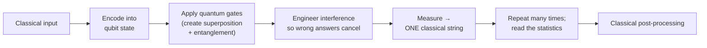
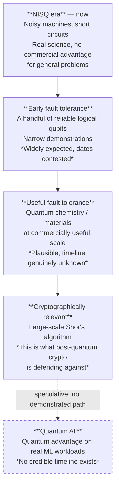
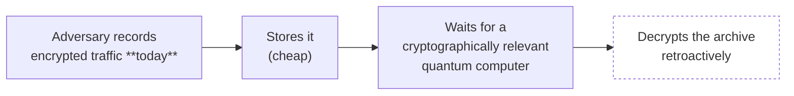
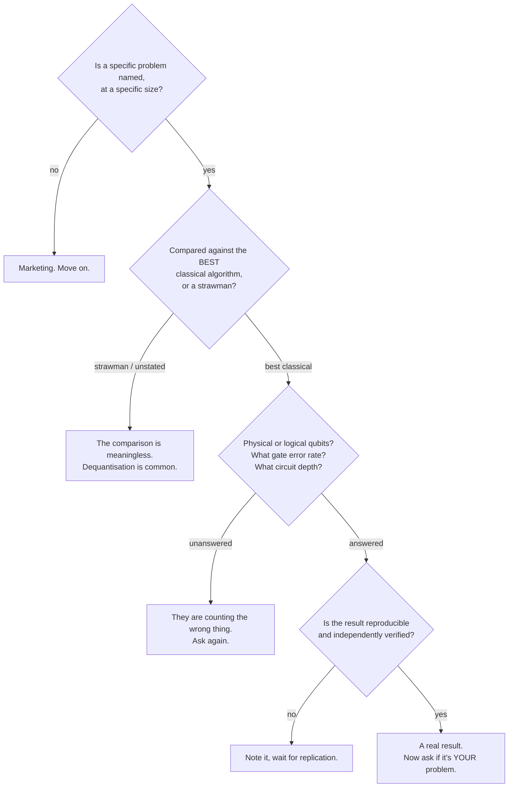

# 6 — Outlook: Quantum Computing ⚠️

> **This is the most speculative content in the entire fifteen-session series, and it is labelled as such deliberately.** Everything before this file rests on measurements of systems you can use today. This file is about a technology that mostly does not work yet, whose timeline is contested, and whose intersection with AI is — honestly — research-stage. Read it in that spirit and present it in that spirit.

Goal 11. Fully authored — there was no source material in the corpus. ~15 minutes of the session.

---

## 6.1 The bottom line first

Because if the room takes only one thing from these fifteen minutes, it should be this:

| Question | The straight answer |
|---|---|
| **Will quantum computing change my job in the next 5 years?** | **Almost certainly not** — with one exception |
| **What is that exception?** | **Post-quantum cryptography.** It is real, dated, standardised, and it affects shipped products and long-lived devices. It is an engineering migration, not a research topic. |
| **Will quantum computing supercharge AI soon?** | **No.** The intersection is early research. There is no demonstrated quantum advantage for any practically useful machine-learning task. |
| **What about "quantum AI" products?** | **Treat with the same skepticism this course applies to everything else.** Ask what problem it solves, at what size, versus the best classical method. Anyone selling "quantum AI" today is selling futures. |
| **Is it a hoax, then?** | **No.** The physics is real, the engineering progress is real, and the long-term potential in chemistry, materials and optimisation is genuine. The *timeline* and the *AI connection* are where the overclaiming lives. |

**Two disclaimers to state out loud:**
1. This is a horizon scan by a non-specialist, aimed at giving you enough to evaluate claims — not enough to design anything.
2. If quantum computing is strategically relevant inside Qualcomm, the internal experts know far more than this segment does. The purpose here is calibration, not authority.

## 6.2 What a quantum computer actually is

**A classical bit** is definitely 0 or 1. Eight bits hold exactly one of 256 possible values.

**A qubit** is a two-state quantum system (a superconducting circuit, a trapped ion, a photon's polarisation) that, until measured, is in a **superposition** — a weighted combination of 0 and 1 described by complex amplitudes.

Three ideas, in the order they need explaining:

| Concept | What it means | The most common misunderstanding |
|---|---|---|
| **Superposition** | Before measurement, a qubit's state is a combination of 0 and 1, described by amplitudes | ❌ *"It's both 0 and 1 at once, so it tries all answers in parallel."* This is the popular-science version and it is what makes people wrong about what quantum computers can do. |
| **Entanglement** | Two or more qubits can share a joint state such that measuring one instantly constrains the other, no matter the distance | ❌ *"So you can send information faster than light."* You cannot — the correlation is only visible after classically comparing results. |
| **Interference** | Amplitudes are complex numbers and can cancel or reinforce. **This is where the computational power actually lives.** | Usually omitted from popular explanations, which is exactly why those explanations mislead. |

**The correct mental model, and the one to give the room:**

> A quantum algorithm is not a parallel search. It is the art of arranging **interference** so that the amplitudes of wrong answers cancel out and the amplitude of the right answer reinforces — so that when you measure (and you only get to measure once, collapsing everything to a single classical outcome), you are very likely to read out the answer you want.

That reframe matters because it explains the limitation directly: **you only get one classical result out.** An *n*-qubit register spans 2ⁿ amplitudes, but you never see them. You see one *n*-bit string. Any algorithm that would require reading all 2ⁿ amplitudes gives you nothing.

*Figure: the actual shape of a quantum computation. Note the two classical ends and the single-string bottleneck at measurement — the step popular explanations skip.*

## 6.3 Why it is not "a faster computer"

This is the most important correction in the segment, and the one the room is most likely to be carrying wrong.

| | Classical computer | Quantum computer |
|---|---|---|
| **Basic unit** | Bit: definitely 0 or 1 | Qubit: superposition until measured |
| **Speedup type** | General-purpose; faster at everything | **Only specific algorithms, on specific problem structures** |
| **Everyday tasks** (email, builds, CI, spreadsheets, web) | Excellent | **Worse.** Slower, error-prone, needs classical control anyway |
| **Reliability** | Bit errors ~ vanishingly rare | Errors are *the* dominant engineering problem |
| **Operating environment** | Room temperature, a rack | Near absolute zero (for leading modalities), heavy isolation, large classical control stack |
| **Reading the result** | Read any bit any time, non-destructively | Measurement destroys the state; you get one sample |
| **State of the art** | Mature, commodity | Laboratory / early-cloud-access |

> **Say this sentence in the room:** *A quantum computer is not a faster computer. It is a different kind of computer that is dramatically faster at a short list of specific problems and worse at almost everything else.* It will not compile your code, run your CI, or serve your web requests faster — ever. That is not a timeline claim; it is a claim about what the machine is.

**The short list of problems with known quantum advantage** — and it is genuinely short:

| Algorithm | Problem | Speedup | Practical status |
|---|---|---|---|
| **Shor's** (1994) | Factoring integers; discrete logarithms | Exponential | The one that breaks RSA/ECC — see §6.6. Requires large fault-tolerant machines. |
| **Grover's** (1996) | Unstructured search | Quadratic (√N) | Real but modest. A quadratic speedup is often eaten by the constant-factor overhead of quantum hardware. |
| **Quantum simulation** | Simulating quantum systems: molecules, materials, chemistry | Exponential for some cases | **The most credible near-to-mid-term application.** Feynman's original 1981 motivation, and still the best one. |
| Various optimisation / linear-algebra proposals | QAOA, VQE, HHL and relatives | Contested | Advantage frequently claimed and frequently withdrawn after better classical algorithms appear ("dequantisation") |

Note the pattern in the last row. Several proposed quantum machine-learning speedups have been **dequantised** — a classical algorithm was found that matched the quantum one, dissolving the advantage. That has happened enough times to be a base rate, not an anecdote.

## 6.4 Where we actually are: the NISQ era and the error-correction wall

**NISQ** = **Noisy Intermediate-Scale Quantum**. It describes today: machines with meaningful qubit counts, but qubits that lose coherence quickly and gates that make frequent errors. You can run short circuits before noise swamps the signal.

**Error correction is the real bottleneck — not qubit count.** This is the single most useful technical fact in the segment, because qubit count is the number in every headline and it is the wrong number to watch.

A qubit cannot be copied (no-cloning theorem), so classical redundancy is unavailable. Quantum error correction instead spreads one **logical** qubit across many **physical** qubits, measuring error syndromes without measuring the data. The overhead is large.

| Layer | What it is | Rough scale |
|---|---|---|
| **Physical qubit** | An actual device on the chip; noisy | What headlines count |
| **Logical qubit** | An error-corrected qubit you can compute with reliably | Requires ~10²–10³+ physical qubits, depending on code and error rate `[verify at delivery — this ratio is improving and the numbers are actively contested]` |
| **Useful fault-tolerant algorithm** | e.g. breaking 2048-bit RSA | Estimates commonly cited in the **thousands of logical / millions of physical** qubits `[verify at delivery — estimates have been revised downward repeatedly]` |

> **The headline-reading rule:** when you see *"Company X announces a 1,000-qubit processor"*, the questions are — **physical or logical? What is the two-qubit gate error rate? What circuit depth can it sustain?** A thousand noisy physical qubits and a hundred good logical qubits are not comparable objects, and the press release will usually not distinguish them.

**A realistic timeline.** Presented as **eras, not dates**, because dates in this field have a poor record and confident ones should be discounted:

*Figure: eras rather than dates. Anyone who puts years on this diagram is guessing; the honest version has ordering but no calendar. Note that the AI intersection sits **after** everything else and off the main path.*

**Why refusing to give dates is the right call here, and how to defend it if asked.** Expert forecasts for cryptographically-relevant quantum computing have ranged across decades and have been revised in both directions. The field has real, steady progress and repeated timeline surprises in both directions. A specific date is not knowledge.

## 6.5 The AI intersection: mostly early research

Now the part everybody asks about. Four proposed intersections, in descending order of credibility:

| Proposed intersection | The claim | Honest status |
|---|---|---|
| **Quantum simulation for scientific ML** | Quantum computers simulate molecules; the results become training data for classical ML models in chemistry and materials | **Most credible.** Note the shape: quantum generates *data*, classical ML does the learning. This is a data-supply story, not a quantum-AI story. |
| **Quantum optimisation** | Training, hyperparameter search, or combinatorial subproblems solved faster | **Contested.** No demonstrated advantage on a problem where classical methods were also given a fair shot. Repeated dequantisation results. |
| **Quantum machine learning (QML)** | Quantum circuits as models — quantum neural networks, quantum kernels | **Research-stage.** Two structural problems: (a) **loading classical data into quantum states can cost more than the speedup saves**, and (b) **barren plateaus** — gradients vanish exponentially with system size, making training hard for exactly the same reason it is hard for very deep classical nets, only worse. |
| **Quantum-accelerated LLM inference/training** | Faster attention or matrix multiplication | **No credible path today.** Transformer training is dominated by dense linear algebra on huge classical datasets — precisely the workload where the data-loading bottleneck bites hardest. |

**The data-loading problem deserves a sentence of its own** because it is the crispest reason to be skeptical of QML and it generalises:

> To run a quantum algorithm on your data, the data must be encoded into a quantum state. For a large classical dataset, that encoding can take time proportional to the data size — **eating the very speedup you were buying.** Quantum advantage is easiest to find where the *input is small and the computation is huge* (factoring a number, simulating a molecule). Machine learning is the opposite shape: enormous input, comparatively simple arithmetic. It is close to the worst-case profile for quantum advantage.

**The verdict for this room:**

> **AI and quantum computing are two separate revolutions that the press has stapled together because both sound futuristic.** There is real research at the intersection and it may yield something. There is nothing there today that changes any decision you will make this decade. Treat "quantum AI" in a vendor pitch as a signal to increase scrutiny, not decrease it.

## 6.6 The one part that is genuinely near-term: post-quantum cryptography

This is the segment's practical payload, and for a hardware company shipping long-lived devices it may be the most relevant thing in it.

**The problem.** Shor's algorithm, on a sufficiently large fault-tolerant quantum computer, efficiently breaks the public-key cryptography that secures essentially everything: **RSA, Diffie-Hellman, and elliptic-curve cryptography (ECC)**. These underpin TLS, code signing, firmware signing, secure boot, VPNs, certificate chains.

**Symmetric cryptography is much less affected.** Grover's algorithm gives only a quadratic speedup against symmetric ciphers and hashes, which is handled by roughly doubling key lengths. AES-256 remains fine. **The crisis is specifically in public-key cryptography.**

**"Harvest now, decrypt later" — why this is urgent before the machine exists:**

*Figure: the harvest-now-decrypt-later threat model. **Any secret that must stay secret for longer than the time until a capable quantum computer exists is already at risk today.** That is what makes this a present-tense engineering problem rather than a future one.*

**The response is standardised, not speculative.** NIST ran a multi-year public competition and has published post-quantum cryptographic standards — lattice-based and hash-based schemes designed to resist both classical and quantum attack. `[verify at delivery — check current NIST publication numbers, the algorithm set, and any additional standards issued since]` **NIST publications are US-government work and are public domain — SLIDE-SAFE.**

**Why this matters specifically for a release / problem / configuration management audience:** a cryptographic migration is *your* discipline, not a cryptographer's.

| Concern | Why it lands on this team |
|---|---|
| **Crypto-agility** | Can a shipped product's cryptographic algorithms be replaced in the field? This is an architecture and configuration property, decided years before it is needed. |
| **Long-lived devices** | A device shipping today with a 10–15 year service life must survive the transition. Automotive, IoT, industrial and infrastructure fleets are the exposed cases. |
| **Certificate and key inventory** | You cannot migrate what you have not inventoried. Most organisations do not know where all their keys and certificates are. This is a configuration-management problem, exactly. |
| **Firmware and code signing** | Signatures made today may need to remain verifiable for a decade. Signing infrastructure is long-lived and hard to change. |
| **Hybrid deployment** | The standard migration pattern is running classical + post-quantum together, so a break in either leaves you covered. It is a rollout-and-compatibility problem — release management's core competence. |
| **Supply chain** | Dependencies, libraries, HSMs and third-party components all need PQC support on a compatible schedule. |

> **If you remember one actionable thing from the quantum segment, remember this:** the quantum question that will reach your desk is *"is our cryptography agile enough to be replaced?"* — and it will reach you long before any quantum computer runs a useful program.

## 6.7 How to evaluate a quantum claim

The same four-question filter from `content/01` §1.5, retargeted:

*Figure: a quantum-claim filter. It is structurally the same filter as the AGI one — which is the point.*

## 6.8 What honest uncertainty looks like here

To be explicit about what this segment does and does not claim:

| Claim | Our confidence |
|---|---|
| Quantum computers will not accelerate general-purpose computing | **Very high** — this follows from what the machine is |
| Post-quantum cryptography is a real, dated engineering programme | **Very high** — standards are published |
| Near-term (5-year) impact on this team's daily work is minimal, apart from PQC | **High** |
| No demonstrated quantum advantage on a practically useful ML task today | **High** |
| Quantum simulation of chemistry/materials will eventually be commercially significant | **Moderate** — likely, timing unknown |
| Quantum computing will meaningfully change AI at some point | **Low confidence either way** — genuinely unknown |
| Any specific date for any of the above | **No confidence. We are not offering one.** |

---

**Section takeaway.** Quantum computing is real physics, real engineering, and real long-term potential — attached to a real hype problem. It is not a faster computer; it is a different computer that is extraordinary at a short list of problems and worse at everything else. Error correction, not qubit count, is the bottleneck. The AI intersection is early research with structural obstacles that are not obviously solvable. The one thing that is genuinely on your horizon is **crypto-agility and the post-quantum migration** — and that is a configuration-management problem, which makes it yours.
