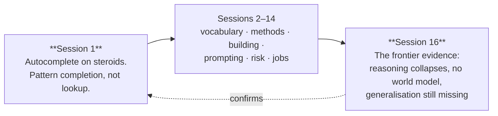

# 7 — Closing the Series: Where to Go Next

Fifteen sessions, eleven goals, one recurring argument. This file closes the loop and points at what to do on Monday.

---

## 7.1 The callback to Session 1

Session 1 made one central claim, and the whole series has been an elaboration of it:

> **An LLM is not a search engine looking up facts. It is a pattern-completion engine — autocomplete on steroids.** It does not retrieve; it generates a plausible continuation. And when plausibility and truth diverge, it produces a confident, coherent, wrong answer.

Session 1 also made an uncomfortable comparison: **hallucination and human prejudice are the same failure mode.** Human memory is reconstructive — we rebuild recollections rather than replaying them, and the rebuild fills gaps with what *should* have been there. Prejudice is that same mechanism aimed at people: a pattern over-generalised from a skewed sample, asserted with confidence.

Fifteen sessions later, does that hold up?

| Session | What it added | Does it still support the Session 1 claim? |
|---|---|---|
| 2 | Tokens, context, cost | Yes — the cost meter is a per-token generation meter, not a lookup fee |
| 3–6 | Learning from data; the four method families | Yes — every method learns patterns from examples; none stores facts |
| 7–8 | Building and improving a network by hand | Yes — you watched a model fit patterns and overfit them |
| 9 | How LLMs work: attention, next-token prediction | Yes — this is the mechanism, made explicit |
| 10–11 | Prompting; working with Claude | Yes — prompting works *because* you are steering a generator, not querying a database |
| 12 | Confidently wrong; base rates; the 99% → ~14% turn | Yes — and the metric hides it |
| 13 | Security; injection; the hazard triangle | Yes — injection works because instructions and data are the same token stream |
| 14 | Capability, its ceiling, and jobs | Yes — the S-curve and the proof-of-concept-to-production gap |
| **15** | **AGI and quantum** | **Yes — the frontier evidence says the same thing at the largest scale** |

**And this session is the strongest confirmation of all.** The Tower-of-Hanoi collapse, the chess probe, and ARC-AGI-2 are exactly what you would predict from "pattern completion, not algorithm execution." The Session 1 mental model, formed before anyone in the room knew what an attention head was, correctly predicts the frontier results of Session 16. That is the sign of a good mental model — it keeps paying.

*Figure: the series arc closes where it opened. The opening mental model predicted the closing evidence.*

## 7.2 The five things worth carrying out of the whole series

Not a summary of fifteen sessions — a shortlist of what survives contact with real work.

| # | The habit | Where it came from | Where you use it |
|---|---|---|---|
| 1 | **"Autocomplete on steroids."** Ask what the model is *generating*, not what it *knows*. | Session 1 | Every AI conversation you will ever have |
| 2 | **The metric can hide the failure.** Accuracy conceals rare-event failure; base rates invert intuitions. | Session 13 | Every vendor claim, every internal PoC review |
| 3 | **Constrain the system to do less.** Shrink the operating domain; never let a pipeline act on model output without a qualified human gate. | Session 14 | Every AI integration decision |
| 4 | **Verify, and check the verifier.** Human-in-the-loop is necessary, not sufficient — the human must be equipped to catch the error. | Sessions 13–13 | Every workflow you design |
| 5 | **Who made this claim, and what would falsify it?** | Sessions 13 & 15 | AGI, quantum, and whatever is next |

**And the one line:** *the interesting engineering is in the gap between the demo and production.* That gap is this room's entire professional discipline. The series has argued, session by session, that AI does not eliminate that discipline — it makes it the scarce skill.

## 7.3 Where to go next — three paths

Pick by what you actually want. Each is a genuine commitment; none of them is "keep reading newsletters."

### Path A — Practitioner (developers, hands-on)

| Step | What | Why |
|---|---|---|
| 1 | Re-run the Session 7/8 labs on **your own** data — a real dataset from your work | The transfer from tutorial to real data is where the actual learning is |
| 2 | Build one small, bounded AI tool for a task you personally do weekly | Bounded scope, personal ownership, immediate feedback |
| 3 | **Build an eval before you build the feature** — 20–50 examples with known-good answers | This is the single habit that separates people who ship AI features from people who demo them |
| 4 | Read a from-scratch implementation (e.g. an openly-licensed "build an LLM from scratch" repository) | Removes the last of the magic |
| 5 | Study the failure modes of agent/tool systems before adopting one | Session 14's attack surface expands the moment a model can act |

### Path B — Manager / decision-maker (release, problem, configuration)

| Step | What | Why |
|---|---|---|
| 1 | Write down **one page** of AI usage guidance for your team: what may go in, what may not, what must be verified | The corpus's biggest gap was policy; a one-pager beats a policy that does not exist |
| 2 | Apply the **hazard triangle** (Session 14) to one AI use already live in your area | Turns an abstract framework into a decision |
| 3 | Add **"model version"** to your configuration inventory, and treat model upgrades as dependency changes requiring regression testing | Directly follows from §3.4 — model upgrades are not strictly improvements |
| 4 | Ask for a **crypto-agility assessment** on your longest-lived shipped product | The only near-term quantum action item |
| 5 | Track the **EU AI Act** obligations that apply to a deployer (Session 14) | Dated obligations, not speculation |

### Path C — Keeping current without drowning

The half-life of specifics in this field is short. A sustainable approach:

| Do | Don't |
|---|---|
| Follow **2–3 sources with a track record of honest negative results** | Follow launch announcements |
| Re-verify the numbers you rely on **quarterly** | Assume last year's benchmark still holds |
| Read the **methodology section** of any benchmark claim | Read the headline number |
| Ask **"who made it and what would falsify it"** every time | Assume the framing is neutral |
| Try things yourself — one afternoon of hands-on beats ten articles | Accumulate reading you never apply |

## 7.4 The honest closing note

This series has been deliberately skeptical. That was an editorial choice, and it deserves to be named rather than smuggled.

The reason for it: this audience's professional identity is built around the distance between "it worked in the demo" and "it works in production, under load, for years, with support obligations." That instinct is exactly right for AI, and much of the public conversation about AI is designed to bypass it.

But skepticism is not the conclusion. The systems in this series are genuinely useful. They have made drafting, summarising, transforming, searching and explaining meaningfully faster for a great many people, including everyone who built this material. Session 15's job analysis was honest in both directions: parts of this work will change, and the parts that change first are the parts already scripted.

**What this series has tried to give you is not an opinion about AI. It is the ability to form your own, from evidence, when the next claim arrives** — and it will arrive, next quarter, about something not yet named. The four questions work on it too.

> **The last line of the series:** *You do not need to know whether AGI is coming. You need to know how to evaluate the claim that it is.* That is a skill, it is now yours, and it does not expire when the model names do.

---

**Thank you for fifteen sessions.** Q&A is next — and `exercises/discussion.md` has a closing prompt worth actually running.
