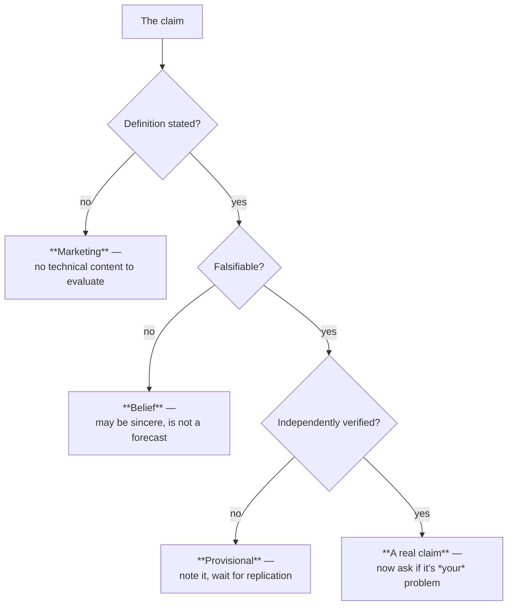

# Lab — Session 16

**This is a concept session — there is no full hands-on lab.** Session 16 closes the series with material about capability limits and a speculative horizon topic; there is nothing meaningful to build in 25 minutes that would teach it better than the evidence does.

What follows instead is:
- **(A)** a **~10-minute optional code illustration** — a tiny ARC-style grid task in pure Python, to make "generalisation beyond training data" concrete rather than abstract;
- **(B)** a **reflective exercise** for the self-study reader, which is the substantive assignment for this session.

---

## (A) Optional: an ARC-style task in 30 lines of Python

**Purpose.** Slide 12 claims ARC-AGI tasks are trivial for humans and hard for machines. That claim is much more persuasive after you have solved one and then thought about *how you solved it*.

**Setup.** Pure Python 3, no dependencies. Runs in Colab, JupyterLite, or any local interpreter. Nothing to install.

**Time.** 10 minutes, including the discussion.

### Step 1 — Look at the examples. Do not read ahead.

```python
# An ARC-style task. Grids are lists of lists; integers are colours (0 = background).
# You get three worked examples. Infer the rule. The rule is never stated.

TRAIN = [
    # (input, output)
    ([[0, 0, 0],
      [0, 3, 0],
      [0, 0, 0]],
     [[3, 3, 3],
      [3, 3, 3],
      [3, 3, 3]]),

    ([[0, 0, 0],
      [0, 7, 0],
      [0, 0, 0]],
     [[7, 7, 7],
      [7, 7, 7],
      [7, 7, 7]]),

    ([[0, 0, 0],
      [0, 2, 0],
      [0, 0, 0]],
     [[2, 2, 2],
      [2, 2, 2],
      [2, 2, 2]]),
]

TEST_INPUT = [[0, 0, 0],
              [0, 5, 0],
              [0, 0, 0]]


def show(grid, label):
    """Print a grid readably. '.' marks the background."""
    print(label)
    for row in grid:
        print(" ".join("." if c == 0 else str(c) for c in row))
    print()


for i, (inp, out) in enumerate(TRAIN, 1):
    show(inp, f"Example {i} — input")
    show(out, f"Example {i} — output")

show(TEST_INPUT, "TEST — what is the output?")

# Expected output (abbreviated):
# Example 1 — input
# . . .
# . 3 .
# . . .
#
# Example 1 — output
# 3 3 3
# 3 3 3
# 3 3 3
#
# ... (examples 2 and 3 follow the same shape) ...
#
# TEST — what is the output?
# . . .
# . 5 .
# . . .
```

**Answer it in your head before continuing.** You will have the rule in under two seconds: *fill the whole grid with the non-background colour.*

### Step 2 — Write the rule you inferred

```python
def solve(grid):
    """Fill the grid with its single non-background colour."""
    colour = next(c for row in grid for c in row if c != 0)
    return [[colour] * len(grid[0]) for _ in grid]


show(solve(TEST_INPUT), "Predicted output")
# Predicted output
# 5 5 5
# 5 5 5
# 5 5 5
```

### Step 3 — Now make it harder, and notice what changes

```python
# A second task. Same format, different rule. Infer it from two examples.

TRAIN_2 = [
    ([[1, 0, 0],
      [0, 0, 0],
      [0, 0, 0]],
     [[1, 0, 0],
      [0, 1, 0],
      [0, 0, 1]]),

    ([[4, 0, 0],
      [0, 0, 0],
      [0, 0, 0]],
     [[4, 0, 0],
      [0, 4, 0],
      [0, 0, 4]]),
]

TEST_2 = [[6, 0, 0],
          [0, 0, 0],
          [0, 0, 0]]

for i, (inp, out) in enumerate(TRAIN_2, 1):
    show(inp, f"Task 2 · Example {i} — input")
    show(out, f"Task 2 · Example {i} — output")

show(TEST_2, "Task 2 · TEST — what is the output?")


def solve_2(grid):
    """Draw a diagonal from the marked corner in the marker's colour."""
    colour = next(c for row in grid for c in row if c != 0)
    n = len(grid)
    return [[colour if r == c else 0 for c in range(n)] for r in range(n)]


show(solve_2(TEST_2), "Task 2 · Predicted output")
# Task 2 · Predicted output
# 6 . .
# . 6 .
# . . 6
```

### Step 4 — The point of the exercise

Ask yourself three questions:

| Question | The observation |
|---|---|
| **How many examples did you need?** | Two or three. Not two thousand. |
| **Had you ever seen this specific rule before?** | No — and it did not matter. |
| **What did you actually do?** | Formed a hypothesis about the *transformation*, checked it against every example, applied it to a new input. |

**That is skill-acquisition efficiency**, and it is what Chollet's definition of intelligence points at. You did it from three examples, in seconds, on a rule that appears nowhere in your training.

**Now the honest caveats — these matter, so do not skip them:**

1. **The two tasks above are far easier than real ARC-AGI-2 tasks.** They are illustrative. Real tasks compose multiple rules (*find the odd shape, then recolour it, then move it toward the largest object*) and use larger, irregular grids.
2. **Frontier models solve tasks at *this* difficulty easily.** Nothing here demonstrates a machine limitation. The demonstration is of *your own* mechanism, which is the useful half.
3. **The real experiment is at `github.com/fchollet/ARC-AGI`** (Apache-2.0) — go and try ten actual evaluation tasks. Expect to solve most of them and to find a few genuinely hard. That personal calibration is worth more than any benchmark number in the deck.

**Extension challenges (if you have another 10 minutes):**
- Write a `solve_general(train_pairs, test_input)` that tries a small library of candidate rules (fill · diagonal · mirror · rotate · recolour) and returns the first that reproduces **every** training pair. Notice how quickly the library needs to grow, and that this is essentially program synthesis by brute-force search — which is roughly how the strongest ARC-AGI-1 systems worked, and why they were so expensive.
- Design a task whose rule requires **composition** of two of your primitives. Then ask a current LLM to solve it. Record what happens `[your result will date quickly — note the model and date]`.
- Design a task where the rule depends on **counting** (e.g. "recolour the shape with the most cells"). Counting is a known weak spot; see whether it shows.

---

## (B) Reflective exercise — the horizon-claim audit

**This is the substantive assignment for Session 16.** Allow 20–30 minutes. It is deliberately not code.

**Task.** Find one real claim about the future of AI or quantum computing — a vendor pitch, a conference talk, a LinkedIn post, an analyst report, a news headline, or an internal strategy slide. Then audit it.

**Step 1 — Record the claim verbatim.** Exact words. Paraphrasing hides the vagueness, and the vagueness is usually where the problem is.

**Step 2 — Run the four questions** (`content/01` §1.5, `content/06` §6.7):

| # | Question | Your answer |
|---|---|---|
| 1 | **Which definition** is being used (of AGI / of "quantum advantage")? Is it stated at all? | |
| 2 | **What measurement** would settle it? Does one exist? | |
| 3 | **Who made the claim**, and what do they gain if it is believed? | |
| 4 | **What would we observe if it were false?** | |

**Step 3 — Classify it.**



**Step 4 — Write three sentences** stating your verdict and *why*. Constrain yourself to three — the discipline is in the compression.

**Step 5 (optional, and the most valuable step) — bring it to the Q&A.** A real claim from the room's own working life is worth more than any example in this material.

**What good looks like.** Most claims land in **Marketing** or **Belief**, and noticing that is not cynicism — it is the correct classification, and it saves the effort you would otherwise spend arguing with an unfalsifiable statement. The rarer **Real claim** verdict then deserves genuine attention, which is the whole point of triaging.

---

## Why there is no full lab

Stated plainly, because the spec asks for honesty about this: a hands-on lab for Session 16 would have to be either (a) a benchmarking exercise, which duplicates evaluation work already covered earlier in the series, or (b) a quantum-simulator toy, which would teach gate mechanics the audience has no use for and would undercut the segment's central message that this is not near-term relevant. Neither earns 25 minutes of a closing session. **The reflective exercise is the assignment; the code above is the optional illustration.**
