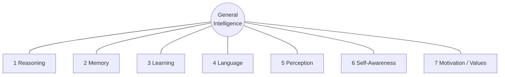

# Slides — Session 16: What Is AGI, and an Outlook on Quantum

Deck spec for the deck-builder. Build per `../../powerpoint_instructions.md` (layout, palette, type, a11y). **Target: 18 content slides** + title + agenda + Q&A + resources = 22 slides, ~45 min. Speaker notes carry the detail; slides stay sparse.

**Three deck-wide rules for this session:**

1. **⚠️ Verify before delivery.** Every benchmark score, model name and lab position is tagged `[verify]`. Re-check them on the delivery date and update the deck. A stale number in a session about benchmark skepticism is an own goal. Budget 30 minutes.
2. **⚠️ No LINK-ONLY material embedded.** The AGI source deck (`resources/sources.md` #1) is all-rights-reserved commercial training material. **Nothing from it is reproduced** — no slide, no figure, no phrasing. Lab quotes are **paraphrased in our own words and attributed to the speaker**, never to the deck. Only **ARC-AGI (Apache-2.0)**, **NIST PQC (US-gov public domain)** and our own diagrams/tables are embeddable.
3. **⚠️ Slides 15–19 (quantum) carry a persistent "SPECULATIVE" marker** in the footer or as a section-divider treatment. This is a design requirement, not a suggestion — it is what makes the honesty visible rather than merely spoken.

---

## Slide 1 — Title
- **On-slide:** "What Is AGI, and an Outlook on Quantum" · Session 16 of 16 · Block: Judge It · *"The series closer."*
- **Speaker notes:** Last session. Two horizon topics, one method — ask what the evidence shows and notice who benefits from the claim. Flag up front that the quantum segment at the end is the most speculative content in the whole series, and that we will label it as such. Promise the room a straight answer on both.
- **Visual:** Series master title layout. Mark "15 / 15" prominently — the room should feel this is the close.
- **Source/licence:** none.

## Slide 2 — Agenda
- **On-slide:** the 9-row agenda from `README.md` (Hook → definitions → pillars → evidence → labs disagree → Transformer limits → **quantum ⚠️** → series close → Q&A).
- **Speaker notes:** Note the split: ~30 min AGI, ~15 min quantum. Flag the timing honestly — this is the tightest session in the series. If we run long, the evidence segment is protected and the philosophy detail gets cut.
- **Visual:** Agenda layout; the quantum row visually marked as speculative.
- **Source/licence:** none.

---

## Slide 3 — Hook: define AGI
- **On-slide headline (a claim):** "Everyone in this room means something different by 'AGI'."
- **Bullets (as a live poll, revealed one at a time):** does any task a human can · is conscious · replaces most jobs · improves itself · passes as human.
- **Speaker notes:** Run this as an actual poll — ask the room to pick one before showing the list. You will get a split. That split *is* the lesson: these are five different claims with five different evidence requirements, and the same system can satisfy some and fail others simultaneously. Do not resolve it yet. Say: "hold that disagreement, we'll come back to it."
- **Visual:** Discussion/poll layout. Five options, no answer revealed.
- **Source/licence:** original.

## Slide 4 — The definition keeps moving
- **On-slide headline:** "AGI has been redefined roughly every decade since 1950."
- **Visual (primary — this is a table slide):** the 7-row timeline table from `content/01` §1.2, reduced to three columns for legibility: **Year · Who · What it puts at the centre.**

| 1950 | Turing | behavioural imitation |
| 1976 | Newell & Simon | symbolic reasoning |
| 1997 | Legg & Hutter | goals across environments |
| 2007 | Goertzel | …with limited resources |
| 2019 | Chollet | skill-acquisition efficiency |
| 2023 | industry | economically valuable work |
| 2025 | ARC-AGI | generalisation beyond training |

- **Speaker notes:** Walk the drift: imitation → reasoning → generality → efficiency → economics → generalisation. Point out the pattern — each definition retreats from the one that got solved. Turing's test was passed, and the field's response was "that was never a good test." That is not cheating, it's how a field learns its proxy was a proxy — but it means the target moves by construction.
- **Source/licence:** framing after the source deck's timeline (LINK-ONLY — **do not reproduce their slide**); this table is our own rendering. `[verify]` the last two rows.

## Slide 5 — One of these is not like the others
- **On-slide headline:** "Six definitions describe the system. One describes the economy."
- **Bullets:** every other definition = a property of the machine · 2023 industry definition = labour-market substitution · satisfied by a narrow tool that's merely cheaper · unsatisfied by a general system that's too expensive · **a business milestone in scientific clothing**.
- **Speaker notes:** This is the sharpest point in the first ten minutes. The economic definition moves when *prices* move, not when capability moves. And several of the benchmarks operationalising it are published by the organisations selling the models. Reconnect to Session 13's benchmark checklist — who made it, what does it test, is it measuring what it claims. Not an accusation of bad faith: an observation about incentives.
- **Visual:** two-column layout — "property of the system" (six items) vs. "property of the economy" (one item, visually isolated).
- **Source/licence:** original analysis.

## Slide 6 — Seven pillars of intelligence
- **On-slide headline:** "Decompose before you argue: seven components, one checklist."
- **Visual (primary):** the concept-map Mermaid from `content/02` §2.2 — redraw in palette, ≤8 nodes.

- **Speaker notes:** "Is it intelligent?" is unanswerable. "Does it acquire new skills after deployment?" is answerable. Decomposition converts an argument into a checklist. Be honest that this is one framework among several — cognitive science would draw the lines differently, and memory/learning in particular blur. It earns its place because it maps onto things we can actually test.
- **Source/licence:** framework framing after the source deck (LINK-ONLY — concept only, our own diagram and wording).

## Slide 7 — The pillar scorecard
- **On-slide headline:** "Strongest where humans are most easily fooled. Weakest on the word 'general'."
- **Visual (primary — table):** the scorecard from `content/02` §2.5. Use ✅ / ⚠️ / ❌ **plus the word** — never colour alone (a11y).

| Pillar | Status | The gap |
|---|---|---|
| Language | ✅ Strong | form, not grounded reference |
| Reasoning | ⚠️ Partial | degrades on novel structure |
| Memory | ⚠️ External | re-reading + bolt-on stores |
| Perception | ⚠️ Partial | no persistent world model |
| Self-awareness | ⚠️ Partial | calibration, unreliable "I don't know" |
| **Learning** | ❌ **Absent** | **weights frozen at deployment** |
| Motivation | ❌ External | values are ours, unevenly installed |

- **Speaker notes:** Two things to land. (1) Language is strongest — which is exactly why it misleads, because fluency is what humans instinctively read as general intelligence. Never evaluate a system on the quality of its prose. (2) Learning is the clearest gap and the one most central to "general": a deployed model does not learn. Everything that looks like learning is context, an external store, or a retraining run. Say clearly: this is not "AGI is two pillars away" — nobody knows if the pillars are additive.
- **Source/licence:** original table.

## Slide 8 — Section divider: the evidence
- **On-slide:** "Four results that don't fit the story." · *This is the part of the session that matters.*
- **Speaker notes:** Set up the asymmetry: positive results are published loudly by the people who produced them; negative results are published quietly or not at all. So the public picture of AI capability is biased upward, and correcting for that means going and finding the negatives. All four coming up are cases where a reasonable person expected success.
- **Visual:** Section divider layout.
- **Source/licence:** none.

## Slide 9 — Reasoning models fail puzzles children solve
- **On-slide headline:** "Performance didn't degrade. It collapsed."
- **Bullets:** Tower of Hanoi — a 3-line recursive rule · difficulty is a dial (add a disc) · children solve it · past a threshold, models **collapse** · some **reduced** effort as difficulty rose.
- **Speaker notes:** Apple's *Illusion of Thinking* `[verify — check for replications and rebuttals; this is actively debated]`. Give the honest counter-argument out loud: critics say some failures are output-length limits, not reasoning limits — a 10-disc solution is 1,023 moves. Fair, and it weakens the strongest reading. But a system that *had* the algorithm could say "this needs 2ⁿ−1 moves, here's the rule" instead of enumerating and failing. **The inability to abstract is the finding.** Land it: chain-of-thought produces text that looks like derivation; whether derivation happened is a separate question the text cannot settle.
- **Visual:** the schematic accuracy-vs-complexity curve from `content/03` §3.2 — **must be captioned "schematic, not measured data"** on the slide itself. Alternatively, screenshot the paper's own figure — **no: the paper is LINK-ONLY. Use our schematic, labelled.**
- **Source/licence:** Apple paper = **LINK-ONLY** (link on resources slide). Chart is our own schematic — label it as such.

## Slide 10 — The world model that wasn't there
- **On-slide headline:** "Give an LLM a chess game in text. It beats guessing by ten points."
- **Bullets:** probing = read the internal state with a small classifier · whose turn: **100%** (trivial — it's move parity) · **piece positions: ~10 pts over random** · chess is the friendliest possible case.
- **Speaker notes:** Explain why chess is the fair test: fully observable, fully determined by the move list, densely represented in training data. If a grounded internal model emerges from text anywhere, it should emerge here. A real board representation would score near-perfectly — chess state has no ambiguity. Ten points over a naive baseline is consistent with "learned which pieces tend to have moved by move 20," not with "tracking a board." Scope it honestly: one probe, one model, one domain — but the burden of proof now sits with the other side.
- **Visual:** the probing-flow Mermaid from `content/03` §3.3, redrawn in palette.
- **Source/licence:** original diagram; result `[verify]`.

## Slide 11 — The upgrade that made it worse
- **On-slide headline:** "The reasoning models hallucinated *more* than the model they replaced."
- **Bullets:** expectation: think first → fewer errors · observed: o3 / o4-mini **worse than 4o** on factual recall `[verify]` · **capability is not a scalar** · a newer model is not strictly better.
- **Speaker notes:** This is the slide with the direct operational consequence, so slow down here. If you have a working prompt, a working pipeline, or a working eval on model N, you must re-test on model N+1. Teams skip this because "the new one is better." That is a configuration-management failure with a very familiar shape — it is a dependency upgrade without regression testing. Ask the room: would you ship a library major-version bump untested? Then why a model?
- **Visual:** simple before/after comparison; two bars or a two-row table. Keep it minimal — the point is the direction, not the magnitude.
- **Source/licence:** vendor evaluation data = **LINK-ONLY** (link, don't screenshot). Our own rendering of the direction of the result.

## Slide 12 — Humans yes. AI no.
- **On-slide headline:** "ARC-AGI-2: ordinary people solve these. Frontier AI does not."
- **Bullets:** grid puzzles, no language, no world knowledge · 2–4 examples then a test · every task a novel rule · humans usually solve in ≤2 tries · **ARC-AGI-1 ~75% (solved, at extreme compute cost)** · **ARC-AGI-2 open** `[verify both]`.
- **Speaker notes:** Chollet's thesis: **skill is not intelligence.** Being superb at a trained task is skill; intelligence is how fast you get good at something you've never seen. Be fair about ARC-AGI-1 — it was designed to be memorisation-proof and it was substantially beaten. That is a real achievement, and dismissing it isn't skepticism, it's stubbornness. But the cost caveat is part of the measurement: brute-forcing an *efficiency* benchmark with enormous search is a partial answer. Then land the clean fact: ARC-AGI-2 exists, humans pass it, machines don't. Whatever else is true, "general" is not yet accurate.
- **Visual:** **an actual ARC task** — input/output example grids. `github.com/fchollet/ARC-AGI`, **Apache-2.0 — SLIDE-SAFE, embed with attribution.** This is the best visual in the deck; use a real task, not a mock-up. Optional 60-second live demo of the public task viewer.
- **Source/licence:** **ARC-AGI, Apache-2.0** — footer tag `ARC-AGI (Chollet), Apache-2.0`.

## Slide 13 — The labs themselves disagree
- **On-slide headline:** "Six labs. Six incompatible answers. That's the finding."
- **Visual (primary):** the disagreement Mermaid from `content/04` §4.2 — reduce to **four** branches for legibility: Mistral (category error) · Meta (wrong architecture) · Anthropic (a gradient) · OpenAI (an economic threshold).
- **Speaker notes:** **Paraphrase every quote — do not read them verbatim from the deck, and do not put quotation marks on the slide.** Amodei: it's a transition, not a moment. LeCun: smart parrots, needs embodiment. Mensch: he doesn't believe in God, so he doesn't believe in AGI — the pursuit reads as religious to him. Altman: sooner than most think, and it'll matter less. Then the key move: these are not degrees of optimism on one axis. They disagree about **what kind of thing the question is.** If AGI were a well-defined engineering milestone, the people closest to it would broadly agree. In physics, the people building the detector agree on what they're detecting.
- **Source/licence:** positions `[verify]`; quotes **paraphrased, attributed to the speaker not the deck**. Primary lab posts linked on the resources slide only.

## Slide 14 — Five structural limits of the Transformer
- **On-slide headline:** "Scaling doesn't obviously fix any of these."
- **Visual (primary — table):** from `content/05` §5.7.

| Limit | Fixed by scaling? |
|---|---|
| 1 · O(n²) context scaling | Partly — approximations, quality trades off |
| 2 · Shallow vectorised reasoning | **No** |
| 3 · Architectural rigidity (no state, no modular planning) | No |
| 4 · No embodiment / world model | **No — the deepest one** |
| 5 · Intellectual monoculture | No — scaling *causes* it |

- **Speaker notes:** Two touchstones. (1) O(n²): a million-token window is not 10× a hundred-thousand-token window, it's 100×. And capacity isn't use — retrieval degrades inside long contexts. A bigger buffer is not memory; human memory compresses, prioritises, forgets deliberately. (2) Embodiment: you knew a thrown ball comes down before you could speak in full sentences. A text-trained model has the *sentences* about gravity without the intuition underneath — and the chess probe from slide 10 is the evidence. Close with the tell: when the labs building the next generation are simultaneously building *different architectures*, that tells you what they actually believe.
- **Source/licence:** original table; critique framing after the source deck (concept only).

---

## Slide 15 — ⚠️ Section divider: quantum
- **On-slide:** "Outlook: Quantum Computing" · **⚠️ THE MOST SPECULATIVE CONTENT IN THIS SERIES** · *~15 minutes.*
- **Speaker notes:** Change register deliberately and say so. Everything up to now rested on measurements of systems you can use today. This is a technology that mostly doesn't work yet, on a contested timeline, whose AI connection is research-stage. Two disclaimers out loud: this is a horizon scan by a non-specialist aimed at helping you evaluate claims, and if quantum is strategically relevant inside Qualcomm, the internal experts know far more than this segment does.
- **Visual:** Section divider with a persistent speculative marker. **From here to slide 19, every footer carries the marker.**
- **Source/licence:** none.

## Slide 16 — The bottom line, first
- **On-slide headline:** "Near-term impact on your work: minimal. One exception."
- **Visual (primary — table):** the bottom-line table from `content/06` §6.1, five rows: *changes my job in 5 years?* → **almost certainly not** · *the exception?* → **post-quantum crypto** · *supercharges AI soon?* → **no** · *"quantum AI" products?* → **selling futures** · *is it a hoax?* → **no — real physics, real progress, contested timeline**.
- **Speaker notes:** Give the answer before the explanation — this room's time is better spent on the "why" than on suspense. Emphasise the last row: this is not dismissal. The physics is real and the long-term potential in chemistry and materials is genuine. The overclaiming is concentrated in the *timeline* and the *AI connection*.
- **Source/licence:** original.

## Slide 17 — Not a faster computer
- **On-slide headline:** "A quantum computer will never speed up your build."
- **Bullets:** superposition · entanglement · **interference — where the power actually is** · you measure once → **one classical string** · no free parallel search.
- **Speaker notes:** Kill the popular-science version explicitly: "it's both 0 and 1 so it tries all answers at once" is what makes people wrong about what these machines do. The real story is interference — arranging amplitudes so wrong answers cancel and the right one reinforces. An n-qubit register spans 2ⁿ amplitudes and you never see them; you see one n-bit string. Then the sentence to say slowly: *a quantum computer is not a faster computer; it is a different computer that is dramatically faster at a short list of problems and worse at almost everything else.* That's not a timeline claim — it's a claim about what the machine is.
- **Visual:** the computation-flow Mermaid from `content/06` §6.2 (classical in → gates → interference → **measure: one string** → repeat → classical out). Emphasise the measurement bottleneck.
- **Source/licence:** original diagram.

## Slide 18 — Error correction is the bottleneck, not qubit count
- **On-slide headline:** "When you read '1,000 qubits' — ask: physical or logical?"
- **Bullets:** NISQ = noisy, intermediate-scale, short circuits · no-cloning → no classical redundancy · **1 logical qubit ≈ 10²–10³+ physical** `[verify]` · useful algorithms need **thousands of logical** `[verify]` · headlines count the wrong number.
- **Speaker notes:** This is the most useful technical fact in the segment because it gives them a headline-reading rule that works for years. Three questions for any announcement: physical or logical? two-qubit gate error rate? sustainable circuit depth? A thousand noisy physical qubits and a hundred good logical qubits are not comparable objects, and the press release usually won't distinguish them. Then show the timeline as **eras, not dates** — and say plainly that anyone putting years on it is guessing, in both directions.
- **Visual:** the era-timeline Mermaid from `content/06` §6.4 (NISQ → early FT → useful FT → crypto-relevant, with "quantum AI" dashed and off the main path). **No years on the diagram** — that omission is the point.
- **Source/licence:** original diagram.

## Slide 19 — The AI intersection, and the part that's actually real
- **On-slide headline:** "Two revolutions the press stapled together — and one genuine deadline."
- **Bullets (left/two-column):** *AI intersection:* quantum simulation → training data (credible) · optimisation (contested) · QML (research: **data loading** + **barren plateaus**) · LLM acceleration (no path) — several proposed speedups **dequantised**.
- **Bullets (right):** *PQC — real and dated:* Shor breaks RSA / DH / ECC · symmetric crypto survives with longer keys · **"harvest now, decrypt later"** · NIST standards published · **crypto-agility is a config-management problem**.
- **Speaker notes:** Explain the data-loading problem in one sentence — quantum advantage is easiest where the input is small and the computation is huge (factoring, molecules); ML is the opposite shape, enormous input and simple arithmetic. Close to the worst-case profile. Then pivot hard to PQC and make it personal to the room: crypto-agility, key and certificate inventory, firmware and code signing, hybrid rollout, supply chain, and devices shipping today with a 10–15 year service life. Land it: *the quantum question that reaches your desk is "is our cryptography replaceable?" — and it arrives long before any quantum computer runs a useful program.*
- **Visual:** two-column layout. Right column may cite NIST — **US-government work, public domain, SLIDE-SAFE**, tag the footer.
- **Source/licence:** **NIST PQC — public domain, embeddable.** `[verify]` current publication numbers and algorithm set.

---

## Slide 20 — Closing the series: back to Session 1
- **On-slide headline:** "Session 1's mental model predicted Session 16's evidence."
- **Bullets:** *autocomplete on steroids — pattern completion, not lookup* · Hanoi collapse ✓ · no world model ✓ · ARC-AGI-2 ✓ · **good mental models keep paying**.
- **Speaker notes:** This is the emotional close — take the extra thirty seconds. In Session 1, before anyone in the room knew what an attention head was, we said an LLM generates a plausible continuation rather than retrieving a fact. Fifteen sessions later, the frontier results are exactly what that model predicts. Then the five habits: what is it generating · the metric can hide the failure · constrain the system to do less · verify and check the verifier · who made this claim and what would falsify it. And the line the series has been building toward — *the interesting engineering is in the gap between the demo and production*, which is this room's entire discipline. AI doesn't remove that discipline; it makes it the scarce skill.
- **Visual:** the arc Mermaid from `content/07` §7.1 (Session 1 → 2–14 → Session 16 → confirms → Session 1).
- **Source/licence:** original.

## Slide 21 — Where to go next
- **On-slide headline:** "Pick one path. Not 'keep reading newsletters'."
- **Visual (primary — three columns):** **Practitioner** (own data → one bounded tool → **eval before feature** → from-scratch reading) · **Manager** (one-page usage guidance → hazard triangle on a live use → **model version in the config inventory** → crypto-agility assessment) · **Staying current** (2–3 honest sources · re-verify quarterly · read methodology · try things).
- **Speaker notes:** Push the two starred items hardest. For developers: build the eval before the feature — 20 to 50 examples with known-good answers. That single habit separates people who ship AI features from people who demo them. For managers: add model version to your configuration inventory and treat model upgrades as dependency changes needing regression testing — which follows directly from slide 11. Both are doable this month.
- **Source/licence:** original.

## Slide 22 — Discussion & Q&A
- **On-slide:** 3–4 prompts from `exercises/discussion.md`, including the closing series prompt.
- **Speaker notes:** Open with the callback poll: "we defined AGI five different ways at the start — has anyone's answer changed?" Then the series prompt: what will you do differently next Monday? Expect quantum questions to be more speculative than the answers can support — model saying "I don't know, and here's how you'd find out." That is the behaviour the series has been teaching.
- **Visual:** Discussion/poll layout.
- **Source/licence:** none.

## Slide 23 — Resources & credits
- **On-slide:** the LINK-ONLY reading list and the licence attributions from `resources/sources.md`.
- **Speaker notes:** Point at the ARC-AGI repository — it's open, the tasks are playable, and trying five of them is the fastest way to feel the gap. Note that all benchmark numbers in this deck were verified on the delivery date and will drift again.
- **Visual:** Resources layout. Attributions: **ARC-AGI (Apache-2.0)** · **NIST PQC (US-gov, public domain)**. Links only for: the AGI source deck, Apple's *Illusion of Thinking*, lab blog posts, vendor evaluation hubs.
- **Source/licence:** as listed.

---

## Deck-builder checklist (session-specific, additional to §5 of `powerpoint_instructions.md`)

- [ ] Every `[verify]` tag resolved against a current source, and the tag removed from the built deck.
- [ ] **Nothing from the AGI source deck reproduced** — no slide, figure, layout or phrasing. Lab quotes paraphrased and attributed to the speaker.
- [ ] Slide 9's chart is captioned **"schematic — not measured data"** on the slide face, not only in the notes.
- [ ] Slide 12 uses a **real ARC-AGI task** with an `ARC-AGI (Chollet), Apache-2.0` footer tag.
- [ ] Slides 15–19 carry the persistent **⚠️ SPECULATIVE** footer marker.
- [ ] Slide 7's scorecard uses **symbol + word**, never colour alone (greyscale-safe).
- [ ] Slide 18's timeline diagram carries **no years**.
- [ ] The quantum emphasis has been **steered by the requester** (see `README.md` §"Two delivery notes") before the deck is finalised.
- [ ] Rehearsed at 45 min. If over: cut philosophy detail on slide 6, then compress slide 14 to three limits. **Never cut slides 9–12.**
